[TOC]

# 1  基础

​		本章涵盖了本书中经常提及的最基本的内容。在此之前，我们将介绍一个最小流体模拟器，使您对构建模拟引擎有一个基本的了解。然后我们开始建立在这本书中经常使用的数学基础和几何运算。本章还将介绍计算机生成动画的核心概念及其实现，然后将演变为基于物理的动画。最后，在本章末尾将介绍模拟流体模拟的一般过程。

## 1.1 你好，流体模拟器（Hello, Fluid Simulator）

​		在本节中，我们将实现本书中最简单的流体模拟器。这个小例子可能一点也不新奇，但它将涵盖流体模拟引擎从头到尾的关键思想。它是自包含（self-contained）的，不依赖于除了标准C++库以外任何其他的库。虽然我们还没有讨论过关于模拟的任何内容，这个hello world样例将深入了解如何编写流体引擎代码。唯一的前提是C++的一些知识和在命令行工具上运行C++的能力（黑框框程序）。

​		该例子的目标很简单：在一维（1D）世界中模拟两个行波，如图1.1所示。当波浪撞击容器的末端时，它将反弹回相反的方向

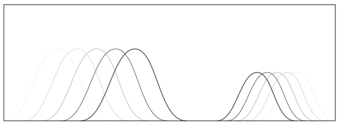

**图 1.1**

简单的一维波浪动画。两种不同的波在来回移动

### 1.1.1   定义状态（Defining State）

​		在开始编码之前，让我们退一步，想象一下我们将如何用代码描述波浪。在给定时间，波位于某个位置，其速度如图1.2所示。此外，如图所示，最终形状可以从波位置构造。所以，波的状态可以简单地定义为一对位置和速度。因为我们有两个波，所以我们需要两对状态（two pairs of states）。非常简单，没有什么复杂的。

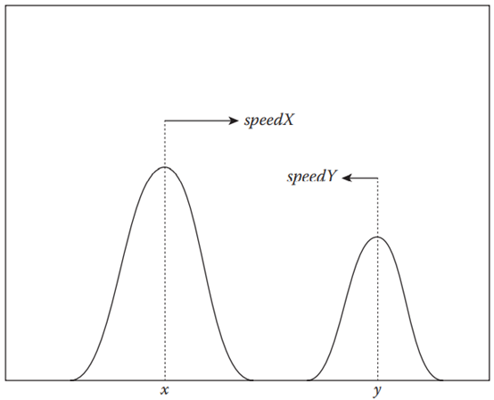

**图 1.2**

两个波的状态由它们的位置和速度来描述

 

​		现在，是时候写一些代码了。考虑以下事项：

```c++
#include <cstdio>

int main() {
	double x = 0.0;
	double y = 1.0;
	double speedX = 1.0;
	double speedY = -0.5;
	
	return 0;
}
```

​		命名变量时，我们将使用字母X表示其中一个波，Y表示另一个波。如代码所示，分配给这些变量的初始值告诉我们，波X从最左侧开始（double X=0.0），以1.0的速度向右侧移动（double speedX=1.0）。类似地，波Y从最右侧开始（double Y=1.0），然后以波X速度的一半向左侧移动（double speedY =-0.5）。

​		请注意，我们刚刚使用四个变量定义了模拟的“状态”，这是设计模拟引擎时最关键的步骤。在这个特定的例子中，模拟状态只是波的位置和速度。但在更复杂的系统中，它通常是通过各种数据结构的集合来实现的。因此，识别模拟过程中要跟踪的数值以及找到用于存储数据的正确数据结构非常重要。一旦定义了数据模型，下一步就是赋予它生命。

### 1.1.2 计算运动（Computing Motion）

​		为了了让波浪动起来，我们应该定义“时间”。见如下代码

```c++
#include <cstdio>

int main() {
    double x = 0.0;
    double y = 1.0;
    double speedX = 1.0;
    double speedY = -0.5;

    const int fps = 100;
    const double timeInterval = 1.0 / fps;

    for (int i = 0; i < 1000; ++i) {
        // Update waves
    }
    return 0;
}
```

​		代码的长度增加了一倍，但仍然非常简单。首先，新变量fps代表“每秒帧数（“frames-per-second FPS）”，它定义了每秒要绘制多少帧。如果我们反转这个FPS值，即每帧秒数，我们得到两帧之间的时间间隔。现在，我们在代码中将fps设置为100。这意味着两帧之间的间隔为0.01秒，存储为单独的可变时间间隔。在初始化新变量之后，我们定义了一个循环，在第12行迭代1000次。在这个循环中，我们现在将实际移动波X和Y。但是在我们填充循环之前，让我们在主函数的正上方编写以下函数

```c++
void updateWave(const double timeInterval, double* x, double* speed) {
	(*x) += timeInterval * (*speed);
}
```

​		这个函数只是一个线性函数，但做了一件有趣的事情。它采用波的时间间隔和当前中心位置。它还将波速作为一个参数，并将其相乘以更新波的位置。因此，如图1.3所示，该代码在给定的持续时间内稍微平移波的位置x，更新的量取决于它的速度（速度）和移动的时间（时间间隔）。此外，运动的方向取决于速度的符号。

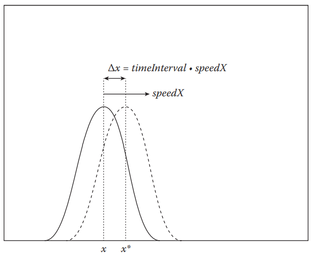

**图 1.3**

图像显示了在极短的时间间隔后波从x到x*的位移，位移Δx等于 时间间隔 × 速度

​		这种增量更新方法是大多数物理模拟随时间演化系统状态的方法。如代码所示，它通过累加，或换句话说，积分来更新状态。每个函数调用的积分量是物理量的变化率乘以时间间隔。这实际上是用计算机求解微分方程的最简单方法之一，我们可以用微分方程描述许多物理系统。因此，这一行代码背后的思想将贯穿全书。

### 1.1.3  边界处理（Boundary Handling）

​		我们现在知道了如何移动波浪，但是如果它们撞到墙怎么办？以下代码扩展了上述代码，通过将波反射到相反方向来处理此类撞墙情况。

```c++
void updateWave(const double timeInterval, double* x, double* speed) {
    (*x) += timeInterval * (*speed);

    // Boundary reflection
    if ((*x) > 1.0) {
        (*speed) *= -1.0;
        (*x) = 1.0 + timeInterval * (*speed);
        } else if ((*x) < 0.0) {
        (*speed) *= -1.0;
        (*x) = timeInterval * (*speed);
    }
}
```

​		在函数开始计算候选位置后，如果新位置超出墙，则代码首先翻转速度符号。然后从墙位置开始重新计算新位置。这是处理墙反射的最简单方法之一，但您也可以设计更复杂的逻辑来检测和解决冲突。代码是用来展示如何解决问题的一般思路的。不管怎样，现在我们可以像这样从主循环调用updateWave函数.

```c++
#include <cstdio>

void updateWave(const double timeInterval, double* x, double* speed) {
    (*x) += timeInterval * (*speed);

    // Boundary reflection
    if ((*x) > 1.0) {
        (*speed) *= -1.0;
        (*x) = 1.0 + timeInterval * (*speed);
    } else if ((*x) < 0.0) {
        (*speed) *= -1.0;
        (*x) = timeInterval * (*speed);
    }
}

int main() {
    double x = 0.0;
    double y = 1.0;
    double speedX = 1.0;
    double speedY = -0.5;

    const int fps = 100;
    const double timeInterval = 1.0 / fps;

    for (int i = 0; i < 1000; ++i) {
        // Update waves
        updateWave(timeInterval, &x, &speedX);
        updateWave(timeInterval, &y, &speedY);
    }
    return 0;
}
```

​		我们现在已经编写了运行模拟所需的所有部分。现在，让我们把它们显示出来吧。

### 1.1.4 可视化（Visualization）

​		仅仅运行模拟是不够的，但我们希望通过动画“看到”结果。这就是计算机图形学的全部要点。让我们通过向我们的 cool 流体模拟器添加一些可视化代码来完成我们的代码。我们是不打算编写任何漂亮的OpenGL或DirectX渲染器。您可以尝试使用第三方数据可视化工具，如Matplotlib [54] 来显示数据，但让我们的代码尽可能简单一点吧。在本例中，我们只需在终端屏幕上显示结果。

```c++
#include <array>
#include <cstdio>

const size_t kBufferSize = 80;

using namespace std;

void updateWave(const double timeInterval, double* x, double* speed) {
    ...
}

int main() {
    const double waveLengthX = 0.8;
    const double waveLengthY = 1.2;

    const double maxHeightX = 0.5;
    const double maxHeightY = 0.4;

    double x = 0.0;
    double y = 1.0;
    double speedX = 1.0;
    double speedY = -0.5;

    const int fps = 100;
    const double timeInterval = 1.0 / fps;

    array<double, kBufferSize> heightField;

    for (int i = 0; i < 1000; ++i) {
        // Update waves
        updateWave(timeInterval, &x, &speedX);
        updateWave(timeInterval, &y, &speedY);
    }
    return 0;
}
```

​		从前面的代码开始，这是新的一步。请注意，我们又添加了五个变量：**waveLengthX**、**waveLengthY**、**maxHeightX**、**maxHeightY**和**heightField**。除**heightField**外，这些变量定义波浪的形状属性。变量**heightField**用于特定的对象。每个0，1，…，N−1 阵列元素将存储0.5/N、1.5/N、…、(N - 0.5)/N处的波高位置，如图1.4所示。通过此设置，具有波长和最大高度属性的x和y位置都将映射到阵列**heightField**中。我们假设波具有cos形状，图1.5显示了该映射的预期结果。为了实现这个映射，让我们再添加一个函数

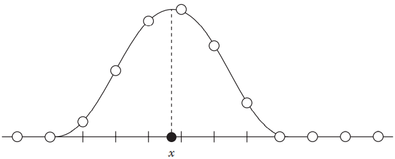

**图 1.4**

从波的位置位 x 构造高度场

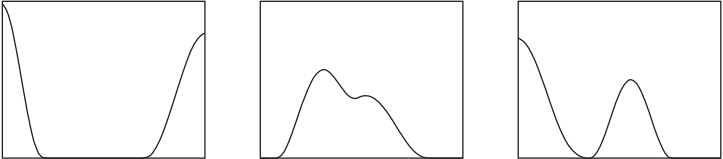

**图 1.5**

具有重叠的波浪动画序列

```c++
#include <cmath>
// x,waveLength都是小于1的数
void accumulateWaveToHeightField(
    const double x,
    const double waveLength,
    const double maxHeight,
    array<double, kBufferSize>* heightField) 
{
    const double quarterWaveLength = 0.25 * waveLength;
    const int start = static_cast<int>((x - quarterWaveLength) * kBufferSize);
    const int end = static_cast<int>((x + quarterWaveLength) * kBufferSize);

    for (int i = start; i < end; ++i) {
        int iNew = i;
        if (i < 0) {
            iNew = -i - 1;
        } else if (i >= static_cast<int>(kBufferSize)) {
            iNew = 2 * kBufferSize - i - 1;
        }

        double distance = fabs((i + 0.5) / kBufferSize - x); //距离波的距离
        double height = maxHeight * 0.5
            * (cos(min(distance * M_PI / quarterWaveLength, M_PI)) + 1.0);
        (*heightField)[iNew] += height;// +=很重要
    }
}
```

​		这个新函数获取波浪的位置、长度和最大高度。在函数的开头定义了一对局部变量，然后进行for循环，将钳制余弦函数累积到波的高度场。集成代码可以编写如下。

```c++
#include <array>
#include <cmath>
#include <cstdio>

const size_t kBufferSize = 80;

using namespace std;

void accumulateWaveToHeightField(
    const double x,
    const double waveLength,
    const double maxHeight,
    array<double, kBufferSize>* heightField) { ... }

void updateWave(const double timeInterval, double* x, double* speed) {
    ...
}

int main() {
    const double waveLengthX = 0.8;
    const double waveLengthY = 1.2;

    const double maxHeightX = 0.5;
    const double maxHeightY = 0.4;

    double x = 0.0;
    double y = 1.0;
    double speedX = 1.0;
    double speedY = -0.5;

    const int fps = 100;
    const double timeInterval = 1.0 / fps;

    array<double, kBufferSize> heightField;

    for (int i = 0; i < 1000; ++i) {
        // March through time
        updateWave(timeInterval, &x, &speedX);
        updateWave(timeInterval, &y, &speedY);

        // Clear height field
        for (double& height : heightField) {
            height = 0.0;
        }

        // Accumulate waves for each center point
        accumulateWaveToHeightField(x, waveLengthX, maxHeightX, &
                                    ightField);
        accumulateWaveToHeightField(y, waveLengthY, maxHeightY, &
                                    ightField);
    }

    return 0;
}
```

到目前为止，我们已经将波浪点映射到可以可视化的实际高度场。此过程非常类似于栅格化点，用于在位图屏幕上可视化数据，但仅限于一维。由于我们并不是真正在位图上绘制，最后的代码使用简单的ASCII代码 hack[1] 在终端屏幕上显示1D高度字段。包含可视化的最终代码如下所示。

```c++
#include <algorithm>
#include <array>
#include <chrono>
#include <cmath>
#include <cstdio>
#include <string>
#include <thread>

using namespace std;
using namespace chrono;

const size_t kBufferSize = 80;
const char* kGrayScaleTable = " .:-=+*#%@";
const size_t kGrayScaleTableSize = sizeof(kGrayScaleTable)/sizeof(char);

void updateWave(const double timeInterval, double* x, double* speed) {
    (*x) += timeInterval * (*speed);

    // Boundary reflection
    if ((*x) > 1.0) {
        (*speed) *= -1.0;
        (*x) = 1.0 + timeInterval * (*speed);
    } else if ((*x) < 0.0) {
        (*speed) *= -1.0;
        (*x) = timeInterval * (*speed);
    }
}

void accumulateWaveToHeightField(
    const double x,
    const double waveLength,
    const double maxHeight,
    array<double, kBufferSize>* heightField) {
    const double quarterWaveLength = 0.25 * waveLength;
    const int start
        = static_cast<int>((x - quarterWaveLength) * kBufferSize);
    const int end
        = static_cast<int>((x + quarterWaveLength) * kBufferSize);

    for (int i = start; i < end; ++i) {
        int iNew = i;
        if (i < 0) {
            iNew = -i - 1;
        } else if (i >= static_cast<int>(kBufferSize)) {
            iNew = 2 * kBufferSize - i - 1;
        }

        double distance = fabs((i + 0.5) / kBufferSize - x);
        double height = maxHeight * 0.5
            * (cos(min(distance * M_PI / quarterWaveLength, M_PI)) + 1.0);
        (*heightField)[iNew] += height;
    }
}

void draw(
    const array<double, kBufferSize>& heightField) {
    string buffer(kBufferSize, ’ ’);

    // Convert height field to grayscale
    for (size_t i = 0; i < kBufferSize; ++i) {
        double height = heightField[i];
        size_t tableIndex = min(
            static_cast<size_t>(floor(kGrayScaleTableSize * height)),
            kGrayScaleTableSize - 1);
        buffer[i] = kGrayScaleTable[tableIndex];
    }

    // Clear old prints
    for (size_t i = 0; i < kBufferSize; ++i) {
        printf("\b");
    }

    // Draw new buffer
    printf("%s", buffer.c_str());
    fflush(stdout);
}

int main() {
    const double waveLengthX = 0.8;
    const double waveLengthY = 1.2;

    const double maxHeightX = 0.5;
    const double maxHeightY = 0.4;

    double x = 0.0;
    double y = 1.0;
    double speedX = 1.0;
    double speedY = -0.5;

    const int fps = 100;
    const double timeInterval = 1.0 / fps;

    array<double, kBufferSize> heightField;

    for (int i = 0; i < 1000; ++i) {
        // March through time
        updateWave(timeInterval, &x, &speedX);
        updateWave(timeInterval, &y, &speedY);

        // Clear height field
        for (double& height : heightField) {
            height = 0.0;
        }

        // Accumulate waves for each center point
        accumulateWaveToHeightField(
            x, waveLengthX, maxHeightX, &heightField);
        accumulateWaveToHeightField(
            y, waveLengthY, maxHeightY, &heightField);

        // Draw height field
        draw(heightField);

        // Wait
        this_thread::sleep_for(milliseconds(1000 / fps));
    }

    printf("\n");
    fflush(stdout);

    return 0;
}
```

请注意，我们还在第115行的draw调用之后添加了一行代码。这只是一个sleep函数调用，让应用程序在继续下一行之前等待给定的时间。在这种情况下，它让循环的每次迭代花费1000/fps毫秒。

### 1.1.5 最终结果（Final Result）

​		我们终于完成了第一个流体模拟代码的编写！您可以通过运行来运行应用程序。

​		从源代码存储库的根目录出发，源代码（main.cpp）可以在src/examples/hello\u fluid\u sim/main.cpp中找到。总之，这个hello world示例的目标是提供开发流体引擎所需的核心思想。代码演示了如何定义模拟状态、随时间更新状态、处理与非流体对象的交互，以及最终可视化结果。在本书中，我们将看到各种现象的不同模拟技术，但基本思想是相同的。


## 1.2 （How to Read This Book）如何阅读本书

​		为了帮助阅读和理解本书，本节将介绍代码和数学表达式的基本约定。

### 1.2.1  获取代码（Getting the Codes）

​		这本书中的代码可以在GitHub页面上找到(https://github.com/doyubkim/fluid-engine-dev). 您还可以从存储库克隆代码的最新版本，我推荐这样，因为最新版本可能包含bug修复和更多功能。您可以使用git命令克隆存储库：

```powershell
git clone https://github.com/doyubkim/fluid-engine-dev
```

​		代码库依赖于一些第三方库，其中一些库无法从包管理器（如Homebrew或apt get）获得。这些库作为git子模块包含。因此，必须在克隆主存储库后初始化子模块，如下：

```powershell
git submodule init
git submodule update
```

​		为了构建代码，SCons [73] 用于Mac OS X和Linux平台。对于Windows，使用Microsoft Visual Studio。请参阅存储库中的README.md和INSTALL.md以获取最新的构建说明

### 1.2.2 阅读代码（Reading Codes）

​		正如我们从一开始的hello world流体模拟示例中已经看到的，指示代码或文件路径的文本将以固定宽度的字体书写。多行代码将被写成

```c++
void foo() {
    printf("bar\n");
}
```

#### 1.2.2.1 语言（Languages）

​		该代码主要是用C++11编写的，同时也用Python编写了一些构建工具和实用程序脚本。例如，lambda函数、模板别名、可变模板、基于范围的循环、auto和std:：array是代码在C++11中使用的一些特性。但是，本书试图通过避免使用花哨但难以理解的代码，使代码尽可能可读。要获得关于C++11的更多信息，请从Bjarne Stroustrup的网页[114]和Scott Meyers的新书[84]中找到更多细节。

#### 1.2.2.2 源代码结构（Source Code Structure）

​		如果未指定，则大多数代码可以通过类的名称找到。例如，Collider3类的头文件和源文件可以在**include/jet/Collider3.h**和**src/jet/Collider3.cpp**中找到。文件和目录以小写字母和下划线命名，例如**path_to/my/awesome_code.cpp**。对于非类代码，例如全局函数和常量，它们按其特征分组。例如，可以从**include/jet/math_utils.h**中找到数学实用程序函数。

​		对于模板类或函数，可以在include/jet下找到声明，在include/jet/detail下找到定义。由于定义是内联实现，因此文件名的后缀为 -inl.h。例如，模板类Vector3在include/jet/Vector3.h中声明，在include/jet/vector3inl.h中实现。

ps:内联函数：以空间换时间的一种函数实现方式，不同于一般的直接调用函数，内联函数会在编译时将函数重写在调用出（一般都是小函数）

#### 1.2.2.3 命名约定（Naming Conventions）

代码使用**CamelCase**作为类名，**CamelCase**作为函数/变量，MACRO_NAME 称作为宏。如果类型需要通过其维度和值类型来区分，则代码会添加相应的后缀来描述它。例如

```c++
template <typename T, size_t N>
class Vector { ... };
```

在这种情况下，我们可以为特定的值类型和维度定义类型别名，例如

```c++
template <typename T> using Vector3 = Vector<T, 3>;
typedef Vector3<float> Vector3F
typedef Vector3<double> Vector3D
```

​		请注意，后缀 **3** 用于表示该向量类的维数为3。此外，后缀F和D用于表示它们分别对值类型使用float和double。

​		私有或受保护成员变量的名称以下划线开头，例如

```c++
class MyClass {
    ...
        
        private:
    double _data;
};
```

​		如果可能的话，代码，特别是API，会尽量冗长。例如，我们更喜欢使用 **timeIntervalInSeconds** 而不是dt或 **viscosityCoefficient** 而不是mu。

#### 1.2.2.4 常数（Constants）

​		常用常量位于 jet/include/constants.h 头文件中。常量的名称以字母k开头，然后是值和类型，使用驼峰命名法。例如，无符号大小类型零常量定义为：

```c++
const size_t kZeroSize = 0;
```

​		类似地，双精度浮点π定义为

```c++
const double kPiD = 3.14159265358979323846264338327950288;
```

​		还有一些物理常数，比如：

```c++
// Gravity
const double kGravity = -9.8;

// 20摄氏度时水中的声速
const double kSpeedOfSoundInWater = 1482.0;
```

#### 1.2.2.5 数组（Arrays）// TODO

​		数组是代码库中最常用的原语。它提供了多种数据类型来访问1D、2D和3D阵列。它们不像 NumPy [118] 那样是非常通用的类，但支持大多数用例。
​	为了存储1D数据，我们定义了以下类：

```c++
template <typename T, size_t N>
class Array final {};

template <typename T>
class Array<T, 1> final {
public:
    Array();

    ...

    T& operator[](size_t i);
    const T& operator[](size_t i) const;

    size_t size() const;

    ...

private:
    std::vector<T> _data;
};

template <typename T> using Array1 = Array<T, 1>;
```

​		新的数据类型Array<T，1>，是 **std::vector** 的包装器，并添加了一些内容。有关更多详细信息，请参见**jet/include/array1.h **。我们可以将其扩展到二维和三维阵列，如下所示：

```c++
template <typename T>
class Array<T, 2> final {
public:
    Array();

    ...

    T& operator()(size_t i, size_t j);
    const T& operator()(size_t i, size_t j) const;

    Size3 size() const;
    size_t width() const;
    size_t height() const;

    ...

private:
    Size2 _size;
    std::vector<T> _data;
};

template <typename T> using Array2 = Array<T, 2>;
```

以及三维的数组

```c++
template <typename T>
class Array<T, 3> final {
public:
    Array();

    ...

    T& operator()(size_t i, size_t j, size_t k);
    const T& operator()(size_t i, size_t j, size_t k) const;

    Size3 size() const;
    size_t width() const;
    size_t height() const;
    size_t depth() const;

    ...

private:
    Size3 _size;
    std::vector<T> _data;
};

template <typename T> using Array3 = Array<T, 3>;
```

​		在这里，Size2和Size3是包含两个和三个表示多维数组大小的size_t的元组。i的范围是[0，width]，j是[0，height]，k是[0，depth]。注意，这两个类都定义了运算符（），它返回2D中位于（i，j）和3D中位于（i，j，k）的数组元素。数据存储为1D std:：vector，但通过以下方式映射到2D或3D：

```c++
template <typename T>
T& Array<T, 2>::operator()(size_t i, size_t j) {
    return _data[i + _size.x * j];
}

template <typename T>
const T& Array<T, 2>::operator()(size_t i, size_t j) const {
    return _data[i + _size.x * j];
}

template <typename T>
T& Array<T, 3>::operator()(size_t i, size_t j, size_t k) {
    return _data[i + _size.x * (j + _size.y * k)];
}

template <typename T>
const T& Array<T, 3>::operator()(size_t i, size_t j, size_t k) const {
    return _data[i + _size.x * (j + _size.y * k)];
}
```

请注意，我们使用i主序。因此，迭代3D数组可以写成：

```c++
Array3<double> data = ...
    
for (size_t k = 0; k < data.depth(); ++k) {
    for (size_t j = 0; j < data.height(); ++j) {
        for (size_t i = 0; i < data.width(); ++i) {
            data(i, j, k) = ...
        }
    }
}
```

​		最里面的循环迭代**i**，因为它将**最大化缓存命中率**。如果编写三个for循环对您来说太耗时，那么有一些帮助函数可以缩短代码：

```c++
template <typename T>
class Array<T, 3> final {
    public:
    Array();

    ...

    void forEachIndex(
    const std::function<void(size_t, size_t, size_t)>& func) const;

    void parallelForEachIndex(
    const std::function<void(size_t, size_t, size_t)>& func) const;

    ...
};
```

​		函数 **forEachIndex** 接受函数对象，并按i-major顺序迭代每个i、j和k。函数 **parallelForEachIndex** 执行相同的迭代，但并行使用多个线程。这两个实用程序函数可按如下方式使用：

```c++
Array3<double> data = ...

data.forEachIndex([&] (size_t i, size_t j, size_t k) {
    data(i, j, k) = ...
});

data.parallelForEachIndex([&] (size_t i, size_t j, size_t k) {
	data(i, j, k) = ...
});
```

​		这里，我们使用lambda函数内联函数对象。如果此代码不太容易理解，请参见C++11 lambda特性[114]。

​		代码库中经常使用的另一种与数组相关的类型是数组访问器。它们是非常类似于随机访问迭代器的简单数组包装器。它们不提供任何分配或取消分配**堆内存**的功能，只是携带数组指针并提供相同的（i、j、k）索引。例如，3D数组访问器类的定义如下：

```c++
template <typename T>
class ArrayAccessor<T, 3> final {
public:
    ArrayAccessor();
    explicit ArrayAccessor(const Size3& size, T* const data);
    
    ...
        
    T& operator()(size_t i, size_t j, size_t k);
    const T& operator()(size_t i, size_t j, size_t k) const;
    
    Size3 size() const;
    size_t width() const;
    size_t height() const;
    size_t depth() const;
    
    ...
        
private:
    Size3 _size;
    T* _data;
};

template <typename T> using ArrayAccessor3 = ArrayAccessor<T, 3>;

template <typename T>
class ConstArrayAccessor<T, 3> {
public:
    ConstArrayAccessor();
    explicit ConstArrayAccessor(const Size3& size, const T* const data);
    
    ...
        
    const T& operator()(size_t i, size_t j, size_t k) const;
    
    Size3 size() const;
    size_t width() const;
    size_t height() const;
    size_t depth() const;
    
    ...
        
private:
    Size3 _size;
    const T* _data;
};

template <typename T> using ConstArrayAccessor3 = ConstArrayAccessor<T,3>;
```

​		这两个类用于在不分配或取消分配内存的情况下交换数据。特别是第二类，ConstArrayAccessor< T，3 >，只用于读取操作，就像C++ STL中的const迭代器。在代码库中，所有多维数组类型都返回数组访问器。例如，Array<T，3>提供如下成员函数：

```c++
template <typename T>
class Array<T, 3> final {
public:
    ...
        
    ArrayAccessor3<T> accessor();
    ConstArrayAccessor3<T> constAccessor() const;
    
    ...
};

template <typename T>
ArrayAccessor3<T> Array<T, 3>::accessor() {
    return ArrayAccessor3<T>(size(), data());
}

template <typename T>
ConstArrayAccessor3<T> Array<T, 3>::constAccessor() const {
    return ConstArrayAccessor3<T>(size(), data());
}
```

​		这种编码模式经常出现在基于网格的流体模拟（欧拉视角）代码中。

### 1.2.3 阅读数学表达式（Reading Math Expressions）

​		数学表达式将使用Serif字体编写，如e=mc^2^。较长的方程式或偶数多行表达式（even multiline expressions）将写成：
$$
\frac {\partial u}{\partial t}+u\cdot \nabla u=\mu \nabla^2u+g\\
\nabla\cdot u = 0
$$

#### 1.2.3.1 标量，向量，以及矩阵（Scalar, Vector, and Matrix）

​		我们将在接下来的部分中介绍什么是向量和矩阵。 但简而言之，向量是表示点或方向的数字列表。 另一方面，标量是单个数字。 标量值以简单的样式书写，例如 c，而向量则以粗体小写字体书写，例如 **f**。 矩阵使用大写粗体字母，例如 **M**。

## 1.3 数学（Math）

​		本节将介绍全书最常用的数学运算、数据结构和概念。 如果您已经熟悉线性代数和**向量微积分**，则可以跳过本节。

### 1.3.1 坐标系（Coordinate System）

​		坐标系是使用以某种特定方式测量的坐标来指定点的系统 [119] 。 最简单的坐标系由相互垂直的坐标轴组成，称为笛卡尔坐标。 还有其他类型的坐标系，例如极坐标，但在本书中我们将只使用笛卡尔坐标。

图 1.6 显示了二维 (2D) 和三维 (3D) 空间，箭头表示坐标轴，每个轴都标有 x、y 和 z。 该图显示 x 标记在指向右侧的轴上，而 y 和 z 分别位于向上和向前的轴上。 您可以使用不同的顺序来标记 x、y 和 z。 但在本书中，我们将遵循图 1.6 所示的约定。 这称为右手坐标系，因为您可以用右手将拇指、食指和中指分别指向 x、y 和 z 方向。

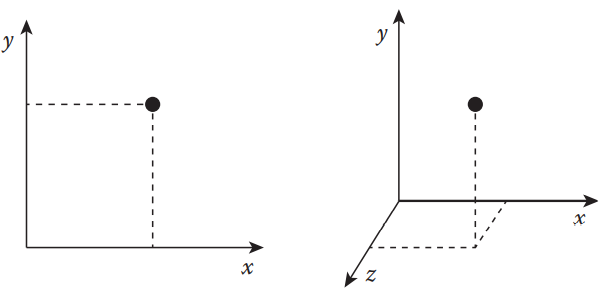

**图 1.6**

2D 和 3D 笛卡尔坐标

### 1.3.2 向量

​		我们为我们的空间定义了轴。现在，让我们谈谈积分。从图 1.7 可以看出，图中的 A 点可以正交投影到 x 轴和 y 轴上，投影值可以用一对数字表示。 在此特定示例中，它将是 (2, 3)。

​		同样，我们也可以用pair来描述两点之间的差异。 从图 1.7 看从 A 指向 B 的箭头，B 点在 (7, 4) 处，因此它在 x 方向上距离两个单位，在 y 方向上距离 A 四个单位。我们可以 也将这个差值或delta写成一对数字(5, 1)，这可以表示为一个点，如图所示（点C）。

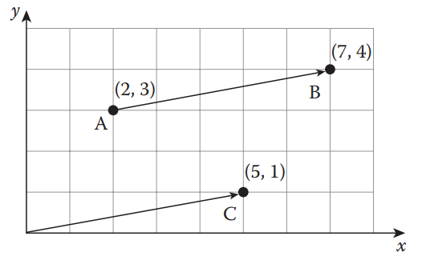

**图 1.7**

在2D空间的3点 A，B，C

​		为了概括这些想法，我们引入了一个向量。 正如我们从前面的例子中看到的那样，向量只是一组数字，这些数字从原点指向这些数字的坐标。 例如，在 3D 情况下，向量 (2, 3, 7) 是从点 (0, 0, 0) 开始到点 (2, 3, 7) 结束的箭头。 向量可以用来描述一个点的坐标，也可以用来表示位移。 例如，如果你想通过将 x 坐标平移 -1、y 坐标 5 和 z 坐标 4 来移动一个点，你可以写一个向量 (-1, 5, 4) 来描述平移。 我们也可以有任何维度
的向量，从一维到 N 维。
​		现在，让我们看看如何定义一个类来表示向量。 见下述类。

```c++
template <typename T, size_t N>
class Vector final {
    public:
    static_assert(
        N > 0,
        "Size of static-sized vector should be greater than zero.");
    static_assert(
        std::is_floating_point<T>::value,
        "Vector only can be instantiated with floating point types");

    private:
    std::array<T, N> _elements;
};
```

​		该类采用两个模板参数，元素 T 的数据类型和向量 N 的维度。请注意，对于值类型 T，我们只允许浮点数、float 或 double 类型，因为我们希望该向量类仅用于数学运算 计算，而不是存储任何任意类型。* 我们还将 N 的范围限制为大于零。

​		添加一些构造函数、设置器（setter）、获取器（getter） 和实用操作符后，代码将如下所示：

```c++
template <typename T, std::size_t N>
class Vector final {
    public:
    // static_asserts
    ...
        
        
    Vector();
    
    template <typename... Params>
    explicit Vector(Params... params);
    
    explicit Vector(const std::initializer_list<T>& lst);
    
    Vector(const Vector& other);
    
    void set(const std::initializer_list<T>& lst);
    
    void set(const Vector& other);
    
    Vector& operator=(const std::initializer_list<T>& lst);
    
    Vector& operator=(const Vector& other);
    
    const T& operator[](std::size_t i) const;
    
    T& operator[](std::size_t);
    
    private:
    std::array<T, N> _elements;
    
    // private helper functions
    ...
};
```

​		完整的实现可以从 **include/vector.h** 和 **include/detail/vector-inl.h** 中找到。 基本用法示例可以从位于 src/tests/unit_tests/vector_tests.cpp 的单元测试器中找到。

​		在计算机图形学中，最常用的向量是 2D、3D 和四维 (4D) 向量。 对于这样的维度，我们可以专门化模板类，并有更多有用的结构和辅助函数供我们经常使用。 这也将防止过度泛化可能使内部逻辑过于复杂的向量类。 以3D向量为例，我们可以将专门的类写成：

```c++
template <typename T>
class Vector<T, 3> final {
    public:
    ...
        
    T x;
    T y;
    T z;
};

template <typename T> using Vector3 = Vector<T, 3>;

typedef Vector3<float> Vector3F;
typedef Vector3<double> Vector3D;
```

​		最显着的变化是新类没有定义数组，而是显式声明 x、y 和 z。 这是一个很小的变化，但提供了对坐标的简单访问点，这在许多情况下都非常方便。 可以通过使用大小为 3 的数组来实现这一点，就像 Vector <T, N> 一样，并为 x、y 和 z 分量提供专用的 getter 和 setter 函数。 这完全没问题，这只是一个决定问题。 无论如何，在类定义之后还定义了别名，这在尝试实例化常用类型时也很有用。 Vector<T,3>的最终实现可以从**include/vector3.h** 和 **include/detail/vector3-inl.h** 中找到。与 Vector <T, N> 类似，示例位于 **src/tests/unit_tests/vector3_tests.cpp**。

​		至此，我们已经了解了向量的基本思想和一些表示向量数据的代码。 从现在开始，我们将介绍向量及其实现的常用操作。

#### 1.3.2.1 基础运算（Basic Operations）

​		让我们从最基本的东西开始——算术运算。就像标量值一样，我们也可以加、减、乘、除一个向量和另一个向量。通过扩展前面的代码，我们可以编写：

```c++
template <typename T>
class Vector<T, 3> final {//final 防止类继承
    public:
    ...
        
    // Binary operations: new instance = this (+) v
    Vector add(T v) const;
    Vector add(const Vector& v) const;
    Vector sub(T v) const;
    Vector sub(const Vector& v) const;
    Vector mul(T v) const;
    Vector mul(const Vector& v) const;
    Vector div(T v) const;
    Vector div(const Vector& v) const;
};
```

​		这段代码表明我们也可以对标量类型应用算术运算。以add函数为例，它可以写成：

```c++
template <typename T>
Vector<T,3> Vector<T,3>::add(T v) const {
    return Vector(x + v, y + v, z + v);
}

template <typename T>
Vector<T,3> Vector<T,3>::add(const Vector& v) const {
    return Vector(x + v.x, y + v.y, z + v.z);
}
```

​		重载操作符也很方便，因此我们可以使用如下类：

```c++
Vector3D a(1.0, 2.0, 3.0), b(4.0, 5.0, 6.0):
Vector3D c = a + b;
```

​		我们可以通过添加以下内容轻松实现这些功能：

```c++
template <typename T>
Vector<T,3> operator+(const Vector<T,3>& a, T b) {
    return a.add(b);
}

template <typename T>
Vector<T,3> operator+(T a, const Vector<T,3>& b) {
    return b.add(a);
}

template <typename T>
Vector<T,3> operator+(const Vector<T,3>& a, const Vector<T,3>& b) {
    return a.add(b);
}
```

​		加法、减法和乘法的几何意义如图1.8所示。

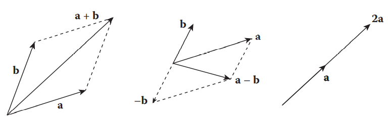

**图 1.8**

左图：向量a与向量b相加。

中间：向量a-向量b。

右图：向量a乘以标量2

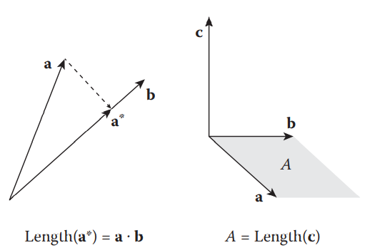

**图 1.9**

左图：向量a *是向量a在向量b上的投影，a *的长度是a与b的点积

右图：向量c是a与b的叉乘，c的长度等于A的面积

#### 1.3.2.2 点乘和叉乘（Dot and Cross Product）

​		点乘和叉乘运算都是二元运算，它们都具有几何度量意义。点积将一个向量投影到另一个向量，并返回投影向量的长度。根据余弦函数的定义，点积等于两个单位大小的向量之间的余弦角的cos值。叉积从两个向量定义的平行四边形生成垂直向量，其大小由平行四边形的面积决定。图1.9说明了这两个操作的工作原理。

点积的数学定义是
$$
a\cdot b = a_xb_x+a_yb_y+a_zb_z \tag{1.1}
$$
​		而叉积的定义是
$$
a\cross b = (a_y b_y - a_z b_z)i+(a_z b_x - a_x b_z)j+(a_x b_y - a_y b_x)k \tag{1.2}
$$
​		其中i、j和k分别表示x、y和z轴。等效代码如下所示：

```c++
template <typename T>
class Vector<T, 3> final {
public:
    ...
    T dot(const Vector& v) const;
    Vector cross(const Vector& v) const;
};
```

​		后面的实际实现如下所示：

```c++
template <typename T>
T Vector<T,3>::dot(const Vector& v) const {
    return x * v.x + y * v.y + z * v.z;
}

template <typename T>
Vector<T,3> Vector<T,3>::cross(const Vector& v) const {
    return Vector(y*v.z - v.y*z, z*v.x - v.z*x, x*v.y - v.x*y);
}
```

​		值得一提的是，点积返回两个向量中的标量值，而叉积则返回一个向量。但在2D中，叉积也会产生一个标量值。如果将二维空间重新解释为三维中的xy平面，则在该平面上执行叉积将得到一个向量，该向量指向+z或−z方向。在2D世界中，这只是一个符号问题。因此，叉乘可以简单的变为：

```c++
template <typename T>
Vector<T,2> Vector<T,2>::cross(const Vector& v) const {
    return x*v.y - v.x*y;
}
```

#### 1.3.2.3 更多的运算（More Operations）

​		使用到目前为止我们已经实现了许多基本操作符，我们还可以实现操纵向量时经常使用的辅助函数。

##### 1.3.2.3.1 向量的长度（Length of a Vector）

​		我们可以使用勾股定理测量向量的长度，l = |**v**|，如图1.10所示。对于3D矢量，我们可以实现如下所示的功能：

```c++
template <typename T>
T Vector<T,3>::length() const {
    return std::sqrt(x * x+y * y+z * z);
}
```

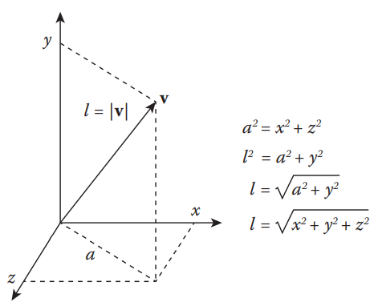

**图 1.10**

计算向量**v**的长度l

​		这段代码实现了简单的公式 √(x^2^+y^2^+z^2^)。现在，有时使用length^2^而不是length更有效，特别是当比较两个向量之间的长度时。这是因为您不必调用**std::sqrt**，它涉及更多的操作，而且，如果a<b，那么a2<b2也是真的。因此，我们可以编写额外的辅助函数，如下所示：

```c++
template <typename T>
T Vector<T,3>::lengthSquared() const {
    return x * x+y * y+z * z;
}
```

##### 1.3.2.3.2 归一化（Normalization）

​		长度等于1的向量称为单位向量，将向量转换为单位向量称为归一化。如果一个向量的长度为l，我们可以将它的大小缩放1/l，得到归一化向量。因此，代码可以写成：

```c++
template <typename T>
void Vector<T,3>::normalize() {
    T l = length();
    x /= l;
    y /= l;
    z /= l;
}

Vector<T,3> Vector<T,3>::normalized() const {
    T l = length();
    return Vector(x / l, y / l, z / l);
}
```

​		第一个函数normalize()将给定向量转换为单位向量，而第二个函数normalized()将返回一个新向量，即给定向量的单位向量。

##### 1.3.2.3.3 投影

​		下一个操作需要一点几何理解。如图1.11所示，我们希望在曲面上投影一个由曲面法向量定义的向量。正如我们在第1.3.2.2节中已经知道的，我们可以使用点积将一个向量投影到另一个向量。但在这种情况下，我们要将向量投影到曲面上。为此，我们首先需要将向量分解为一个平行于曲面法线的向量，以及另一个我们想要知道的投影向量。如果我们从原始向量中减去法向分量，我们可以得到投影向量。我们可以把它写成一个方程
$$
v^* = v-(v\cdot n)n \tag{1.3}
$$
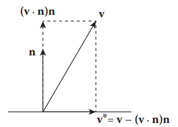

**图 1.11** 

向量v投影在以n为法向量的表面，产生向量v*

​		其中n是曲面法向量。该方程可直接实现为：

```c++
template <typename T>
Vector<T, 3> Vector<T, 3>::projected(const Vector<T, 3>& normal) const {
    return sub(dot(normal) * normal);
}
```

##### 1.3.2.3.4 反射（Reflection）

​		我们可以采用同样的方法来计算反射。如图1.12所示，我们再次将输入向量分解为曲面法线和切线分量。然后，我们减去输入向量的缩放法线分量，得到反射向量。写下方程式，我们得到
$$
v^* =v-2(v\cdot n)n \tag{1.4}
$$


**图 1.12**

向量**v**从以n为法向量的表面反射得到向量v *

​		代码可以写成：

```c++
template <typename T>
Vector<T, 3> Vector<T, 3>::reflected(const Vector<T, 3>& normal) const {
    return sub(normal.mul(2 * dot(normal)));
}
```

##### 1.3.2.3.5 切向向量

​		如果给定向量定义曲面的法线方向，我们也可以考虑从法线计算切向向量。如果要在曲面上生成由曲面法线定义的点，这非常有用。但是，如图1.13所示，曲面上可能有无限多个切向向量，因此我们将拾取两个垂直向量。根据定义，这两个切向向量也与法向量正交。这三个向量构成了曲面上的坐标系。

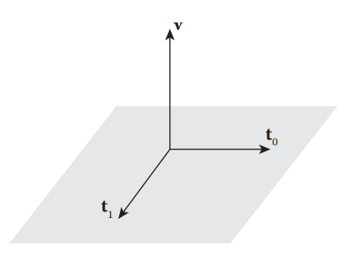

**图 1.13**

向量**v**有两个切向向量t~0~和t~1~

​		要计算两个切向向量，请参见下面的代码。

```c++
template <typename T>
std::tuple<Vector<T, 3>, Vector<T, 3>> Vector<T, 3>::tangential() const {
    Vector<T, 3> a = ((std::fabs(y) > 0 || std::fabs(z) > 0) ?
                      Vector<T, 3>(1, 0, 0) :
                      Vector<T, 3>(0, 1, 0))
        .cross(*this).normalized();
    Vector<T, 3> b = cross(a);
    return std::make_tuple(a, b);
}
```

​		请注意，此向量是曲面法向量。如果法线不平行于x轴，我们首先拾取x方向向量（1，0，0），如果法线平行于x轴，则拾取y（0，1，0）。如果所选向量与法向量不平行，则它可以是任何向量。我们只需要暂时计算一个垂直于曲面法线的向量。我们通过取所选向量和曲面法线的叉积来计算这个新向量a。然后，我们再次将叉积与法向量相结合，得到向量b，并将a和b作为元组返回。

##### 1.3.2.3.6  运算符重载及其他（Operator Overloading and Others）

​		我们还可以添加其他辅助函数，例如运算符重载。我不会深入讨论细节，但下面的代码列出了可以实现的内容。对于三维向量，可以从**include/vector3.h**和**include/detail/vector3 inl.h**中找到详细信息。您还可以从**include/detail/vector2inl.h**和include/detail/vector4inl.h中找到2D和4D实现。

```c++
template <typename T>
class Vector<T, 3> final {
public:
    ...
        
    // Constructors
    Vector();
    explicit Vector(T x, T y, T z);
    explicit Vector(const Vector2<T>& pt, T z);
    Vector(const std::initializer_list<T>& lst);
    Vector(const Vector& v);
    
    ...
        
    // Operators
    T& operator[](std::size_t i);
    const T& operator[](std::size_t i) const;
    
    Vector& operator=(const std::initializer_list<T>& lst);
    Vector& operator=(const Vector& v);
    Vector& operator+=(T v);
    Vector& operator+=(const Vector& v);
    Vector& operator-=(T v);
    Vector& operator-=(const Vector& v);
    Vector& operator*=(T v);
    Vector& operator*=(const Vector& v);
    Vector& operator/=(T v);
    Vector& operator/=(const Vector& v);
    
    bool operator==(const Vector& v) const;
    bool operator!=(const Vector& v) const;
};


template <typename T> using Vector3 = Vector<T, 3>;

template <typename T>
Vector3<T> operator+(const Vector3<T>& a);

template <typename T>
Vector3<T> operator-(const Vector3<T>& a);

template <typename T>
Vector3<T> operator+(T a, const Vector3<T>& b);

template <typename T>
Vector3<T> operator+(const Vector3<T>& a, const Vector3<T>& b);

template <typename T>
Vector3<T> operator-(const Vector3<T>& a, T b);

template <typename T>
Vector3<T> operator-(T a, const Vector3<T>& b);

template <typename T>
Vector3<T> operator-(const Vector3<T>& a, const Vector3<T>& b);

template <typename T>
Vector3<T> operator*(const Vector3<T>& a, T b);

template <typename T>
Vector3<T> operator*(T a, const Vector3<T>& b);

template <typename T>
Vector3<T> operator*(const Vector3<T>& a, const Vector3<T>& b);

template <typename T>
Vector3<T> operator/(const Vector3<T>& a, T b);

template <typename T>
Vector3<T> operator/(T a, const Vector3<T>& b);

template <typename T>
Vector3<T> operator/(const Vector3<T>& a, const Vector3<T>& b);

template <typename T>
Vector3<T> min(const Vector3<T>& a, const Vector3<T>& b);

template <typename T>
Vector3<T> max(const Vector3<T>& a, const Vector3<T>& b);

template <typename T>
Vector3<T> clamp(const Vector3<T>& v, const Vector3<T>& low, const
                 ctor3<T>& high);

template <typename T>
Vector3<T> ceil(const Vector3<T>& a);

template <typename T>
Vector3<T> floor(const Vector3<T>& a);

typedef Vector3<float> Vector3F;
typedef Vector3<double> Vector3D;
```

### 1.3.3 矩阵（Matrix）

​		矩阵是在每行和每列存储数字的二维数组。例如，具有M行和N列的矩阵，即M×N矩阵，可以写成：
$$
A=\left[\begin{matrix}a_{11}&a_{12}&a_{13}&...&a_{1N}\\
					a_{21}&a_{22}&a_{23}&...&a_{2N}\\
					...&...&...&...&...\\
					a_{M1}&a_{M2}&a_{M3}&...&a_{MN}
\end{matrix}\right]\tag{1.5}
$$
​		这里，a~ij~表示第i行和第j列的矩阵元素。M×N矩阵可以解释为一组M行向量或N列向量。

#### 1.3.3.1 基础矩阵运算（Basic Matrix Operations）

##### 1.3.3.1.1 矩阵左乘向量（Matrix–Vector Multiplication）

​		第一个涉及的运算是矩阵-向量乘法。假设我们有一个M×N矩阵A和N维向量x。将向量乘以矩阵表示为
$$
y=Ax\tag{1.6}
$$
​		我们可以按如下方式编写矩阵操作元素（element-wise）

ps：element-wise指对应元素依次相乘
$$
\left[\begin{matrix}y_1\\
y_2\\
\vdots\\
y_M
\end{matrix}\right]=
\left[\begin{matrix}a_{11}&a_{12}&a_{13}&\cdot\cdot\cdot&a_{1N}\\
a_{21}&a_{22}&a_{23}&\cdot\cdot\cdot&a_{2N}\\
\cdots&\cdots&\cdots&\ddots&\vdots\\
a_{M1}&a_{M2}&a_{M3}&\cdot\cdot\cdot&a_{MN}
\end{matrix}\right]
\left[\begin{matrix}x_1\\
x_2\\
\vdots\\
x_M
\end{matrix}\right]\tag{1.7}
$$
​		其中，输出向量y是M维向量。输出向量y可以通过取矩阵第i列的点积和输入向量来计算，如
$$
y_i =\left[\begin{matrix}a_{i1}&a_{i2}&a_{i3}&\cdots&a_{iN}
\end{matrix}\right]\cdot

\left[\begin{matrix}x_1\\
x_2\\
\vdots\\
x_N
\end{matrix}\right]\tag{1.8}
$$
求得
$$
y_i=a_{i1}x_1 + a_{i2}x_2 +\cdots + a_{iN}x_N\tag{1.9}
$$
​		矩阵-向量乘法的时间复杂度为O（M×N）

##### 1.3.3.1.2 矩阵与矩阵的乘法（Matrix–Matrix Multiplication）

​		扩展矩阵-向量乘法，我们还可以将两个矩阵相乘。例如，矩阵A和B的乘法可以写成：
$$
C=AB\tag{1.10}
$$
或者是
$$
\left[\begin{matrix}c_{11}&c_{12}&\cdot\cdot\cdot&c_{1N}\\
c_{21}&c_{22}&\cdot\cdot\cdot&c_{2N}\\
\cdots&\cdots&\ddots&\vdots\\
c_{M1}&c_{M2}&\cdot\cdot\cdot&c_{MN}
\end{matrix}\right]=
\left[\begin{matrix}a_{11}&a_{12}&\cdot\cdot\cdot&a_{1N}\\
a_{21}&a_{22}&\cdot\cdot\cdot&a_{2N}\\
\cdots&\cdots&\ddots&\vdots\\
a_{M1}&a_{M2}&\cdot\cdot\cdot&a_{MN}
\end{matrix}\right]
\left[\begin{matrix}b_{11}&b_{12}&\cdot\cdot\cdot&b_{1N}\\
b_{21}&b_{22}&\cdot\cdot\cdot&b_{2N}\\
\cdots&\cdots&\ddots&\vdots\\
b_{M1}&b_{M2}&\cdot\cdot\cdot&b_{MN}
\end{matrix}\right]\tag{1.11}
$$
​		矩阵C中的每个元素都可以通过矩阵a的第i行和矩阵B的第j列的点积来计算，例如
$$
c_{ij} =\left[\begin{matrix}a_{i1}&a_{i2}&\cdots&a_{iN}
\end{matrix}\right]\cdot

\left[\begin{matrix}b_{1j}\\
b_{2j}\\
\vdots\\
b_{Nj}
\end{matrix}\right]\tag{1.12}
$$
或是
$$
c_{ij} = a_{i1}b_{1j} + a_{i2}b_{2j} + \cdots + a_{iN}b_{Nj}\tag{1.13}
$$
​		图1.14显示了如何更直观地获取每行和每列的dot产品。注意，矩阵A的列数应等于矩阵B的行数。此外，如果A和B的维数分别为M×N和N×L，则输出矩阵C将具有M×L维数。矩阵乘法的时间复杂度为O（L×M×N）。

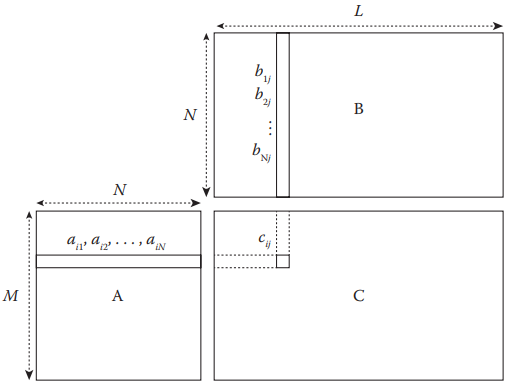

**图 1.14**

矩阵-矩阵相乘的可视化表示，**C**=**AB**. 矩阵A的行向量和矩阵B的列向量构成了c~ij~

##### 1.3.3.1.3 逆矩阵（Inverse）

​		最后，让我们了解如何执行矩阵的求逆。如果我们有一个矩阵a，它的逆矩阵可以写成a^−1^满足以下条件
$$
A^{-1}A = AA^{-1} = I\tag{1.14}
$$
这里，I是一个单位矩阵，其对角线元素均为1，其他元素均为零，如
$$
\left[\begin{matrix}1&0&0&\cdots&0\\
0&1&0&\cdots&0\\
0&0&1&\cdots&0\\
\vdots&\vdots&\vdots&\ddots&0\\
0&0&0&\cdots&1
\end{matrix}\right]\tag{1.15}
$$
请注意，输入矩阵A应为方形矩阵（square matrix），这意味着行数和列数应相同。

​		计算逆矩阵最直接的方法是高斯-乔丹消去法（Gauss–Jordan elimination method）。它首先从原始矩阵A开始，与具有相同维数的单位矩阵连接。例如，如果我们有一个3×3的矩阵
$$
\left[\begin{matrix}2&-1&0\\
-1&2&-1\\
0&-1&2\\
\end{matrix}\right]\tag{1.16}
$$
​		然后我们可以在右边连接3×3矩阵，得到

\\ TODO 就是线代课上的左边待转矩阵，右边单位矩阵，然后左边变成单位矩阵时，右边得到的就是逆矩阵，这部分有很多函数可以直接调用，暂不赘述

####  1.3.3.2 稀疏矩阵（Sparse Matrix）

​		流体模拟中矩阵的常见用例，如解决扩散或压力问题，需要非常大的维数，很容易超过一百万。这甚至对于简单的矩阵-向量计算也是很复杂的，因为在方阵（N x N）的情况下，操作的时间复杂度是O（N2）。此外，矩阵的空间复杂度是O（N2），这也是非常昂贵的。但是，流体模拟中的矩阵通常被零占据。例如，计算扩散方程的矩阵（见第3.4.4节）每行最多有七列非零列。这样的矩阵称为“稀疏”矩阵，而传统的矩阵称为“密集”
矩阵。为了提高时间和空间复杂度，我们可以考虑只存储非零元素，如果可能的话，矩阵-向量乘法的时间复杂度和空间复杂度都将降低到O（N）。

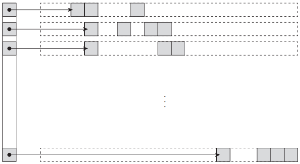

**图 1.15**

压缩稀疏行矩阵的图示。每个ow存储非零元素（灰色框）和指针列表

​		有效表示稀疏矩阵的数据结构之一是每行存储非零元素及其列索引。然后将每一行存储为一个列表，如图1.15所示。这种方法称为压缩稀疏行（CSR）矩阵。如果压缩是以列为单位进行的，则称为压缩稀疏列（CSC）矩阵。要了解其他压缩格式，请参阅Saad关于稀疏矩阵的技术论文[99]。在本书中，基于网格的流体模拟器使用稀疏矩阵来求解线性系统，对于此类用例，我们可以进一步优化压缩格式。详情见附录C.1。

### 1.3.4  系统的线性方程组（System of Linear Equations）

​		在处理数值求解问题时，我们经常遇到线性方程组。例如，基于网格的模拟器中的扩散或压力方程通常通过求解线性系统来计算。我们将在第3章中介绍细节，但这些问题需要计算具有许多约束的问题，并对流体系统有更加宏观的理解。

​		当我们有一组线性方程组时，我们可以用矩阵来表示这个集合或系统。例如，考虑线性方程组：
$$
2x-y=3\\
-x+2y=6
$$
​		我们可以通过将第一行乘以2，将其添加到第二行以消除y项，然后将其除以3得到x=4和y=5来求解上述方程。这也可以从几何角度进行解释；求x–y平面上两条直线的交点。或者，我们可以将方程转换为矩阵和向量形式，就像这样
$$
\left[\begin{matrix}2&-1\\
-1&2\\
\end{matrix}\right]
\left[\begin{matrix}x\\
y\\
\end{matrix}\right]
=
\left[\begin{matrix}3\\
6\\
\end{matrix}\right]
\tag{1.21}
$$
然后，可通过将方程两侧的逆矩阵相乘来计算该解，从而
$$
\left[\begin{matrix}x\\
y\\
\end{matrix}\right]
=\left[\begin{matrix}2&-1\\
-1&2\\
\end{matrix}\right]^{-1}

\left[\begin{matrix}3\\
6\\
\end{matrix}\right]
=\frac{1}{3}
\left[\begin{matrix}2&1\\
1&2\\
\end{matrix}\right]\left[\begin{matrix}3\\
6\\
\end{matrix}\right]
=\left[\begin{matrix}4\\
5\\
\end{matrix}\right]
\tag{1.22}
$$
如果我们把这个过程推广到N维系统，我们可以把线性方程组表示为
$$
Ax=b\tag{1.23}
$$
其中A是系统矩阵，x是未知解，b是线性方程组常数项的向量

#### 1.3.4.1 直接求解法 （Direct Methods）

​		上面的例子使用逆矩阵来计算解是求解线性系统的一种方法。这里的关键是如何计算逆矩阵，从上一节我们知道，我们可以使用高斯-乔丹消去法。这种不经近似*直接计算解的方法称为“直接”方法。对于小型系统，直接方法可能很有用。但对于许多数值问题中的大系统，由于时间复杂性，直接方法往往不切实际。例如，高斯-乔丹消去法的时间复杂度为O（N3），其中N是线性系统的维数。

#### 1.3.4.2 间接求解法 （Indirect Methods）

​		与直接计算解决方案不同，获得解决方案的另一种方法是进行初始猜测并多次迭代以接近答案。如果确定达到预定义阈值，表明近似解足够好，我们可以终止迭代并使用最后一个已知答案。这种方法称为“间接”方法。

##### 1.3.4.2.1 雅可比方法（Jacobi Method）

​		假设系统矩阵A是对角矩阵。这意味着只有对角元素a~ii~是非零的，其他非对角元素都是零。在这种情况下，求A的逆矩阵非常简单；A^-1^的第i个对角元素就是1/a~ii~。如果A不是对角矩阵，但对角分量仍然占主导地位，我们可以预测A^−1^类似于D^−1^，其中D是矩阵A的对角线部分。记住这一点，让我们重写方程1.23，比如
$$
(D+R)x=b\tag{1.24}
$$
​		其中R=A-D。这个这个方程可以进一步推导
$$
Dx=b-Rx\tag{1.25}
$$
​		最后
$$
x=D^{-1}(b-Rx)\tag{1.26}
$$
​		如果上面的x是正确的解，则方程将成立。但是，如果左侧和右侧的x不同，则将新x放到右侧将导致左侧的x不同。我们可以通过将结果x从左侧再次传递到右侧，直到两个x都达到相同的值，从而继续迭代
$$
x_i^{k+1} = \frac{1}{a_{ii}}(b_i-\sum_{j\neq i}a_{ij}x_j^k)\tag{1.28}
$$
​		其中k是迭代次数。这个过程称为雅可比迭代，这种方法称为雅可比方法。根据上面的最后一个等式，如果系统矩阵是纯对角矩阵，R应该为零。因此，我们只需一次迭代就能得到正确的解。如果系统矩阵A并不是纯对角矩阵，则Rx将涌入更多的非零元素，需要更多的迭代才能收敛。一般来说，Jacobi方法具有O（N2）时间复杂度[100]。

ps：雅可比迭代在对角矩阵不占优势（dominant）的情况下可能会发散

对角阵占优：简而言之就是对角矩阵的某一元素比该元素所在行的所有元素相加都要大（除该元素），见下公式
$$
|a_{ii}|\geq\sum_{j\neq i}|a_{ij}|
$$


##### 1.3.4.2.2 高斯-赛德尔法（Gauss-Seidel Method）

​		为了加速Jacobi方法的收敛，让我们尝试将更多信息传递到方程的右侧，而不是对角线。与雅可比方程类似，我们可以将方程1.23改写为：
$$
(L+U)x=b\tag{1.29}
$$
​		其中L是矩阵的下三角部分，包括对角线，U是严格的上三角部分。例如，
$$
\left[\begin{matrix}1&2&3\\
4&5&6\\
7&8&9\\
\end{matrix}\right]=
\left[\begin{matrix}1&0&0\\
4&5&0\\
7&8&9\\
\end{matrix}\right]
\left[\begin{matrix}0&2&3\\
0&0&6\\
0&0&0\\
\end{matrix}\right]
$$
​		这里，右边的第一个矩阵是L，最后一个是U。然后我们可以把迭代方程写成
$$
Lx=b-Ux\tag{1.31}
$$
​		现在，与对角矩阵不同，知道三角矩阵L的求逆不是一个简单的任务，而且需要直接的方法。然而，如果你仔细研究这个方程，你会注意到x的第一个元素x1，可以通过简单的计算得到
$$
x_1^{k+1}=\frac{1}{a_{11}}(b_1 - \sum_{j>1}a_{1j}x^k_j)\tag{1.32}
$$
​		因为我们现在有x~1~^k+1^，我们可以将此解分配给方程的第二行，即：
$$
x_2^{k+1}=\frac{1}{a_{22}}(b_2 - a_{21}x_1^{k+1} -\sum_{j>i}a_{2j}x^k_j)\tag{1.33}
$$
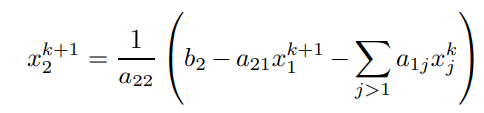

ps:原图是上面这个，怀疑错了

为了推广这个过程，我们可以将迭代方程写成如下：
$$
x_i^{k+1}=\frac{1}{a_{ii}}(b_i - \sum_{j>i}a_{ij}x_j^{k+1} -\sum_{j>i}a_{ij}x^k_j)\tag{1.34}
$$
​		因此，在不反转矩阵L的情况下，我们可以执行迭代。这就是所谓的高斯-赛德尔方法。请注意，上述方程中的项
$$
\sum_{j>i} a_{ij}x_{j}^{k+1}
$$
是**高斯-赛德尔方法**和**雅可比方法**之间的唯一区别。**该项是前一行的解的贡献，它使迭代最新**，因此比雅可比迭代收敛得更快。但是，该方法仍然具有O（N2）时间复杂度，这与Jacobi方法相同。

##### 1.3.4.2.3 梯度下降法（Gradient Descent Method）	

​		另一种解决线性系统的方法是通过解决最小化问题。根据方程式1.23
$$
F(x)=|Ax-b|^2\tag{1.35}
$$
​		如果输入x是方程解，此函数将返回零。如果不是，我们可以迭代找到使F（x）=0的x。例如，想象一个二维系统，其中F（x）可以绘制，如图1.16所示。从x1开始的点在每一步都遵循最陡（或梯度）方向，垂直于等角线。*经过足够的迭代后，解将收敛，使函数F最小化。这个过程称为梯度下降法。然而，在流体模拟中求解线性系统时，由于收敛速度慢，很少使用梯度下降法。例如，如果图1.16中椭球体的一个半轴比另一个长得多，则需要多次迭代才能得到最终解。然而，梯度下降法这种方法 为最常用的方法之一：共轭梯度法 提供了基础。

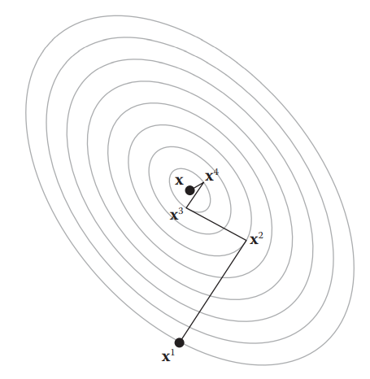

**图 1.16**

梯度下降过程的图示。灰线表示函数F的等熵线

##### 1.3.4.2.4 共轭梯度法（Conjugate Gradient Method）\\ TODO

​		在实践中，通常使用称为共轭梯度（CG）的扩展方法。该方法不是在每次迭代时采用最陡的方向，而是遵循“共轭”方向。当两个向量a和b满足
$$
a\cdot(Ab)\tag{1.36}=0
$$
​		我们说这两个向量是共轭的。注意，在确定共轭时涉及系统矩阵A。因此，在寻找方向向量时，系统的特性会得到反映。对于N维系统，这些共轭向量的最大数目是N。因此，CG方法最多需要N次迭代才能完全收敛到解。图1.17说明了CG程序。与最陡的梯度不同，只需两次迭代即可找到相同的解。有关CG方法的更深入的见解和实现细节，请参见Shewchuk[107]的注释。从我们的代码库中，可以在jet/include/cg.h和jet/include/detail/cg-inl.h中找到实现。

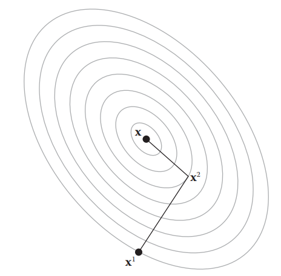

**图 1.17**

共轭梯度过程的图解。灰线表示函数F的等熵线

​		CG方法的实现细节，参见Shewchuk[107]的注释。从我们的代码库中，可以在jet/include/cg.h和jet/include/detail/cg inl.h中找到实现。为了进一步加速计算，有一种叫做“预处理”共轭梯度的方法。同样，Shewchuk[107]对算法的细节进行了很好的解释，但其思想是将预处理滤波器应用于系统，如

​		为了进一步加速计算，有一种叫做“预处理”共轭梯度的方法。同样，Shewchuk[107]对算法的细节进行了很好的解释，但其思想是将预处理滤波器应用于系统，如
$$
M^{-1}Ax=M^{-1}b \tag{1.37}
$$
​		其中M是易于计算逆矩阵但仍然类似于A的预处理矩阵。拥有这样的M将使M^−1^A接近单位矩阵，并将使收敛速度快于常规CG方法。实施情况见附录A.1或jet/include/detail/cg inl.h。\\ TODO

### 1.3.5  场（Field）

​		到目前为止，我们一直在处理一个或两个向量。在本节中，我们将把重点扩展到整个空间，其中在空间中的每个点上定义标量或向量值。这种映射，即点到值的映射，称为场。如果我们把一个点映射到一个标量值，比如温度或压力，那就是一个标量场。如果我们把一个点映射到一个向量，那么它就变成了一个向量场。我们通常从天气报告中看到的热图是一个标量场。风或海流是矢量场。在本书中，字段主要用于描述流体的物理量。但它可以用于任何其他一般量，即使它们没有物理意义，比如颜色。

​		为了使这个想法更有意义，让我们编写一些代码。以下是标量场和向量场的最小接口：

```c++
class Field3 {
    public:
    Field3();
    
    virtual ~Field3();
};

class ScalarField3 : public Field3 {
    public:
    ScalarField3();
    
    virtual ~ScalarField3();
    
    virtual double sample(const Vector3D& x) const = 0;
};

class VectorField3 : public Field3 {
    public:
    VectorField3();
    
    virtual ~VectorField3();
    
    virtual Vector3D sample(const Vector3D& x) const = 0;
};
```

​		我们可以看到，我们有基类Field3来表示一个3D场。它不存储任何数据也不执行任何操作，但它只是层次结构的根。它由ScalarField3和VectorField3继承，它们定义了特定的标量和向量场接口。我们目前在两个抽象基类中都有一个虚拟函数示例；此函数表示将三维中的点映射为标量值或向量值的场

​		我们现在可以扩展这些基类来实现实际场。例如，让我们定义一个标量函数，如下所示：
$$
f(x)=f(x,y,z)=sinx\cdot siny\cdot sinz\tag{1.38}
$$
​		其中，向量x是（x，y，z），f（x）是将x映射为标量值的标量函数。图1.18显示了此函数的外观。现在，我们可以通过覆盖前面定义的纯虚拟函数来实现此字段：

```c++
class MyCustomScalarField3 final : public ScalarField3 {
    public:
    double sample(const Vector3D& x) const override {
        return std::sin(x.x) * std::sin(x.y) * std::sin(x.z);
    }
};
```

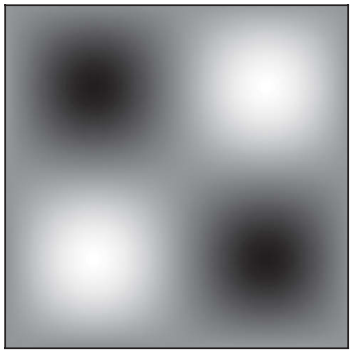

**图 1.18**

示例标量场f(x,y,z) = sinx siny sinz在z=pi/2处的横截面

​		同样，我们也可以定义简单的向量场，其中
$$
F(x) = F(x,y,z)=(F_x,F_y,F_z) = (sinx\cdot siny,siny\cdot sinz,sinz\cdot sinx)\tag{1.39}
$$
​		根据方程式1.39，向量场F用黑体字表示，因为它将一个向量映射到另一个向量。它还以扩展向量形式（F~x~、F~y~、F~z~）编写，其中每个元素分别对应于F(x)~x~、F(x)~y~和F(x)~z~。图1.19说明了该字段的外观，等效代码可以写成：

```c++
class MyCustomVectorField3 final : public VectorField3 {
    public:
    Vector3D sample(const Vector3D& x) const override {
        return Vector3D(std::sin(x.x) * std::sin(y),
                        std::sin(x.y) * std::sin(z),
                        std::sin(x.z) * std::sin(x));
    }
};
```

​		到目前为止，这是相当直观的。我们定义了将给定点映射到标量或向量值的标量和向量场。从现在起，我们将看到我们可以从场进行什么样的操作或测量。此操作将一个场转换为另一个场，该场测量给定场的不同特征。最常用的操作是**梯度、拉普拉斯**、**散度和旋度**。前两个操作主要应用于**标量场**，后两个操作仅适用于向量场。让我们了解一下这些操作符的含义以及如何实现它们

#### 1.3.5.1 偏导数（Partial Derivative）

​		在我们开始之前，让我们先谈谈偏导数，它是定义和理解本节将介绍的所有运算符的最重要的模块。有些读者可能会觉得这很熟悉，而有些读者则不会。因此，我将非常简短和非正式地解释基本思想，但如果您对学习更多感兴趣，请参阅向量微积分教科书[82101]以了解详细介绍。

​		偏导数只不过是测量给定场在给定位置的切线的方法。但我们称之为“偏导数”，因为我们是沿着给定多维场的特定方向求导数。假设我们有一个标量场f（x）。要计算x=（x，y，z）处x轴的斜率，我们可以从以下等式开始：
$$
\frac{f(x+\triangle,y,z)-f(x,y,z)}{\triangle}\tag{1.40}
$$
​		式中，Δ是x方向上一个相当小的间隔。该方程简单地使用稍微向左和向右的点的场值，并将差值除以它们之间的间距。如果Δ变得很小，那么近似切线收敛到真实的切线，我们说这是x方向上x点的偏导数。该偏导数表示为
$$
\frac{\partial f}{\partial x}(x)\tag{1.41}
$$
​		因此，该过程就像将平行于x轴的给定标量场切片，并测量横截面的切线，如图1.20所示。类似地，我们可以将y和z方向导数写成
$$
\frac{\partial f}{\partial y}(y)
$$
​		以及
$$
\frac{\partial f}{\partial z}(z)
$$
现在假设我们有一个标量场，f(x，y，z)=xy+yz。当对某一轴取偏导数时，我们简单地将其它变量看作常量导数中的常数。因此∂f/∂x在这种情况下会得到
$$
\frac{\partial f}{\partial x}(x) = y\tag{1.42}
$$
因为(xy)'=y和(yz)'=0。对于y和z，我们可以应用相同的例程得到
$$
\frac{\partial f}{\partial y}(x)= x+z
$$
以及
$$
\frac{\partial f}{\partial z}(x)= y
$$
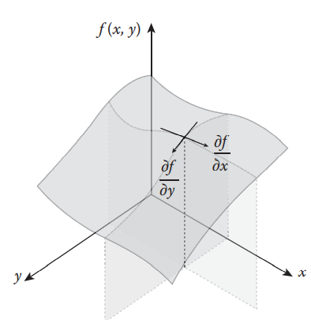

**图 1.20**

x轴和y轴的偏导数显示为2D场f(x，y)。每个导数都是横截面的斜率

​		此外，MyCustomScalarField中字段的偏导数，即f（x，y，z）=sin x sin y sin z，可以写成
$$
\frac{\partial f}{\partial x}(x) = cosx\cdot siny \cdot sinz
$$

$$
\frac{\partial f}{\partial y}(x) = sinx\cdot cosy \cdot sinz
$$

$$
\frac{\partial f}{\partial z}(x) = sinx\cdot siny \cdot cosz
$$

​		现在使用这些偏导数作为我们的基础，让我们来看看我们如何定义其他算子，从梯度开始。

#### 1.3.5.2 梯度（Gradient）

​		梯度算子测量标量场中的变化率和方向，如图1.21所示。从图中，请注意箭头指向“较高”区域，并垂直于等角线。这些是采样位置处最陡的坡度方向

​		梯度算子表示为∇, 我们可以将运算符定义为：
$$
\gradient f(x) = (\frac{\partial f}{\partial x}(x),\frac{\partial f}{\partial y}(x),\frac{\partial f}{\partial z}(x))\tag{1.43}
$$
​		∂/∂x,，∂/∂y、 及∂/∂z是偏导数，如我们从方程1.41中看到的。所以根据定义，梯度算子就是所有方向上的偏导数。

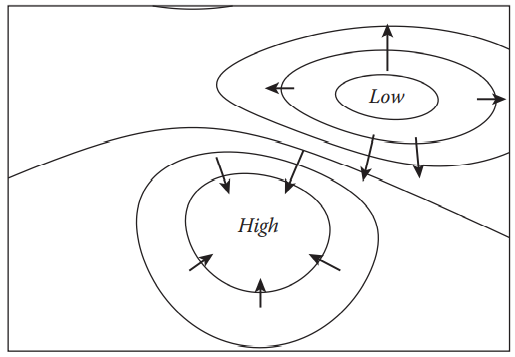

图 1.21

绘制等角线表示高度，梯度向量用箭头表示。高度场来自Matplotlib示例之一[54]。

如果我们将梯度方程（1.43）应用于我们前面的示例标量场，它将变为
$$
\gradient f(x) = (cosx\cdot siny \cdot sinz,sinx\cdot cosy \cdot sinz,sinx\cdot siny \cdot cosz)\tag{1.44}
$$
要将此功能添加到现有类中，首先更新ScalarField3，如下所示：

```c++
class ScalarField3 : public Field3 {
public:
    ...
    virtual Vector3D gradient(const Vector3D& x) const = 0;
};
```

我们还可以将示例类MyCustomScalarField3更新为

```c++
class MyCustomScalarField3 : public ScalarField3 {
public:
    ...
    Vector3D gradient(const Vector3D& x) const {
    return Vector3D(std::cos(x.x) * std::sin(x.y) * std::sin(x.z),
                        std::sin(x.x) * std::cos(x.y) * std::sin(x.z),
                        std::sin(x.x) * std::sin(x.y) * std::cos(x.z));
    }
};
```

​		图1.22显示了代码的结果。您可以注意到箭头指向图1.18中的明亮区域，这是梯度定义所预测的。

​		梯度算子通常与能量场一起使用。例如，如果我们把一个球放在不平的地面上，它会从一个较高的位置滚到较低的位置。作用在那个球上的力试图使重力势能最小化，或者换句话说，试图找到附近可能的最低能级（找低的地方滚）。因此，力与地面高度的梯度（地面的陡峭程度）成正比。另一个例子是我们经常从天气预报中看到的压力。我们知道风从高压区吹到低压区。这也与压力场的梯度有关。我们将在第1.7.2节中重新讨论该主题，在该节中我们将讨论流体动力学。

ps：简而言之，人往高处走，球往低处滚，球上的力想要尽快的消耗球的重力势能，所以会往坡度更陡的方向滚，而这个方向就是梯度

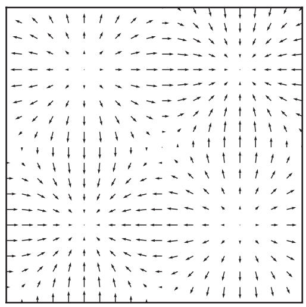

**图 1.22**

示例梯度场在z = pi/2处的横截面

#### 1.3.5.3 散度（Divergence）

​		让我们把焦点移到向量场。矢量场的一个重要测量是散度。对于向量场中的给定点，散度操作符使用标量值测量流入或流出流。想象一个非常小的立方体，假设我们在立方体的每个面上测量给定向量场的向量。如果向量的大小之和大于零，则表示立方体内部产生了一些流；因此，它是一个来源。如果总和小于零，那么某个东西正在吸收水流，这意味着它是一个水槽。总和的大小决定了产生或吸收的量。图1.23更直观地解释了这一想法。

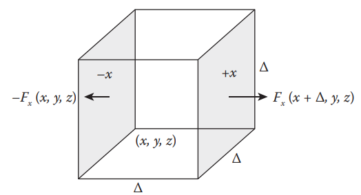

**图 1.23**

显示大小为 Δ x Δ x Δ 的立方体的图像。两个箭头表示+x和-x处的向量场

​		为了测量散度，让我们从图1.23中的立方体开始。立方体的大小为Δ。因此，面面积为Δ^2^。现在通过 +x 面流入或流出的总流量为
$$
\triangle^2 F_x(x+\triangle,y,z)\tag{1.45}
$$
​		其中F=（F~x~，F~y~，F~z~）是输入向量场。因此，F~x~（x+Δ，y，z）是**+x面**上的x方向向量场。同样地，-x面上的x方向向量场为
$$
-\triangle^2 F_x(x,y,z)\tag{1.46}
$$
​		注意，我们使用负号，因为在这种情况下+是向内的方向。现在让我们对每个立方体面求和。然后我们将有
$$
sum=\triangle^2(F_x(x+\triangle,y,z)-F_x(x,y,z)\\
+F_y(x,y+\triangle,z)-F_y(x,y,z)\\
+F_z(x,y,z+\triangle)-F_z(x,y,z))
$$
​		上面的方程测量立方体的散度。实际上，它测量的是立方体整个体积的散度之和。我们把它除以立方体的体积，也就是Δ^3^，得到
$$
\frac{sum}{Volume}=\frac{F_x(x+\triangle,y,z)-F_x(x,y,z)}{\triangle}\\
+\frac{F_y(x,y+\triangle,z)-F_y(x,y,z)}{\triangle}\\
+\frac{F_z(x,y,z+\triangle)-F_z(x,y,z)}{\triangle}
$$
​		注意到一些图案了吗？是的，这就像x，y和z的近似偏导数之和（方程1.40）。因此，如果Δ足够小，我们就得到了散度算符：
$$
\divergence F(x) = \frac{\partial F_x}{\partial x}+\frac{\partial F_y}{\partial y}+\frac{\partial F_z}{\partial z}\tag{1.47}
$$
​		这里，散度算子表示为∇·。这个方程就像在给定的点上用算符和向量求点积一样：
$$
\divergence F(x) = (\frac{\partial}{\partial x},\frac{\partial}{\partial y},\frac{\partial}{\partial z})\cdot F(x) \tag{1.48}
$$
​		如果我们把这个散度算符应用到样本向量场F（x，y，z）=（sin x sin y，sin y sin z，sin z sin x），它将变成cos x sin y+cos y sin z+cos z sin x。要将此功能添加到VectorField3，让我们再向类添加一个虚拟函数：

```c++
class VectorField : public Field3 {
public:
    ...
    virtual double divergence(const Vector3D& x) const = 0;
};
```

​		我们示例类MyCustomVectorField3的函数的实际实现可以写成：

```c++
class MyCustomVectorField3 : public VectorField3 {
public:
    ...
    double divergence(const Vector3D& x) const {
    return std::cos(x.x) * std::sin(x.y)
            + std::cos(x.y) * std::sin(x.z)
            + std::cos(x.z) * std::sin(x.x);
    }
};
```

​		图1.24显示了代码的结果。原始矢量场（sinxsiny，sinysinz，sinzsinx）指向内部的点，散度告诉我们这些是汇。向量朝外的点也是如此。

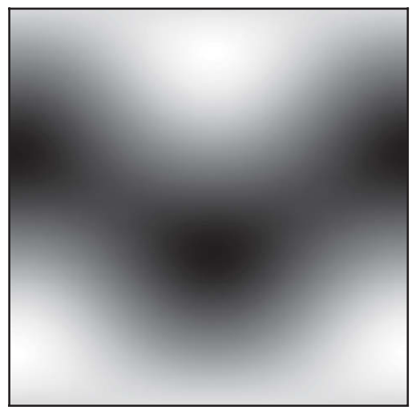

**图 1.24**

示例散度场在z=pi/2处的横截面

#### 1.3.5.4 旋度（Curl）// TODO

​		如果散度测量汇(sink)和源(source)，旋度计算给定点上矢量场的旋转流。如图1.25所示，想象xy平面中的一个小正方形。为了测量围绕该正方形的旋转，我们首先计算+y和-y之间x方向向量的差。然后，我们在+x和-x之间做相同的计算。最后，沿逆时针方向总结这些差异。我们可以把它写成一个近似方程
$$
(\frac{F_y(x+\triangle,y,z)-F_y(x,y,z)}{\triangle}-\frac{F_x(x,y+\triangle,z)-F_z(x,y,z)}{\triangle})k\tag{1.49}
$$
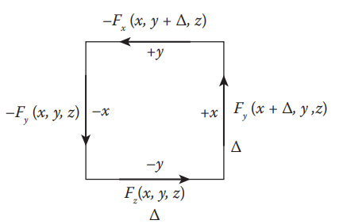

**图 1.25**

用沿边缘的速度场表示的，尺寸为 Δ x Δ的正方形

​		式中，Δ是我们从近似偏导数（方程式1.40）中看到的正方形宽度。如果我们将其扩展到非近似版本，*它将变成：
$$
rotation_z = (\frac{\partial F_y}{\partial x}-\frac{\partial F_x}{\partial y})k\tag{1.50}
$$
​		此方程式测量z轴上的旋转。如果我们进一步将此计算扩展到x轴和y轴，则旋度操作符可以定义为
$$
\curl F(x) = (\frac{\partial F_z}{\partial y}-\frac{\partial F_y}{\partial z})i+(\frac{\partial F_x}{\partial z}-\frac{\partial F_z}{\partial x})j+(\frac{\partial F_y}{\partial x}-\frac{\partial F_x}{\partial y})k\tag{1.51}
$$
​		与散度操作符类似∇x算子可以解释为取偏导数与场的叉积。
$$
\curl F(x) = (\frac{\partial}{\partial x},\frac{\partial}{\partial y},\frac{\partial}{\partial z})\cross F(x) \tag{1.52}
$$
​		旋度操作符的结果是一个向量。矢量的方向和大小分别对应于旋转轴和旋转量。因此，如果您找到一个长度较长的+x方向向量作为输出，则表示给定位置周围的向量场围绕+x轴旋转很多。例如，想象一个简单的向量场
$$
F(x,y,z)=(-y,x,0)\tag{1.53}
$$
​		如图1.26所示，该磁场绕z轴逆时针旋转。该场的旋度为
$$
F(x,y,z) = (0,0,2)\tag{1.54}
$$
​		它与z轴平行。如果将旋度算子应用于我们的样例向量场函数F（x，y，z）=（sin x sin y，sin y sin z，sin z sin x），它将变为(− siny cos z，− sinz cos x，− sinx cos y）。为了实现这一点，我们还向VectorField3添加了一个新的虚函数，并从子类中实现它。例如，我们的示例向量字段类MyCustomVectorField3可以实现为：

```c++
class MyCustomVectorField3 : public VectorField3 {
public:
    ...
    Vector3D curl(const Vector3D& x) const {
    return Vector3D(-std::sin(x.y) * std::cos(x.z),
                        -std::sin(x.z) * std::cos(x.x),
                        -std::sin(x.x) * std::cos(x.y));
    }
};
```

​		该代码的结果如图1.27所示

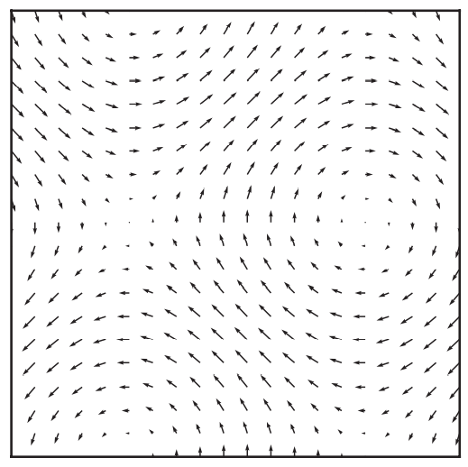

图1.27

z=pi/4时示例旋度场的横截面

#### 1.3.5.5 拉普拉斯（Laplacian）

​		最后，让我们见见拉普拉斯。拉普拉斯算子测量给定位置的标量场值与附近平均场值的差异。换句话说，此运算符计算标量场上的“凹凸”。查看图1.28中的标量场示例。它显示类似于二维高度场的地形。然后，拉普拉斯算子的结果显示山尖，山谷的中心线用白色和黑色拉普拉斯值高亮显示。没有任何曲率的平面或坡度的拉普拉斯值为零（图像中的灰色区域）。

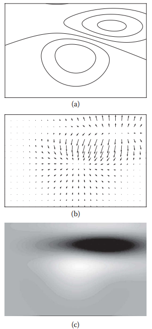

**图 1.28**

（a）原始标量场

（b）梯度场和

（c）拉普拉斯场

​		为了更深入地理解，让我们从梯度开始。再举一次上一个例子，图1.28（b）显示了梯度场，我们可以注意到，向量要么在非平面特征存在的区域收敛，要么扩展。现在，我们已经知道，衡量向量场收敛或扩展程度的算符是散度。因此，我们可以首先将梯度应用于原始标量场以获得中间向量场，然后应用散度来获得描述输入场凹凸性的最终标量场。这是拉普拉斯算子的定义，我们可以写成
$$
\laplacian f(x) = \divergence \gradient f(x) = \frac{\partial^2f(x)}{\partial x^2} + \frac{\partial^2f(x)}{\partial y^2} + \frac{\partial^2f(x)}{\partial y^2}\tag{1.55}
$$
ps：此处f(x)中的x是三维向量

```c++
    class ScalarField3 : public Field3 {
    public:
    ...
    virtual double laplacian(const Vector3D& x) const = 0;
    };
```

我们的示例类可以实现为：

```c++
class MyCustomScalarField3 : public Field3 {
    public:
    ...
    double laplacian(const Vector3D& x) const {
    return -std::sin(x.x) * std::sin(x.y) * std::sin(x.z)
            -std::sin(x.x) * std::sin(x.y) * std::sin(x.z)
            -std::sin(x.x) * std::sin(x.y) * std::sin(x.z);
    }
};

```

​		由于拉普拉斯算子测量峰值和边缘，该算子的一个流行应用是给定标量场的边缘检测，因为输出指示边缘的位置和陡峭程度。此外，如果我们获取该输出并对原始标量场进行加减，则可以模糊或锐化输入。如果我们回到前面的地形示例，则山尖具有负拉普拉斯值。如果我们将拉普拉斯场添加到原始地形场，它将降低尖端的最尖锐点，从而使特征点变暗和模糊。当你用拉普拉斯场进行减法时，会发生完全相反的事情，这会使原始图像锐化。图1.29显示了示例结果。

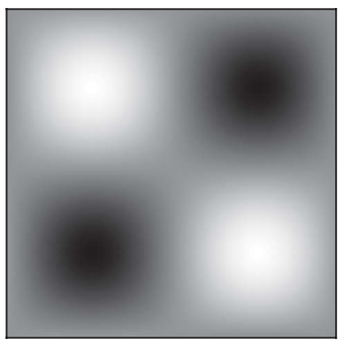

**图 1.29**

示例拉普拉斯场在z=pi/2处的横截面

### 1.3.6 插值（Interpolation）

​		插值是从已知数据值计算未知值的近似过程。因为这本书的目标是用计算机模拟物理，所以连续和无限的真实世界由有限的数据点表示。因此，要使用这种离散样本进行物理计算，通常需要在数据不可用的情况下评估值。

​		想象一辆汽车经过a到B，如图1.30所示，我们只记录了这两个检查站的位置。要想猜出这辆车在这两辆车之间的位置，其中一个选项就是画一条线，假设这辆车就在上面（图1.30b）。为了更好地猜测，我们可以考虑使用基于汽车位置和方向的曲线，如图1.30c所示。

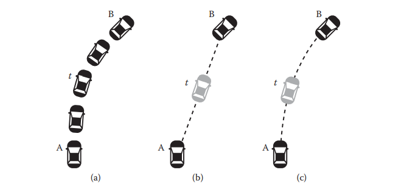

**图 1.30**

（a） 汽车的实际轨迹，（b）直线近似，（c）曲线近似。灰色汽车显示了两种不同近似方法在时间t的近似位置。

​		与car示例类似，我们可以通过对低分辨率图像的像素进行插值来近似高分辨率图像。如图1.31所示，新像素的值是通过查找附近的低分辨率像素并用不同的权重对其进行平均来确定的。
​		有不同的方法来确定权重，但直观地说，我们可以想象，相邻像素越近，加权平均值的贡献就越大。

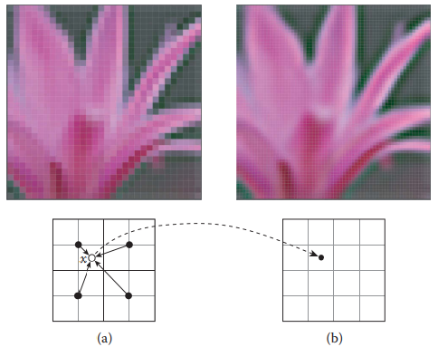

**图 1.31**
图（b）由图（a）插值得到

​		上面的例子显示了我们在处理离散数据时遇到的非常常见的情况，我们可以编写通用插值代码，也可以应用于其他计算。当然，有各种不同特征的算法。但在下一节中，我们将介绍可用于许多其他数据处理应用程序的最通用和最常用的方法。

#### 1.3.6.1 最近点（Nearest Point）

​		通过取**最近**的**数据点的值**来近似是插值的最简单方法。考虑下面的代码：

```c++
template<typename S, typename T>
inline S nearest(const S& f0, const S& f1, T t) {
    return (t < 0.5) ? f0 : f1;
}
```

​		该代码包含三个参数。第一个参数f0是0处的值，第二个参数f1是1处的值。最后一个参数f是介于0和1之间的值。如果此f小于0.5，这意味着它更接近第一个参数，则返回f0。否则，它将更接近f1并返回它。图1.32说明了使用示例数据点时函数的外观。请注意，生成的图形是一组不相交的平面线段。该段从两个数据样本的右中点开始和结束，因为该方法采用最新的数据点进行插值。由于这种不连续性，该方法不适用于插值平滑函数，但适用于快速计算。

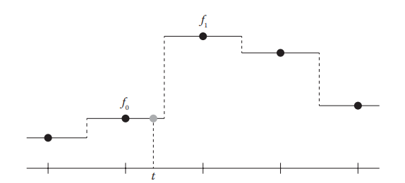

**图 1.32**

对于给定的数据点（黑点），平面实线使用最近点法显示插值结果

ps：（其实就是不插值）

#### 1.3.6.2 线性插值（Linear Interpolation）

​		线性插值，或通常简称为“lerp”，可能是最流行的方法，因为它简单有效，但在许多应用中仍能给出合理的结果。如图1.33所示，它通过一条线连接两个数据点来近似两个数据点之间的值。


**图 1.33**

​		对于给定的数据点（黑点），直线使用线性方法显示插值结果

代码可以直接编写。它实际上比上面的最近点近似更简单，因为新代码没有这样的条件语句

```c++
template<typename S, typename T>
inline S lerp(const S& f0, const S& f1, T t) {
    return (1 - t) * f0 + t * f1;
}
```

​		现在，让我们考虑多维情况。我们希望在矩形或长方体中执行线性近似。这可以通过级联每个维度的线性插值来实现。如图1.34所示，首先沿x轴插值，然后对其余轴执行插值。2D线性插值通常称为双线性插值，下面的代码是该算法的实现

```c++
template<typename S, typename T>
inline S bilerp(
    const S& f00,
    const S& f10,
    const S& f01,
    const S& f11,
    T tx, T ty) {
    return lerp(
        lerp(f00, f10, tx),
        lerp(f01, f11, tx),
        ty);
}
```

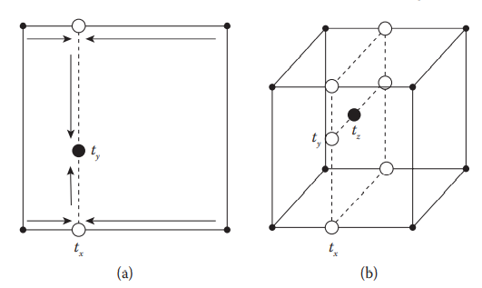

**图 1.34**

显示点（tx，ty）（a）处双线性和点（tx，ty，tz）（b）处三线性插值的图像。

​		同样的想法可以扩展到3D（称为三线性插值），如下所示。

```c++
template<typename S, typename T>
inline S trilerp(
    const S& f000,
    const S& f100,
    const S& f010,
    const S& f110,
    const S& f001,
    const S& f101,
    const S& f011,
    const S& f111,
    T tx,
    T ty,
    T tz) {
    return lerp(
        bilerp(f000, f100, f010, f110, tx, ty),
        bilerp(f001, f101, f011, f111, tx, ty),
        tz);
}
```

​		无论以何种顺序执行插值，都可以轻松验证结果是否相同。上面的代码首先取x轴，然后是y轴和z轴。但你颠倒顺序并不重要。如果展开级联函数，将注意到每个角点值都乘以插值点另一侧的面积（2D）或体积（3D）。图1.35更直观地说明了这意味着什么。

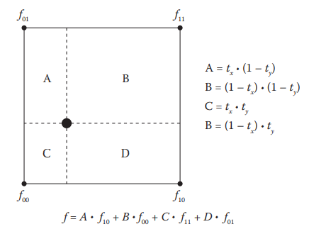

**图 1.35** 

通过权重解释双线性插值

#### 1.3.6.3 Catmull-Rom样条插值（Catmull-Rom Spline Interpolation）

​		要执行线性插值，我们只需要两个数据点。但是，如果我们有更多的数据，这样我们就可以向插值代码提供更多的信息，那该怎么办呢？它会产生更好的近似值吗？

​		Catmull–Rom样条插值是经典插值方法之一[27]，它生成样条曲线来插值中间值。假设我们有四个具有均匀间距的数据点，我们可以首先从通过这些点的三阶多项式函数开始：
$$
f(t) = a_3t^3 + a_2t^2 +a_1t+a_0\tag{1.56}
$$
​		该函数的输入是一个参数变量t，它介于0和1之间。然后，输出f（t）由多项式函数定义。我们目前不知道a0、a1、a2和a3是什么，但假设四个给定点f0、f1、f2和f3对应于t=分别为−1、0、1和2。因此，我们现在知道a0是f1。

​	我们也可以取v（t）的导数：
$$
v'(t) = d(t) = 3a_3t^2+2a_2t+a_1\tag{1.57}
$$
​		我们在t=0和1时用
$$
d(0)=d_1 = (f_2-f_0)/2\\
d(1) =d_2=(f_3-f_1)/2
$$
​		这意味着d1和d2是0和1处的平均斜率。这也给出了a1的解，即d1=（f2− f0）/2。现在剩下的未知数是a2和a3。可通过设置t=1并求解线性方程组来计算这些值：
$$
f_2 = a_3+a_2+a_1+a_0\\
d_2=3a_3+2a_2+a_1
$$
​		求解这些方程将得到以下代码：

```c++
template <typename S, typename T>
inline S catmullRomSpline(
    const S& f0,
    const S& f1,
    const S& f2,
    const S& f3,
    T f) {
    S d1 = (f2 - f0) / 2;
    S d2 = (f3 - f1) / 2;
    S D1 = f2 - f1;
    
    S a3 = d1 + d2 - 2 * D1;
    S a2 = 3 * D1 - 2 * d1 - d2;
    S a1 = d1;
    S a0 = f1;
    
    return a3 * cubic(f) + a2 * square(f) + a1 * f + a0;
}
```

​		如图1.36所示，与线性插值相比，代码给出了更平滑和连续的近似值。当然，除了线性或Catmull–Rom样条方法外，还有各种插值方法。根据数据的应用和约束，可以选择更合适的插值方法。阅读Boor的书[18]或访问Bourke的网站[19]，了解插值的更多细节。

------------------------------

## 1.4 几何（Geometry）

​		在模拟流体时，我们通常需要设置流体的初始形状或定义与流体体交互的实体对象。在本节中，我们将实现开发流体引擎时经常使用的常见几何数据类型和操作

### 1.4.1 面（Surface）

​		在本书中，最重要的几何体类型是surface。曲面支持的一些基本操作包括从任意点查询曲面上最近的点、从该点测量曲面法线以及执行光线-曲面相交测试。Ray是表示具有一个端点的线的数据类型，如图1.37所示。

​		为了支持基本查询，可以如下所示定义类Surface3。

```c++
struct SurfaceRayIntersection3 {
    bool isIntersecting;
    double t;
    Vector3D point;
    Vector3D normal;
};

class Surface3 {
    public:
    Surface3();
    
    virtual ~Surface3();
    
    virtual Vector3D closestPoint(const Vector3D& otherPoint) const = 0;
    
    virtual Vector3D closestNormal(const Vector3D& otherPoint) const = 0;
    
    virtual BoundingBox3D boundingBox() const = 0;
    
    virtual void getClosestIntersection(
        const Ray3D& ray,
        SurfaceRayIntersection3* intersection) const = 0;
    
    virtual bool intersects(const Ray3D& ray) const;
    
    virtual double closestDistance(const Vector3D& otherPoint) const;
};

bool Surface3::intersects(const Ray3D& ray) const {
    SurfaceRayIntersection3 i;
    getClosestIntersection(ray, &i);
    return i.isIntersecting;
}

double Surface3::closestDistance(const Vector3D& otherPoint) const {
    return otherPoint.distanceTo(closestPoint(otherPoint));
}
```

​		请注意，BoundingBox3是一种三维轴对齐的AABB盒（axis-aligned bounding box），本质上是盒子的两个角点。Ray3D是具有光线原点和方向的类。最后，SurfaceRayIntersection3 是一个简单的结构体，它保存光线-曲面相交信息，例如从光线原点到交点（t）的距离、交点本身以及相交处的曲面法线。

​		可以通过重写上面显示的虚拟函数来扩展上面的基类。例如，球体几何体可以实现为：

```c++
class Sphere3 final : public Surface3 {
    public:
    Sphere3(const Vector3D& center, double radius);
    
    Vector3D closestPoint(const Vector3D& otherPoint) const override;
    
    Vector3D closestNormal(const Vector3D& otherPoint) const override;
    
    void getClosestIntersection(
        const Ray3D& ray,
        SurfaceRayIntersection3* intersection) const override;
    
    BoundingBox3D boundingBox() const override;
    
    private:
    Vector3D _center;
    double _radius = 1.0;
};

Vector3D Sphere3::closestPoint(const Vector3D& otherPoint) const {
    return _radius * closestNormal(otherPoint) + _center;
}

Vector3D Sphere3::closestNormal(const Vector3D& otherPoint) const {
    if (_center.isSimilar(otherPoint)) {
        return Vector3D(1, 0, 0);
    } else {
        return (_center - otherPoint).normalized();
    }
}

BoundingBox3D Sphere3::boundingBox() const {
    Vector3D r(_radius, _radius, _radius);
    return BoundingBox3D(_center - r, _center + r);
}
```

​		另一种常用的曲面类型是三角形网格，如图1.38所示。使用网格，可以表示广泛的几何图形，例如艺术家创建的对象或计算机视觉算法重建的场景。从代码库中，三角形及其网格分别实现为**Triangle3**和**TriangleMesh3**。这两个类的实现细节不会在本书中列出，但基本接口如下所示：

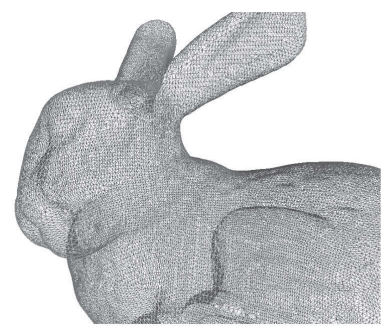

**图 1.38**

斯坦福兔模型中的三角形网格示例

```c++
class Triangle3 final : public Surface3 {
    public:
    std::array<Vector3D, 3> points;
    std::array<Vector3D, 3> normals;
    std::array<Vector2D, 3> uvs;

    Triangle3();

    Triangle3(
        const std::array<Vector3D, 3>& newPoints,
        const std::array<Vector3D, 3>& newNormals,
        const std::array<Vector2D, 3>& newUvs);

    Vector3D closestPoint(const Vector3D& otherPoint) const override;

    Vector3D closestNormal(const Vector3D& otherPoint) const override;

    void getClosestIntersection(
        const Ray3D& ray,
        SurfaceRayIntersection3* intersection) const override;

    bool intersects(const Ray3D& ray) const override;

    BoundingBox3D boundingBox() const override;

    ...
};

class TriangleMesh3 final : public Surface3 {
    public:
    typedef Array1<Vector2D> Vector2DArray;
    typedef Array1<Vector3D> Vector3DArray;
    typedef Array1<Point3UI> IndexArray;

    TriangleMesh3();

    TriangleMesh3(const TriangleMesh3& other);

    Vector3D closestPoint(const Vector3D& otherPoint) const override;

    Vector3D closestNormal(const Vector3D& otherPoint) const override;

    void getClosestIntersection(
        const Ray3D& ray,
        SurfaceRayIntersection3* intersection) const override;

    F Cat #K25519 — K25519_C001 — page 67 — 10/22/2016 — 15:24
        sics 67
        BoundingBox3D boundingBox() const override;

    bool intersects(const Ray3D& ray) const override;

    double closestDistance(const Vector3D& otherPoint) const override;

    ...

        private:
    Vector3DArray _points;
    Vector3DArray _normals;
    Vector2DArray _uvs;
    IndexArray _pointIndices;
    IndexArray _normalIndices;
    IndexArray _uvIndices;

    ...
};
```

​		代码库中还提供了其他曲面类型，如Box3和Plane3。请参阅代码库以了解更多信息。

### 1.4.2 隐式表面（Implicit Surface）

对于平面或三角形网格等曲面，曲面上的一个点是明确定义的，这意味着我们可以编写一个方程，如
$$
x=f(t_1,t_2,\cdots)\tag{1.58}
$$
​		其中t~i~是输入参数，x是曲面上的点。例如，对于球形曲面，可以使用两个参数来定位点。如图1.39所示，想象一对纬度和经度可以定义地球上的地理坐标。此类曲面擅长于某些操作，如测量几何体的边界框或可视化其形状。但是，诸如测试任意点是否位于曲面内部或测量最近曲面法线之类的操作,在使用这种表示的情况下，通常比较复杂，或者效率低下

​		定义曲面以有效处理此类计算的另一种方法是使用隐式函数。隐式方法不是将参数直接映射到曲面上的点，而是使用一个函数来告知输入点是否在曲面上。例如，可以使用距离函数表示球体
$$
f(x) =|x-c|-r\tag{1.59}
$$
​		其中x是空间中的任意点，c是球体的中心，r是球体的半径。此函数测量到曲面的最近距离，因此满足f（x）=0的一组点位于球面上。请注意，如果f（x）<0，则表示该点位于曲面内部，而f（x）>0表示位于曲面外部。因此，评估曲面的内部/外部变得非常简单。这种函数称为**“有向距离”函数或场（SDF）。**

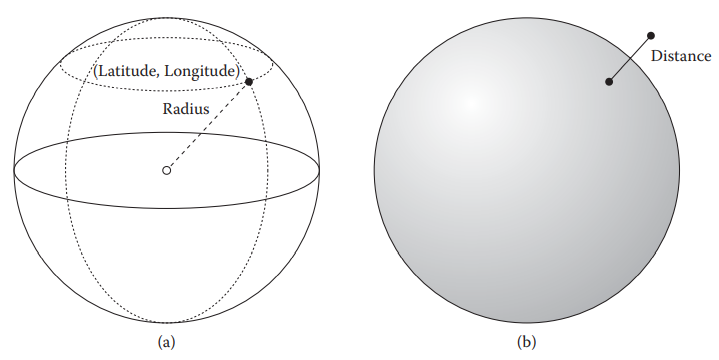

**图 1.39**

​		具有两种不同曲面类型，球体(a）使用半径、纬度和经度显式表示，球体(b）使用距离场的隐式表示。

​		不需要使用SDF定义隐式曲面，但使用SDF对于许多其他操作具有许多优点。例如，只需从SDF中减去一个常数，即可挤出曲面，如图1.40所示。这种操作的一个应用程序可以从文本中找到。要绘制具有轮廓或辉光效果的样式良好的文本，将矢量格式的字体转换为有向距离场[61]。// TODO这里的有点不太清楚在说什么

​		It is not required to define implicit surfaces with SDF, but using SDF has many advantages for many other operations. For example, simply subtracting a constant from an SDF will extrude the surface as shown in Figure 1.40. One of the applications of such an operation can be found from the text rendering. To draw nicely styled text with outlines or glow effect, a font in a vector format is converted into a signed-distance field [61].

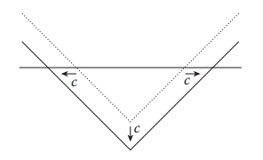

**图 1.40**

用c拉伸一维有向距离场相当于减去一个常量值c

​		另一个示例是曲面法线的计算。由于SDF始终返回到曲面上最近点的距离，因此曲面上SDF的梯度是曲面法线，因此
$$
n=\frac{\gradient f(x)}{|\gradient f(x)|}\tag{1.60}
$$
​		最后，两个SDF之间的布尔运算只是从两个函数中取最小值或最大值的问题。例如，h=min（f，g）表示两个SDF，f和g的并集。用从f中减去g，可以使用h=max（f，−g）。

​		要实现隐式曲面，我们可以使用以下基类：

```c++
class ImplicitSurface3 : public Surface3 {
    public:
    ImplicitSurface3();
    
    virtual ~ImplicitSurface3();
    
    virtual double signedDistance(const Vector3D& otherPoint) const = 0;
};
```

​		如您所见，该类向抽象基类Surface3添加了另一个虚拟函数signedDistance。例如，球体的隐式版本可以写成：

```c++
class ImplicitSphere3 final : public ImplicitSurface3 {
    public:
    ImplicitSphere3(const Vector3D& center, double radius);
    
    double signedDistance(const Vector3D& otherPoint) const override;
    
    ...
};

double ImplicitSphere3::signedDistance(const Vector3D& otherPoint) const{
    return _center.distanceTo(otherPoint) - _radius;
}
```

### 1.4.3 隐式表面转换为显式表面（Implicit Surface to Explicit Surface）

​		由于显式曲面和隐式曲面都有各自的属性，因此通常需要将它们转换为另一个。例如，只有通过执行光线跟踪才能直接可视化隐式曲面[74]。但是使用光栅化的经典或渲染管道，包括OpenGLR或DirectXR，通常需要显式表示，尤其是使用三角形网格。因此，我们需要一种将隐式曲面转换为显式网格的方法。

​		这种转换最流行的方法是marching cubes方法[76]。该方法从一个网格开始，其中每个网格点都有采样的隐式曲面函数。然后，如果八个网格单元角点之间存在符号差异，则该算法迭代网格单元并创建三角形。

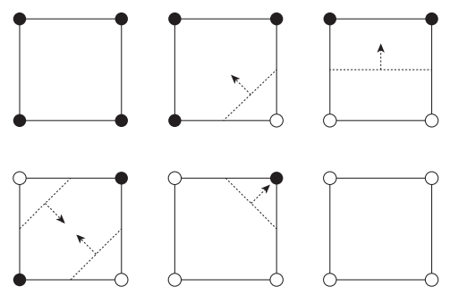

**图 1.41**

二维隐式场的六种可能情况。拐角处的黑点和白点分别表示正值和负值。虚线是重建的显式曲面，箭头是曲面法线。

ps：负值表示有物体存在

​		为了简化这个问题，让我们考虑一个2D曲面。图1.41说明了网格单元可能具有的所有情况。在这些情况下，请注意，如果有任何栅格点具有与其他栅格点不同的符号，则表示曲面正在通过该栅格单元。在这种情况下，我们可以在包含不同符号的边之间绘制线（3D中的三角形），并且这些线（同样，3D中的三角形）从每个网格单元的集合将是隐式函数的显式表示。确定边上新创建顶点的位置时，可以使用线性近似。图1.42显示了隐式曲面场中marching cubes（或marching squares）的示例结果。
$$
x=\frac{|\phi_{left}|}{|\phi_{left}|+|\phi_{right}|}
\tag{1.62}
$$
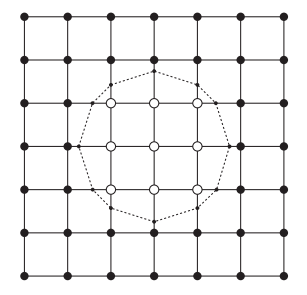

图 1.42

来自marching cubes的示例结果。拐角处的黑点和白点分别表示正值和负值。较小的点和虚线表示重建的显式曲面。

### 1.4.4 显式表面转换为隐式表面（Explicit Surface to Implicit Surface）

将常规显式曲面转换为隐式曲面很简单。考虑下面的代码。

```c++
class SurfaceToImplicit3 final : public ImplicitSurface3 {
public:
    explicit SurfaceToImplicit3(const Surface3Ptr& surface);
    
    double signedDistance(const Vector3D& otherPoint) const override;
    
    ...
        
private:
    Surface3Ptr _surface;
};

double SurfaceToImplicit3::signedDistance(
    const Vector3D& otherPoint) const {
    Vector3D x = _surface->closestPoint(otherPoint);
    Vector3D n = _surface->closestNormal(otherPoint);
    if (n.dot(otherPoint - x) < 0.0) {
        return -x.distanceTo(otherPoint);
    } else {
        return x.distanceTo(otherPoint);
    }
}
```

​		适应类SurfaceToImplicit3采用显式曲面并返回到曲面的有向距离场。从给定点开始，它首先测量距离显式曲面最近的点和法线。如果从最近点到给定点的向量朝向与曲面法线相反的方向，则该向量位于曲面内部，因此返回负距离。如果不是，则该点位于曲面外部，返回正距离。然而，这种方法假设closestPoint和closestNormal的计算成本较低。

​		测量到三角形网格的最近距离也是相同的。为了确定符号，我们还可以查询最近点（ closest point）的曲面法线，并使用点积查看该点是否位于曲面的另一侧。然后，我们还可以设置一个网格，并将测量的距离和符号指定给每个网格点。不过，最有问题的部分是确定符号。特别是当曲面没有完全封闭（有孔）或网格的曲面法线没有很好定义时，会形成

​		测量到三角形网格的最近距离也是相同的。为了确定符号，我们还可以查询最近点的曲面法线，并使用点积查看该点是否位于曲面的另一侧。然后，我们还可以设置一个网格，并将测量的距离和符号指定给每个网格点。不过，最有问题的部分是确定符号。特别是当曲面没有完全封闭（有孔）或网格的曲面法线没有很好地定义时，无法保证有向距离场的形成（只能稳健地生成距离场）。为了处理如此广泛的任意输入，可以考虑稳定的曲面重建技术[106]。为了简单起见，我们可以假设输入网格没有任何孔，*并应用Bærentzen和Aanæs[8]中的角度加权法线方法（angle-weighted normal method）。

## 1.5 动画（Animation）

