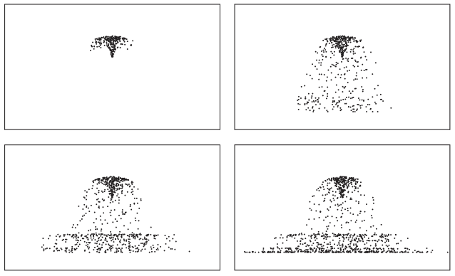
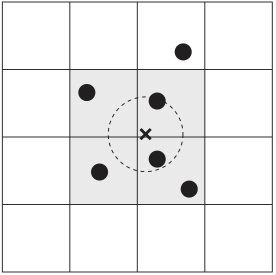
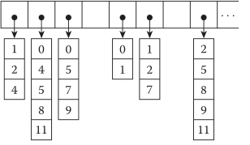
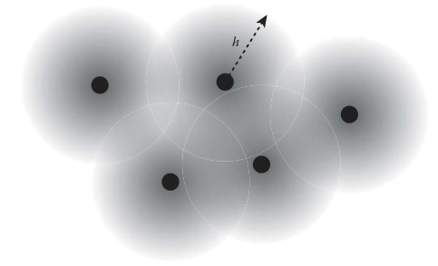
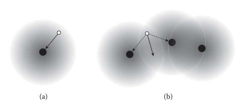

[TOC]

# 2 Particle-Based Simulation（基于粒子的模拟，拉格朗日视角）

## 2.1 Seeing the World Like Seurat（像 Seurat一样看世界）

​		乔治修拉是最著名的画家之一，以他独特的绘画风格而闻名。如图2.1所示，他使用了一种叫做点彩法的技术，使用许多小点来构建图像。每个圆点都有自己的颜色，但从远处看，一个美丽的周日下午在拉格兰德加特岛出现。他用点画图像的技巧启发了许多艺术家，但他看待世界的方式也与我们想要描述的虚拟物理世界有着深刻的联系。

​		在人眼尺度中，液体是连续的物质。流体不像沙子那样可以分解成“合理”可数的元素。我们可以深入到分子水平的液体,但是,如果你觉得有多少分子在一个小杯的水,多少内存你有在你的电脑上,你很快就会意识到这是不切实际甚至试图从微观尺度模拟液体。因此，我们需要用有限的数据点来近似真实的物理世界，就像画家在画他的杰作时，用了很多但是数量可以测量的点。

​		用一组点来离散流体体积有许多不同的方法。有些方法使用粒子，有些使用网格。甚至有混合的方法将不同的离散技术结合起来。基于粒子的方法看世界就像修拉一样。它用分散的粒子来离散世界，它们是自由分布的，没有任何结构。相反，基于网格的方法更像是数字位图图像。它是结构化的，每个数据点彼此连接。基于粒子的方法通常被归类为拉格朗日框架——一个通过跟踪流体包裹(如粒子)来解决流体运动的框架。相反，我们在下一章讨论的基于网格的方法被称为欧拉框架——一个观察流体从固定网格点流动的框架。这两种方法都有各自的优缺点，我们将在本书中讨论它们的特点。

​		在本章中，我们将介绍基于粒子的方法。让我们看看如何定义数据结构、设计求解器和实现动态。


**图 2.1**

一个周日下午，在拉格兰德加特岛，乔治修拉，1884[31]。

## 2.2  Data Structures（数据结构）

​		在本节中，我们将介绍用于模拟带有粒子的流体的核心数据结构。我们将首先介绍如何存储一个粒子集合。然后，我们看到如何在任意随机位置找到附近的粒子，并建立一个粒子网络，这样我们就可以计算粒子之间的相互作用。

### 2.2.1 Particle System Data（粒子系统数据）

​		如第1.6节所述，构建物理动画引擎首先要定义动画的状态及其数据结构。基于粒子的发动机的关键元素显然是粒子，就像第1.6.2节中的质量点一样，粒子状态包括位置、速度和力。所以我们可以这样写Particle3结构体:

```c++
struct Particle3 {
    Vector3D position;
    Vector3D velocity;
    Vector3D force;
};
```

​		结构体的名称以3结尾，表示这是一个3D粒子。因为我们想要很多粒子，我们可以有一个粒子数组来定义粒子集，如下所示:

```c++
typedef std::vector<Particle3> ParticleSet3;
```

​		这种方法被称为结构数组(AOS)，因为它是一个Particle3结构的数组。或者，我们可以将相同的数据重写为:

```c++
structParticleSet3 {
    std::vector<double> positionsX, positionsY, positionsZ;
    std::vector<double> velocitiesX, velocitiesY, velocitiesZ;
    std::vector<double> forcesX, forcesY, forcesZ;
};
```

​		这种表示称为数组结构(SOA)，因为从字面上看，它是数组的结构。一般来说，AOS和SOA之间的选择取决于性能，比如内存访问模式和计算[16]的向量化。选取哪种方式还取决于代码设计，因为它直接影响如何从代码中访问数据。

**ps： 第一模式会在内存上把p,v,f放在一起，第二种模式先放所有的p,再放所有的v,最后放所有的f**

在本书中，我们将采用半soa方法，类似于:

```c++
struct ParticleSet3 {
    std::vector<Vector3D> positions;
    std::vector<Vector3D> velocities;
    std::vector<Vector3D> forces;
};
```

​		由于x、y和z组件通常是同时访问的，因此代码将它们分组在一起以避免缓存丢失。然而，由于不同的模拟器可能需要不同的属性集，每个属性都被定义为一个单独的向量。说到拥有不同的属性，我们希望它足够灵活，以便我们能够动态地为粒子分配属性。例如，一些粒子求解器可能只需要位置、速度和力来进行计算。但如前所述，其他一些求解器可能需要更多属性。为了开发可扩展的结构，让我们定义一个名为ParticleSystemData3的新类，它具有如下所示的接口

```c++
class ParticleSystemData3 {
public:
    typedefstd::vector<Vector3D> VectorArray;

    ParticleSystemData3();
    virtual ~ParticleSystemData3();

    void resize(size_t newNumberOfParticles);
    size_t numberOfParticles()const;

    const Vector3D* const positions()const;
    const Vector3D* const velocities()const;
    const Vector3D* const forces()const;

    void addParticle(
        const Vector3D& newPosition,
        const Vector3D& newVelocity = Vector3D(),
        const Vector3D& newForce = Vector3D());
    void addParticles(
        const VectorArray& newPositions,
        const VectorArray& newVelocities = VectorArray(),
        const VectorArray& newForces = VectorArray());

private:
    VectorArray _positions;
    VectorArray _velocities;
    VectorArray _forces;
};
```

​		本节将不介绍所有这些成员函数的实现细节。看看 src/jet/particle_system_data3.cpp，看看实际的实现是如何编写的。

​		为了让这段代码更通用，我们可以添加任何自定义粒子属性数据(除了位置、速度和力)，我们可以如下更新代码:

```c++
class ParticleSystemData3 {
public:
	...

    size_t addScalarData(doubleinitialVal = 0.0);

    size_t addVectorData(constVector3D& initialVal = Vector3D());

    Const ArrayAccessor1<double> scalarDataAt(size_t idx)const;

    Array Accessor1<double> scalarDataAt(size_t i d x ) ;

    Const ArrayAccessor1<Vector3D> vectorDataAt(size_t i d x )const;

    Array Accessor1<Vector3D> vectorDataAt(size_t idx);

private:
	...

    std::vector<ScalarData> _scalarDataList;
    std::vector<VectorData> _vectorDataList;
};
```

​		例如，如果SDK用户想要添加“life”属性，让粒子在一定时间内消失，可以使用addScalarData。该函数将返回数据的索引，稍后可使用该索引来使用scalarDataAt函数访问数据。同样的想法也适用于addVectorData和vectorDataAt函数，它们用于添加自定义向量属性数据，如3D纹理坐标。

### 2.2.2 Particle System Example（粒子系统样例）

​		为了演示如何使用我们之前讨论的数据布局来做一个粒子系统求解器，我们将构建一个简单的粒子系统求解器，这也将成为其他模拟器的基础求解器。这个模拟器模拟的粒子系统不考虑粒子之间的相互作用;只有像重力或风/阻力这样的外力才会被考虑在内。尽管如此，这在模拟二次喷雾(Secondary spray)效果时还是很有用的。

​		首先，让我们从下面所示的搭建代码开始。

```c++
class ParticleSystemSolver3 :publicPhysicsAnimation {
public:
    ParticleSystemSolver3();

    virtual ~ParticleSystemSolver3();

...

protected:
	void onAdvanceTimeStep(doubletimeIntervalInSeconds)override;

	virtual void accumulateForces(doubletimeStepInSeconds);

	void resolveCollision();

...

private:
	ParticleSystemData3Ptr _particleSystemData;
	...

    void beginAdvanceTimeStep();

    void endAdvanceTimeStep();

    void timeIntegration(double timeIntervalInSeconds);
};
ParticleSystemSolver3::ParticleSystemSolver3() {
    _particleSystemData = std::make_shared<ParticleSystemData3>();
    _wind = std::make_shared<ConstantVectorField3>(Vector3D());
}

ParticleSystemSolver3::~ParticleSystemSolver3() {}

void ParticleSystemSolver3::onAdvanceTimeStep(double meIntervalInSeconds) {
    beginAdvanceTimeStep();

    accumulateForces(timeIntervalInSeconds);
    timeIntegration(timeIntervalInSeconds);
    resolveCollision();

    endAdvanceTimeStep();
}

...
```

 		正如你从上面的代码中看到的，所有的物理逻辑都将在**ParticleSystemSolver3**中实现，而**ParticleSystemData3**实例将是数据模型。因为**ParticleSystemSolver3**继承了**PhysicSanimationClass**，我们也重写了**onAdvanceTimestepFunction**。如果您对此不熟悉，请参阅1.6节。函数**onAdvanceTimeSteptakes**一个单一的时间步长并在给定的时间间隔内推进模拟。在函数中，您可以看到有预处理和后处理函数(beginAdvanceTimeStep and **endAdvanceTimeStep**)。在这两个函数之间，有三个核心子程序来计算力、时间积分和碰撞。这些步骤的结构与第1.6.2节中的质量弹簧例子相同。注意，**accumulateForce**是一个可以被子类覆盖的虚函数。这是因为根据我们采用的物理模型，力是不同的。但其他函数是非虚保护函数，可以从子类调用。

​		同样，新函数的实现与质量-弹簧例子(第1.6.2节)非常相似。让我们先来看一下**accumulateForces**和**accumulateExternalForces**。

```c++
class ParticleSystemSolver3 :publicPhysicsAnimation {
	...
private:
    double_dragCoefficient = 1e-4;
    Vector3D _gravity = Vector3D(0.0, -9.8, 0.0);
    VectorField3Ptr _wind;

...
};

void ParticleSystemSolver3::accumulateForces(double timeStepInSeconds) {
	accumulateExternalForces();
}

void ParticleSystemSolver3::accumulateExternalForces() {
    size_t n = _particleSystemData->numberOfParticles();
    auto forces = _particleSystemData->forces();
    auto velocities = _particleSystemData->velocities();
    auto positions = _particleSystemData->positions();
    const double mass = _particleSystemData->mass();

    parallel For(kZeroSize, n, [&] (size_t i ) {
            // Gravity
            Vector3D force = mass * _gravity;

            // Wind forces
            Vector3D relativeVel
            = velocities[i] - _wind->sample(positions[i]);
            force += -_dragCoefficient * relativeVel;

            forces[i] += force;
        });
}
```

​		**accumulateForces**是一个虚函数，它聚集了粒子在当前时间步长的所有力。如前所述，此示例求解器只考虑外力。因此，该函数调用子例程**accumulateExternalForces**。稍后，**accumulateForces**将有一个函数调用列表，这些函数调用将积累流体将经历的各种力。函数**accumulateForces**接受函数参数**timeIntervalInSeconds**，该参数目前还没有使用。我们为未来的潜在情况保留此参数。

​		继续到**accumulateExternalForces**，你可以看到我们正在向力数组中添加重力和拖动力。空气阻力与第1.6.2节中讨论的相同;取周围空气的相对速度，缩放它，然后在粒子运动的相反方向施加矢量。您可能想知道parallel  For在做什么，但它是一个帮助函数，在给定范围内使用多线程执行给定函数对象。

​		现在让我们看看其余的代码是如何实现的。时间积分和碰撞解析可以写成: 

```c++
classParticleSystemSolver3 :publicPhysicsAnimation {
	...
private:
	...

    ParticleSystemData3::VectorData _newPositions;
    ParticleSystemData3::VectorData _newVelocities;
    Collider3Ptr _collider;
    VectorField3Ptr _wind;

	...
};

void ParticleSystemSolver3::timeIntegration(double timeIntervalInSeconds)

    size_t n = _particleSystemData->numberOfParticles();
    autoforces = _particleSystemData->forces();
    autovelocities = _particleSystemData->velocities();
    autopositions = _particleSystemData->positions();
    const doublemass = _particleSystemData->mass();

    parallelFor(
        kZeroSize,
        n,
        [&] (size_t i ) {
        // Integrate velocity first
        Vector3D& newVelocity = _newVelocities[i];
        newVelocity = velocities[i] + timeIntervalInSeconds * forces[i] / mass;

        // Integrate position.
        Vector3D& newPosition = _newPositions[i];
        newPosition = positions[i] + timeIntervalInSeconds *
        wVelocity;
    });
}

void ParticleSystemSolver3::resolveCollision() {
    resolveCollision(
        _particleSystemData->positions(),
        _particleSystemData->velocities(),
        _newPositions.accessor(),
        _newVelocities.accessor());
}
voidParticleSystemSolver3::resolveCollision(
    const ConstArrayAccessor1<Vector3D>& positions,
    const ConstArrayAccessor1<Vector3D>& velocities,
    ArrayAccessor1<Vector3D> newPositions,
    ArrayAccessor1<Vector3D> newVelocities) {
    if(_collider !=nullptr) {
        size_t numberOfParticles
        	= _particleSystemData->numberOfParticles();
        const double radius = _particleSystemData->radius();

    parallelFor(
        kZeroSize,
        numberOfParticles,
        [&] (size_t i ) {
        _collider->resolveCollision(
            newPositions[i],
            newVelocities[i],
            radius,
            _restitutionCoefficient,
            &newPositions[i],
            &newVelocities[i]);
        });
    }
}

```

函数**timeIntegration**也非常类似于我们在1.6.2节中讨论的内容。它获取最终的力阵，计算加速度，然后将速度和位置积分。注意，我们没有直接将更改应用到**_particleSystemData**的位置和速度数组，因为数据将由**resolveCollision**进行后处理，在此过程中我们需要当前和新数据。所以我们通过给缓冲区分配新值**_newPositions**和**_newvelocity**来保持当前和新的状态。说到碰撞，实际的碰撞解决是在**Collider3**实例**_collider**和**colliderside**函数**Collider3::resolveCollision**中抽象的。现在让我们把它当作一个黑盒，但是您可以看到我们有一个包装器函数ParticleSystemSolver3::resolveCollision，它并行地解决每个粒子的碰撞。注意，我们在**ParticleSystemSolver3::resolvecollision3**中有另一个层，它接受任意位置和速度数组。如果子类想在自定义状态下执行冲突解决，这个额外的层会很有用(参见2.4节)。

 		最后，让我们通过实现代码的前处理和后处理部分来结束我们的示例。 

```c++
void ParticleSystemSolver3::beginAdvanceTimeStep() {
    // Allocate buffers
    size_t n = _particleSystemData->numberOfParticles();
    _newPositions.resize(n);
    _newVelocities.resize(n);

    // Clear forces
    auto forces = _particleSystemData->forces();
    setRange1(forces.size(), Vector3D(), &forces);

    onBeginAdvanceTimeStep();
}

void ParticleSystemSolver3::endAdvanceTimeStep() {
    // Update data
    size_t n = _particleSystemData->numberOfParticles();
    auto positions = _particleSystemData->positions();
    auto velocities = _particleSystemData->velocities();
    parallelFor(
        kZeroSize,
        n,
        [&] (size_t i ) {
        positions[i] = _newPositions[i];
        velocities[i] = _newVelocities[i];
    });

    onEndAdvanceTimeStep();
}
```

​		对于预处理**beginAdvanceTimeStep**，我们为**_newPositions**和**_newvelocity**分配内存，这是时间集成和碰撞处理所需要的。同样，力数组也可以通过设置0来清除，这样我们就可以累积不同的力。对于后处理，我们用缓冲区更新位置和速度状态来完成时间步长。对于这两个函数，你可以看到回调函数**onBeginAdvanceTimeStep**和**onEndAdvanceTimeStep**，它们可以被子类覆盖以执行额外的预处理和后处理。

​		到目前为止，我们已经介绍了如何使用**ParticleSystemData3**构建模拟器。图2.2显示了求解器的示例结果，生成动画的示例代码可以在 src/tests/manual_tests/particle_ system_solver3_tests.cpp中找到。同样，这个基线模拟器不考虑粒子与粒子的相互作用。在下一节中，我们将看到需要哪些额外的数据结构才能使粒子相互作用。

## 2.2.3 Neighbor Search（邻居搜索）

​		在基于粒子的模拟中，最常见的操作之一是为给定的位置找到附近的粒子。在第1.6.2节的质量弹簧例子中，我们预定义了两个有边的质量点之间的连通性。形成这样一个网格是可能的，因为系统的连通性不会随时间而改变。我们也可以构造一个具有初始连通性的粒子集。然而，由于流体的性质，粒子所代表的体积可以打破、合并或从根本上改变原来的形状。因此，连接性会随着时间而变化，需要对每个时间步骤进行持续更新。我们将在本节中介绍的邻居搜索数据结构和算法的目的是加速这种基于位置的查询，并缓存粒子与其邻居之间的连接。



**图 2.2**

使用ParticleSystemSolver3的喷雾模拟序列。粒子从一点像喷泉一样发射出来。当粒子与地板相撞时，会向上弹起。

#### 2.2.3.1 Searching Nearby Particles（搜索附近的粒子）

​		从给定位置搜索附近粒子的一种特别方法是遍历整个粒子列表，看看某个粒子是否位于给定的搜索半径内。这个算法有O(N^2^)的时间复杂度，显然，我们想要一个更好的方法

​		一种常用的加速邻居搜索的算法是哈希算法。哈希算法根据粒子的位置将粒子映射到桶的网格中，桶的大小等于搜索区域的直径。映射由空间哈希函数决定，该函数可以是任何将3D坐标转换为桶索引的函数。现在，每当搜索查询进入时，也可以对查询位置进行哈希，以找到相应的bucket。然后我们可以查找附近的桶，看看储存在这些桶中的粒子是否在搜索半径内。所有其他桶不需要测试，因为很明显，这些桶中的粒子不在搜索范围之内。图2.3更直观地说明了这个过程。为了实现哈希算法和桶数据结构，让我们首先看看如何



**图 2.3**

使用哈希网格数据结构进行邻居搜索。当在用虚线圆表示的半径内从x标记的位置寻找附近的点时，只查找重叠的网格单元格(用灰色表示)。然后，测试每个网格单元上的点是否在圆内。

​		一种常用的加速邻居搜索的算法是哈希算法。哈希算法根据粒子的位置将粒子映射到桶的网格中，桶的大小等于搜索区域的直径。映射由空间哈希函数决定，该函数可以是任何将3D坐标转换为桶索引的函数。现在，每当搜索查询进入时，也可以对查询位置进行哈希，以找到相应的bucket。然后我们可以查找附近的桶，看看储存在这些桶中的粒子是否在搜索半径内。所有其他桶不需要测试，因为很明显，这些桶中的粒子不在搜索范围之内。图2.3更直观地说明了这个过程。为了实现哈希算法和桶数据结构，让我们首先看看邻居搜索类的接口应该是什么样的:

​		邻居搜索类的接口应该如下所示:

```c++
classPointNeighborSearcher3 {
public:
    typedef std::function<void(size_t,const Vector3D&)>
    	ForEachNearbyPointFunc;

    PointNeighborSearcher3();
    virtual ~PointNeighborSearcher3();

    virtual void build(const ConstArrayAccessor1<Vector3D>& points) = 0;

    virtual void forEachNearbyPoint(
    const Vector3D& origin,
    double radius,
    const ForEachNearbyPointFunc& callback)const= 0;
};
```

​		这段代码是邻居搜索类的基类，假设我们可以有多个搜索算法的实现。这个类使用了“点”这个词而不是粒子，因为我们不想将这个类的用例限制为只使用粒子，而是希望有更通用的API，可以用于涉及空间点搜索的任何其他场景。无论如何，基类有两个虚函数要重写，一个用于构建内部数据结构，另一个用于查找附近的点。虚函数 **build** 以一个点数组及其大小作为输入参数。

​		查询函数**forEachNearbyPoint**调用给定的回调函数，如果在**radius**内的**origin**附近有一个点。回调函数中的两个参数是附近点的索引和位置。

​		为了实现散列算法，我们将继承基类并添加特定于散列的成员。从图2.3可以看出，构建桶网格的输入参数可以是网格分辨率和网格大小。对于每个**bucket**，我们将存储落入**bucket**中的点的索引。现在哈希的类接口可以写成:

```c++
classPointHashGridSearcher3final:publicPointNeighborSearcher3 {
public:
    PointHashGridSearcher3(const Size3& resolution,double gridSpacing);
    PointHashGridSearcher3(
        size_t resolutionX,
        size_t resolutionY,
        size_t resolutionZ,
        double gridSpacing);

    void build(const ConstArrayAccessor1<Vector3D>& points)override;

    void forEachNearbyPoint(
        const Vector3D& origin,
        double radius,
        const ForEachNearbyPointFunc& callback)const override;

    ...

private:
    double _gridSpacing = 1.0;
    Point3I _resolution = Point3I(1, 1, 1);
    std::vector<Vector3D> _points;//存储周围点的索引
    std::vector<std::vector<size_t>> _buckets;

	...
};
```

 		从上面的构造函数开始，可以通过提供网格的分辨率和间距来初始化类实例。然后，有两个公共函数覆盖基类中的虚函数。对于成员数据，类存储网格形状信息和桶。另外，它保留传递给**forEachNearbyPoint**函数的点的副本。**build**函数的实现非常简单，如下所示:

```c++
voidPointHashGridSearcher3::build(
    const ConstArrayAccessor1<Vector3D>& points) {//传入周围存在的粒子的位置
    _buckets.clear();
    _points.clear();

    if(points.size() == 0) {
    	return;
    }

    // Allocate memory chuncks
    _buckets.resize(_resolution.x * _resolution.y * _resolution.z);
    _points.resize(points.size());

    // Put points into buckets
    for(size_t i = 0; i < points.size(); ++i) {
        _points[i] = points[i];
        size_t key = getHashKeyFromPosition(points[i]);
        _buckets[key].push_back(i);//该桶新增一个点
	}
}
```

​		这段代码的关键部分在最后几行。在最后的for循环中，您可以注意到一个点被传递给成员函数**getHashKeyFromPosition**，该函数返回相应的散列键。将点映射到一个整型键值的散列函数可以是满足输入和输出的任何东西，但最好将映射分散到空间上，以便bucket内的点的数量尽可能相似。有关哈希函数的更多讨论，请参阅Ihmsen等人[55]。一旦确定了哈希键，该点的索引就被添加到相应的bucket中。函数**getHashKeyFromPosition**和必要的辅助函数可以实现如下:

```c++
Point3I PointHashGridSearcher3::getBucketIndex(constVector3D& position)
    const{
    Point3I bucketIndex;
    bucketIndex.x =static_cast<ssize_t>(
    	std::floor(position.x / _gridSpacing));// 向下取整
    bucketIndex.y =static_cast<ssize_t>(
        std::floor(position.y / _gridSpacing));
    bucketIndex.z =static_cast<ssize_t>(
    	std::floor(position.z / _gridSpacing));
    returnbucketIndex;
}

size_t PointHashGridSearcher3::getHashKeyFromPosition(
    const Vector3D& position) const{
    Point3I bucketIndex = getBucketIndex(position);//获取该点所在的桶的索引值
    return getHashKeyFromBucketIndex(bucketIndex);
}

size_t PointHashGridSearcher3::getHashKeyFromBucketIndex(//从3维映射到1维
    const Point3I& bucketIndex) const{
    Point3I wrappedIndex = bucketIndex;
    wrappedIndex.x = bucketIndex.x % _resolution.x;
    wrappedIndex.y = bucketIndex.y % _resolution.y;
    wrappedIndex.z = bucketIndex.z % _resolution.z;
    if(wrappedIndex.x < 0) { wrappedIndex.x += _resolution.x; }
    if(wrappedIndex.y < 0) { wrappedIndex.y += _resolution.y; }
    if(wrappedIndex.z < 0) { wrappedIndex.z += _resolution.z; }
    return static_cast<size_t>(
        (wrappedIndex.z * _resolution.y + wrappedIndex.y) * _resolution.x
        + wrappedIndex.x);
}
```

​		在代码中，函数**getBucketIndex**将输入位置转换为与网格单元格(x,  y,  z)上的bucket对应的整数坐标。但是，它是一个虚坐标，如果它位于网格之外，它就会被包裹起来。然后将包装的坐标散列成单个整数，此代码中的散列函数简单地将3D整数坐标映射到1D索引，就像将体积网格映射到线性数组一样。同样，图2.3显示了哈希是如何工作的。 

​		一旦桶被初始化，我们就可以使用这个类来查询邻居搜索。对于给定的查询位置，它首先找出哪些bucket与搜索球体(或2D中的圆圈)重叠。对于3D，将有8个重叠的桶，对于2D，将有4个。然后，代码对每个重叠的桶进行迭代，以测试桶内的点是否位于搜索半径内。下面的代码实现了这些步骤:

```c++
voidPointHashGridSearcher3::forEachNearbyPoint(
    const Vector3D& origin,
    double radius,
    const std::function<void(size_t,constVector3D&)>& callback)const{
        if(_buckets.empty()) {
            return;
    }

    size_t nearbyKeys[8];
    getNearbyKeys(origin, nearbyKeys);

    const double queryRadiusSquared = radius * radius;

    for(inti = 0; i < 8; i++) {
        const auto& bucket = _buckets[nearbyKeys[i]];
        size_t numberOfPointsInBucket = bucket.size();

        for(size_t j = 0; j < numberOfPointsInBucket; ++j) {
                size_t pointIndex = bucket[j];
                double rSquared
                = (_points[pointIndex] - origin).lengthSquared();
                if(rSquared <= queryRadiusSquared) {
                	callback(pointIndex, _points[pointIndex]);
            }
        }
    }
}

void PointHashGridSearcher3::getNearbyKeys(
const Vector3D& position,
size_t* nearbyKeys)const{
    Point3I originIndex
    = getBucketIndex(position), nearbyBucketIndices[8];

    for(inti = 0; i < 8; i++) {
    	nearbyBucketIndices[i] = originIndex;
    }

    if((originIndex.x + 0.5f) * _gridSpacing <= position.x) {
        nearbyBucketIndices[4].x += 1; nearbyBucketIndices[5].x += 1;
        nearbyBucketIndices[6].x += 1; nearbyBucketIndices[7].x += 1;
    }else{
        nearbyBucketIndices[4].x -= 1; nearbyBucketIndices[5].x -= 1;
        nearbyBucketIndices[6].x -= 1; nearbyBucketIndices[7].x -= 1;
    }

    if((originIndex.y + 0.5f) * _gridSpacing <= position.y) {
        nearbyBucketIndices[2].y += 1; nearbyBucketIndices[3].y += 1;
        nearbyBucketIndices[6].y += 1; nearbyBucketIndices[7].y += 1;
    }else{
        nearbyBucketIndices[2].y -= 1; nearbyBucketIndices[3].y -= 1;
        nearbyBucketIndices[6].y -= 1; nearbyBucketIndices[7].y -= 1;
    }

    if((originIndex.z + 0.5f) * _gridSpacing <= position.z) {
        nearbyBucketIndices[1].z += 1; nearbyBucketIndices[3].z += 1;
        nearbyBucketIndices[5].z += 1; nearbyBucketIndices[7].z += 1;
    }else{
        nearbyBucketIndices[1].z -= 1; nearbyBucketIndices[3].z -= 1;
        nearbyBucketIndices[5].z -= 1; nearbyBucketIndices[7].z -= 1;
    }

    for(inti = 0; i < 8; i++) {
    	nearbyKeys[i] = getHashKeyFromBucketIndex(nearbyBucketIndices[i]) ;
    }
}
```

注意，**getNearbyKeys**函数通过检查相对于立方体中心的桶中的输入位置来确定哪些桶与搜索球体重叠。



**图 2.4**

邻居列表数据结构的图解。它由点索引表表示。例如，点0的邻居是点1、2和4。

#### 2.2.3.2 Caching Neighbors（缓存邻点）

​		到目前为止，我们所建立的数据结构能够有效地搜索任意随机输入位置附近的点。但是基于粒子的动画的一个常见用例是迭代给定粒子的相邻粒子。在这种情况下，缓存附近的粒子并创建一个邻居列表会更加有效，如图2.4所示，而不是对循环中的每一步运行bucket搜索。下面的代码演示了如何在ParticleSystemData3类中构建邻居列表:

```c++
class ParticleSystemData3 {
public:
    ...

    void buildNeighborSearcher(double maxSearchRadius);
    void buildNeighborLists(double maxSearchRadius);

private:
    ...

    PointNeighborSearcher3Ptr _neighborSearcher;
    std::vector<std::vector<size_t>> _neighborLists;
};

void ParticleSystemData3::buildNeighborSearcher(doublemaxSearchRadius) {
    // Use PointHashGridSearcher3 by default
    _neighborSearcher = std::make_shared<PointHashGridSearcher3>(
        kDefaultHashGridResolution,
        kDefaultHashGridResolution,
        kDefaultHashGridResolution,
    	2.0 * maxSearchRadius);

	_neighborSearcher->build(positions());
}

void ParticleSystemData3::buildNeighborLists(double maxSearchRadius) {
	_neighborLists.resize(numberOfParticles());

    auto points = positions();
    for(size_t i = 0; i < numberOfParticles(); ++i) {
        Vector3D origin = points[i];
        _neighborLists[i].clear();

        _neighborSearcher->forEachNearbyPoint(
            origin,
            maxSearchRadius,
            [&](size_t j ,constVector3D&) {
                if(i != j) {
                    _neighborLists[i].push_back(j);
                }
            });
    }
}
```

 

## 2.3 Smoothed Particles（光滑粒子）

​		用粒子表示流体最流行的方法之一是使用光滑粒子，即光滑粒子流体动力学(SPH)。它是一种用多个粒子划分流体体积的方法，单个粒子只占体积的很小一部分。它被称为“平滑的”，因为这种方法模糊了粒子的边界，这样我们就能得到物理量的平滑分布。它就像喷枪一样，如图2.5所示。注意，平滑的想法可以用有限数量的模糊点“绘制”区域，这意味着你可以用平滑的轮廓填充粒子之间的空隙。对于少量的点或粒子，你需要更大的喷枪喷嘴。粒子越多，越小的点就足以填补空白。这个特性很重要，因为它把有限的数据点变成了连续的域;记住我们的计算资源是有限的，而流体是连续的物质。此外，一旦我们可以在域中任意点测量值(或使用绘画类比的颜色)，我们也可以定义计算流体运动所需的数学运算符，如梯度或拉普拉斯运算符。

​		SPH方法最早由Monaghan引入天体物理学界[86]，在计算流体力学领域也有积极的研究[87]。不久之后，计算机动画开始采用SPH的理念[34,89]，也成为RealFlow[3]等商业产品的核心框架之一。在本书中，我们也将使用SPH框架作为我们主要的基于粒子的仿真引擎。



**图 2.5**

平滑的粒子的插图。每个粒子都有它的影响半径**h**，任何赋给粒子的值都被模糊到那个范围。

### 2.3.1 Basics（基础）

​		本节将介绍基本的SPH操作及其代码，包括插值、梯度和拉普拉斯，它们是实现基于SPH的流体模拟的基本构建块。

#### 2.3.1.1 Kernel（核函数）

​		在SPH中，我们将使用一个名为“**kernel**”的函数来描述“平滑度”。当给定粒子位置时，该核函数将存储在附近粒子中的任何值展开，如图2.6所示。从粒子的中心点开始，当到中心的距离达到核半径时，函数淡出到零。对于使用许多粒子的高分辨率模拟，半径通常设置得更小。对于粒子数量较少的粗糙模拟，我们使用较大的半径。在这种情况下，核函数的峰值也会发生变化，因此函数下面的面积保持不变，即**1**(见图2.6)。对于函数本身，我们可以用任意函数，**如果函数的积分是1并且随着离中心点越远单调衰减到0**。例如,
$$
W_{std} = \frac{315}{64\pi h^3} \left\{\begin{matrix}(1-\frac{r^2}{h^2})^3 ,0\leq r\leq h\\0,\space \space \space otherwise \end{matrix}\right.\tag{2.1}
$$
是最早由Müller等人提出的流行的3D内核之一[89]。从Adams和Wicke[7]中的示例代码中，内核代码可以被写为：

```c++
struct SphStdKernel3 {
	double h, h2, h3;

	SphStdKernel3();

	explicitSphStdKernel3(double kernelRadius);

	SphStdKernel3(const SphStdKernel3& other);

	double operator()(double distance)const;

	...
};

inline SphStdKernel3::SphStdKernel3()
	: h(0), h2(0), h3(0) {}

inline SphStdKernel3::SphStdKernel3(double kernelRadius)
	: h(kernelRadius), h2(h* h), h3(h2* h) {}

inline double SphStdKernel3::operator()(double distance)const {
	if (distance * distance >= h2) {
		return 0.0;
	}
	else {
		doublex = 1.0 - distance * distance / h2;
		return 315.0 / (64.0 * kPiD * h3) * x * x * x;
	}
}
```

​		如前所述，任何有效核函数的积分都应该是1。那就是:
$$
\int W(r) = 1 \tag{2.2}
$$
​		您可以使用上面的积分来验证2.1方程，如果您想要发明自己的内核函数，您将需要这个。最后，我们还在本书中创建了更多的内核函数。要了解如何与其他内核一起计算积分，请参见附录B.1。

#### 2.3.1.2  Data Model（数据模型）

​		既然我们现在有了核函数，我们就可以计算单个粒子的平滑物理量。下一步是将数据结构扩展到多个粒子。

​		如果您回想一下上一节中的类ParticleSystemData3，您可能会同意它是一个很好的起点，因为它存储粒子并具有邻居搜索功能。因此，让我们扩展这个类并添加几个新特性，如下所示。

```c++

class SphSystemData3 :publicParticleSystemData3 {
public:
	SphSystemData3();

	virtual ~SphSystemData3();

	ConstArrayAccessor1<double> densities()const;

	ArrayAccessor1<double> densities();

private:
	...
};
```

​		注意，构造函数正在向系统中添加密度数据。我们很快就会发现，许多SPH算子都需要这个密度，所以我们从一开始就保留了这个密度。结构代码中还包含了几个简单的getter。返回类型ArrayAccessor1和ConstArrayAccessor1只是简单的1D数组指针包装器，就像一个简单的随机访问迭代器。

​		在下面的小节中，我们将继续向这个类添加更多特性。与第2.2.2节中的粒子系统示例类似，我们将把数据模型与物理解耦。因此，大多数与数据求值相关的函数将被实现为inSphSystemData3，一个与动态相关的函数将在一个不同的类中实现，这个类将继承上一节提到的particlesystemsolver3。

#### 2.3.1.3 Interpolation（插值）

​		SPH插值的基本思想是通过查找附近的粒子来测量任意给定位置上的任意物理量。它是一个加权平均，其中权重是质量乘以核函数除以邻近粒子的密度。这意味着什么呢?看看下面的代码。

```c++
classSphSystemData3:publicParticleSystemData3{
public:
	...

	Vector3D interpolate(
	const Vector3D & origin,
	const ConstArrayAccessor1<Vector3D>&values)const;
	...
};

Vector3D SphSystemData3::interpolate(
	const Vector3D & origin,
	const ConstArrayAccessor1<Vector3D>&values)const {
	Vector3D sum;
	autod = densities();
	SphStdKernel3 kernel(_kernelRadius);
	
		neighborSearcher()->forEachNearbyPoint(
			origin,
			_kernelRadius,
			[&](size_t i, constVector3D& neighborPosition) {
				double dist = origin.distanceTo(neighborPosition);
				double weight = _mass / d[i] * kernel(dist);
				sum += weight * values[i];
				});
	
		return sum;
	
}
```

​		在我们的数据模型SphSystemData3中，我们添加了一个新的公共函数interpolate。这个函数有两个参数:我们想要执行插值的位置(原点)和我们想要插值的值数组(值)。每一个元素的值对应于第一个粒子。此外，变量**_kernelRadius**和**_mass**表示粒子的核半径和质量。我们假设核半径和质量对于每个粒子都是一样的。你也可以定义变化的核半径和质量，但我们不会在这本书中涉及到。

​		在函数调用**forEachNearbyPoint**中，代码迭代附近的点，并使用质量、密度和内核权重计算权重之和。如果这听起来不熟悉，请查看第2.2.3节中的邻居搜索。注意质量除以密度d[i]，密度d[i]表示体积。因此，这个插值将更多的权重放在更接近原点的值(kernel(dist))和更大的体积上。代码也可以写在数学表达式以及:
$$
\phi(x) = m \sum_j \frac{\phi_j}{\rho_j}W((x)-x_j)\tag{2.3}
$$
​		其中x m φ ρ和W(r)分别是插值的位置，质量，我们想要插值的量，密度和核函数。下标j表示第j个相邻粒子。

#### 2.3.1.4 Density（密度）

​		密度是一个每次时间步(或每次onAdvanceTimeStep调用)都会改变的量，因为粒子的位置可以改变。因此，对于每个时间步，我们需要用更新的位置计算密度，并将这些值用于其他SPH操作。例如，上面的插值函数已经依赖于密度。实际上，我们必须在任何插值步骤之前计算密度，这也适用于其他算子，比如梯度和拉普拉斯算子。为了获得每个粒子的密度，假设我们想要“插值”每个粒子位置的密度。但是等等，我们不是刚讨论过插值需要密度吗?听起来像是无限递归，但我们还是试试吧。如果我们用**interpolate**函数的密度替换values数组，代码可以写成:

```c++
...

neighborSearcher()->forEachNearbyPoint(
	origin,
	_kernelRadius,
	[&](size_t i, constVector3D& neighborPosition) {
		double dist = origin.distanceTo(neighborPosition);
		double weight = _mass / d[i] * kernel(dist);
		sum += weight * d[i];
		});

...
```

​		这可以进一步简化为:

```c++
...

neighborSearcher()->forEachNearbyPoint(
	origin,
	_kernelRadius,
	[&](size_t i, constVector3D& neighborPosition) {
		double dist = origin.distanceTo(neighborPosition);
		double weight = _mass * kernel(dist);
		sum += weight;
	});

...
```

​		注意，密度部分现在消失了!这样就打破了这个无限循环，使我们能够首先计算密度。因此，测量密度只是每个粒子质量的核加权总和。代码也可以写成方程式形式:
$$
\rho(x) = m\sum_j W(x-x_j)\tag{2.4}
$$
​		在SphSystemData3中，我们可以实现一个帮助函数**updateDensities**，通过一些小的代码清理来更新密度:

```c++
class SphSystemData3:public ParticleSystemData3{
public:
...

void updateDensities();

double sumOfKernelNearby(const Vector3D& position)const;

private:
...
};

void SphSystemData3::updateDensities() {
	auto p = positions();
	auto d = densities();

	parallelFor(
		kZeroSize,
		numberOfParticles(),
		[&](size_t i) {
			doublesum = sumOfKernelNearby(p[i]);
			d[i] = _mass * sum;
		});
}

double SphSystemData3::sumOfKernelNearby(const Vector3D& origin)const {
	double sum = 0.0;
	SphStdKernel3 kernel(_kernelRadius);
	neighborSearcher()->forEachNearbyPoint(
		origin,
		_kernelRadius,
		[&](size_t, constVector3D& neighborPosition) {
			double dist = origin.distanceTo(neighborPosition);
			sum += kernel(dist);
		});
	return sum;
}
```

​		因此，要使用sph类型的操作，如插值，必须调用**updateDensities**函数来初始化密度场

#### 2.3.1.5 Differential Operators（微分算子）

​		我们现在有基本的工具来执行SPH世界的数学计算。然而，要计算流体动力学，我们需要在第1.3.5节中介绍的微分算子。让我们看看如何实现梯度算子和拉普拉斯算子，这是本章中最常用的算子，基于核插值。

##### 2.3.1.5.1 Gradient（梯度）

​		为了计算梯度，∇f，使用SPH粒子，让我们首先从一个粒子开始。如果我们有一个粒子，我们知道我们可以使用SPH核得到一个类高斯分布，如图2.7a所示。从前面编写的插值代码中，我们知道该field 可以通过以下方式计算:

```c++
result = value * mass / density * kernel(distance);
```

​		梯度矢量的大小将与核的导数成正比，其方向将指向核的中心，如图2.7a所示。因此，计算单粒子梯度的代码如下:

```c++
result = value * mass / density * kernel.firstDerivative(distance) *
directionToParticle;
```




**图 2.7**

插图(a)带有单个粒子的梯度矢量和插图(b)带有多个粒子的梯度矢量。从图像(b)中，两个粒子的梯度向量形成了净梯度粒子。

​		注意，插值过程中其他部分保持不变，但我们是将核的一阶导数而不是核本身与从样本位置到粒子中心的方向相乘。新的函数**firstDerivative**可以添加到现有的类**SphStdKernel3**中:

```c++

struct SphStdKernel3 {
	...
    double firstDerivative(double distance)const;

	Vector3D gradient(double distance, const Vector3D& direction)const;
};

inline double SphStdKernel3::firstDerivative(double distance)const {
	if (distance >= h) {
		return0.0;
	}
	else {
		double x = 1.0 - distance * distance / h2;
		return -945.0 / (32.0 * kPiD * h5) * distance * x * x;
	}
}

inline Vector3D SphStdKernel3::gradient(
	double distance,
	const Vector3D& directionToCenter)const {
	return -firstDerivative(distance) * directionToCenter;
}
```

​		这段代码实现了方程2.1的一阶导数和平滑场的梯度。

​		将这个想法扩展到多个粒子是很容易的。如图2.7b所示，只需对邻近的邻居进行迭代并添加梯度向量就可以了。因此，我们可以编写一个与interpolate非常相似的新函数:

```c++
class SphSystemData3 : public ParticleSystemData3 {
public:
	...

		Vector3D gradientAt(
			size_t i,
			const ConstArrayAccessor1<double>& values) const;

private:
	...
};

Vector3D SphSystemData3::gradientAt(
	size_t i,
	const ConstArrayAccessor1<double>& values) const {
	Vector3D sum;
	auto p = positions();
	auto d = densities();
	const auto& neighbors = neighborLists()[i];
	Vector3D origin = p[i];
	SphSpikyKernel3 kernel(_kernelRadius);

	for (size_t j : neighbors) {
		Vector3D neighborPosition = p[j];
		double dist = origin.distanceTo(neighborPosition);
		if (dist > 0.0) {
			Vector3D dir = (neighborPosition - origin) / dist;
			sum += values[j] * _mass / d[j] * kernel.gradient(dist, dir);
		}
	}

	return sum;
}
```

​		新函数**gradientAt**返回给定粒子索引的输入值的梯度。上面的代码等价于下面的公式:
$$
\gradient\phi(x) = m \sum_j \frac{\phi_j}{\rho_j}\gradient W(|x-x_j|)\tag{2.5}
$$
​		然而，梯度的这种实现是不对称的。这意味着从两个相邻的粒子计算出的梯度可以是不同的。例如，假设系统中只有两个粒子，看看代码或方程的返回值是多少。如果粒子的φ(或值)和密度不同，梯度矢量的大小也不同。这可能是个问题，如果你计算出这个梯度的力。非对称梯度意味着两种不同大小的力将作用于你所观察的粒子，这将违反牛顿第三运动定律——对于每个作用力，都有一个大小相等、方向相反的作用力。

​		为了解决这个问题，人们提出了不同版本的梯度实现[86,89,7]。最常用的方法之一是:
$$
\gradient\phi(x) = \rho_i m \sum_j (\frac{\phi_i}{\rho_i^2}+\frac{\phi_j}{\rho_j^2})\gradient W(|x-x_j|)\tag{2.6}
$$
我们也可以替换前面代码的一部分，如下所示:

```c++
Vector3D SphSystemData3::gradientAt(
	size_t i,
	const ConstArrayAccessor1<double>& values) const {
	Vector3D sum;
	auto p = positions();
	auto d = densities();
	const auto& neighbors = neighborLists()[i];
	Vector3D origin = p[i];
	SphSpikyKernel3 kernel(_kernelRadius);

	for (size_t j : neighbors) {
		Vector3D neighborPosition = p[j];
		double dist = origin.distanceTo(neighborPosition);
		if (dist > 0.0) {
			Vector3D dir = (neighborPosition - origin) / dist;
			sum += d[i] * _mass * (values[i] / square(d[i]) + values[j] /
				uare(d[j])) * kernel.gradient(dist, dir);
		}
	}

	return sum;
}
```

​		你可以在附录B.1中看到这个新的梯度方程的详细推导。但是我们可以很容易地确定新的梯度是对称的。

##### 2.3.1.5.2 Laplacian（拉普拉斯）

为了从给定的粒子中计算出Laplacian∇2，我们采取了与梯度计算相似的步骤。因此，从单个粒子的剖面开始:

```c++
result = value * mass / density * kernel(distance);
```

如果我们对变量**distance**求导，它会变成:

```c++
result = value * mass / density * kernel.secondDerivative(distance);
```

其中函数**secondDerivative**可以实现为:

```c++
struct SphStdKernel3 {
	double h5;
	...

		double secondDerivative(double distance) const;
};

inline SphStdKernel3::SphStdKernel3()
	: h(0), h2(0), h3(0), h5(0) {}

inline SphStdKernel3::SphStdKernel3(double kernelRadius)
	: h(kernelRadius), h2(h* h), h3(h2* h), h5(h2* h3) {}

inline double SphStdKernel3::secondDerivative(double distance) const {
	if (distance * distance >= h2) {
		return 0.0;
	}
	else {
		double x = distance * distance / h2;
		return 945.0 / (32.0 * kPiD * h5) * (1 - x) * (3 * x - 1);
	}
}struct SphStdKernel3 {
	double h5;
	...

		double secondDerivative(double distance) const;
};

inline SphStdKernel3::SphStdKernel3()
	: h(0), h2(0), h3(0), h5(0) {}

inline SphStdKernel3::SphStdKernel3(double kernelRadius)
	: h(kernelRadius), h2(h* h), h3(h2* h), h5(h2* h3) {}

inline double SphStdKernel3::secondDerivative(double distance) const {
	if (distance * distance >= h2) {
		return 0.0;
	}
	else {
		double x = distance * distance / h2;
		return 945.0 / (32.0 * kPiD * h5) * (1 - x) * (3 * x - 1);
	}
}
```

​		类似于梯度代码，如果我们把所有的近邻迭代放在一起，代码可以写成:
