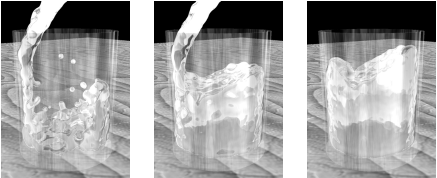
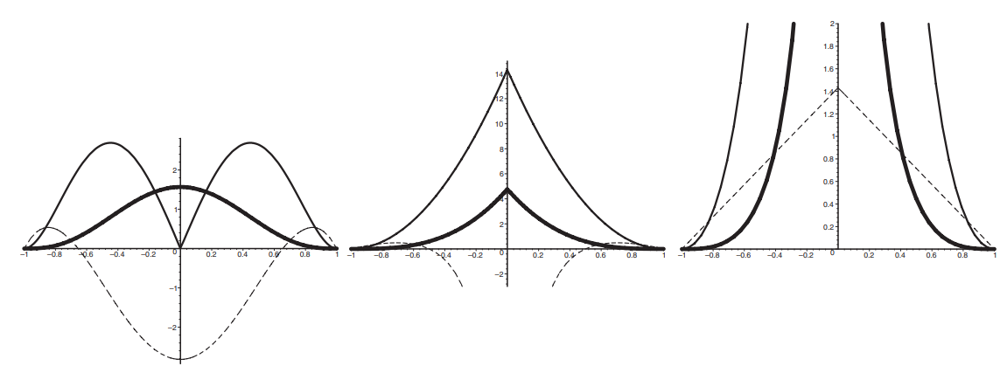

# Particle-Based Fluid Simulation for Interactive Applications

Matthias Müller

David Charypar

Markus Gross

# 摘要（Abstract）

​		逼真的动画流体可以为交互式应用程序（如虚拟手术模拟器或计算机游戏）添加真实感。在本文中，我们提出了一种基于光滑粒子流体动力学（SPH）的交互式方法来模拟具有自由表面的流体。该方法是Desbrun基于SPH的技术的扩展，用于为高度可变形的物体设置动画。我们通过直接从Navier-Stokes方程导出力密度场，并通过在模型表面张力效应中添加一个项，将该方法转向流体模拟。与基于欧拉网格的方法相比，基于粒子的方法使得质量守恒方程和对流项变得不必要，从而降低了模拟的复杂性。此外，粒子可以直接用于渲染流体的表面。我们提出了使用基于点散乱和行进立方体的曲面重建来跟踪和可视化自由曲面的方法。我们的动画方法足够快，可用于交互式系统，并允许用户与多达5000个粒子组成的模型进行交互。

## 1. Introduction

### 1.1. 动机

​		液体（即液体和气体）在日常生活中起着重要作用。流体现象的例子有风、天气、海浪、船只引起的波浪或简单地倒出一杯水。这些现象看似简单而普通，但要模拟它们却是复杂而困难的。尽管计算流体力学（CFD）是一个历史悠久的成熟研究领域，但该领域仍然存在许多开放的研究问题。流体行为复杂的原因是对流、扩散、湍流和表面张力等各种现象的复杂相互作用。流体现象通常离线模拟，然后在第二步中可视化，例如在空气动力学或涡轮或管道优化中，目标是尽可能精确。

​		允许实时模拟流体效果的不太精确的方法开辟了各种新的应用。在上述领域中，实时方法有助于在设计阶段测试某个概念是否有希望。流体实时模拟技术的其他应用包括医疗模拟器、计算机游戏或任何类型的虚拟环境。

**图1**：以每秒5帧的速度将水倒入玻璃杯中。

### 1.2. 相关工作（Related Work）

​		计算流体力学有着悠久的历史。1822年，克劳德·纳维和1845年，乔治·斯托克斯提出了著名的描述流体动力学的纳维·斯托克斯方程。除了描述动量守恒的Navier-Stokes方程外，还需要另外两个方程来模拟流体，即描述质量守恒的连续性方程和描述能量守恒的状态方程。由于这些方程是已知的，并且可以用计算机进行数值求解，CFD文献中提出了大量在计算机上模拟流体的方法。

​		近二十年来，计算机图形学领域发展了专用流体模拟技术。1983年，T.Reeves^17^引入粒子系统作为一种建模一类模糊对象的技术。此后，基于粒子的拉格朗日方法和基于网格的欧拉方法都被用于计算机图形学中的流体模拟。Desbrun、Cani^2^和Tonese^22^使用粒子为软对象设置动画。粒子还被用于设置曲面动画^7^、控制隐式曲面^23^和设置熔岩流动画^20^。近年来，欧拉方法在模拟一般流体^18^、水^4、3、21^、软物体^14^和熔化效应^1^方面更为流行。

​		到目前为止，只有为在交互式系统中使用而优化的一些技术可用。Stam基于网格的方法^18^无疑是实现流体实时模拟的重要一步。对于可以由高度场表示的流体的特殊情况，也可以使用交互式动画技术^6^

​		在这里，我们提出了一种基于平滑粒子流体动力学的基于粒子的方法来设置任意流体运动的动画。

### 1.3. 我们的贡献（Our Contribution）

​		我们提出了一种基于光滑粒子流体动力学（SPH）^9^的方法来模拟具有自由表面的流体。Stam和Fiume首先将SPH引入图形社区，以描绘火和其他气体现象^19^。后来，Desbrun使用SPH为高度可变形的物体制作动画^2^。我们扩展了他的方法，重点放在流体的模拟上。为此，我们直接从Navier-Stokes方程推导粘度和压力场，并提出一种模拟表面张力的方法。为了实现交互性，我们设计了新的专用平滑内核。曲面跟踪和交互速率下的曲面渲染是我们描述的可能解决方案的难题。

## 2. SPH（Smoothed Particle Hydrodynamics）

​		尽管光滑粒子流体动力学（SPH）是由Lucy^9^和Gingold以及Monaghan^5^开发的，用于模拟天体物理问题，但该方法具有足够的通用性，可用于任何类型的流体模拟。有关SPH的介绍，请读者参考Monaghan^10^或Munzel^13^

​		SPH是粒子系统的插值方法。使用SPH，仅在离散粒子位置定义的场量可以在空间中的任何位置进行计算。为此，SPH使用径向对称平滑核在每个粒子的局部邻域中分布数量。根据SPH，标量a在位置r处通过所有粒子贡献的加权和进行插值：
$$
A_S(r)=\sum_j m_j \frac{A_j}{\rho_j}W(r-r_j,h)\tag{1}
$$
​		其中j迭代所有粒子，m~j~是粒子j的质量，r~j~是其位置，ρ~j~是密度，A~j~是r~j~处的场量。

​		函数W（r，h）称为核半径为h的平滑核函数。因为我们只使用具有有限支撑的核，所以在我们的公式中使用h作为支撑半径。如果W是偶函数（即W（r，h）=W(−r、 h))且积分为1，则插值具有二阶精度。如果
$$
\int W(r)dr=1\
$$
​		粒子质量和密度出现在方程式中。（1） 因为每个粒子i代表一定的体积V~i~=m~i~/ρ~i~。虽然质量m~i~在整个模拟过程中是恒定的，在我们的例子中，所有粒子的质量m~i~都是恒定的，但密度ρi会发生变化，需要在每个时间步进行评估。通过代入Eqn。（1） 我们得到位置r处的密度：
$$
\rho_S(r) = \sum_jm_j\frac{\rho_j}{\rho_j}W(r-r_j,h)=\sum_jm_jW(r-r_j,h)\tag{3}
$$
​		在大多数流体方程中，会出现场量的导数，需要对其进行评估。在SPH方法中，此类导数仅影响平滑核。A的梯度很简单
$$
\gradient A_S(r)=\sum_jm_j\frac{A_j}{\rho_j}\gradient W(r-r_j,h)\tag{4}
$$
​		而A的拉普拉斯算子计算为
$$
\laplacian A_S(r)=\sum_j m_j\frac{A_j}{\rho_j}\laplacian W(r-r_j,h)\tag{5}
$$
​		必须认识到，SPH存在一些固有的问题。当使用SPH推导粒子的流体方程时，这些方程不能保证满足某些物理原理，如力的对称性和动量守恒。下一节将介绍我们基于SPH的模型和解决这些SPH相关问题的技术。

## 3. 用粒子模拟流体

​		在欧拉（基于网格的）公式中，等温流体由速度场v、密度场ρ和压力场p描述。这些量随时间的演化由两个方程给出。第一个方程保证了质量守恒
$$
\frac{\partial\rho}{\partial t}+\divergence(\rho v)=0\tag{6}
$$
​		而Navier-Stokes方程^15^规定了动量守恒
$$
\rho (\frac{\partial v}{\partial t}+v\cdot \gradient v)=-\gradient p+\rho g+\mu \laplacian v\tag{7}
$$
​		式中，g为外力密度场，µ为流体粘度。文献中出现了许多形式的Navier-Stokes方程。Eqn。（7） 表示不可压缩流体的简化版本。

​		使用粒子代替固定网格，大大简化了这两个方程。首先，因为粒子的数量是恒定的，每个粒子都有一个恒定的质量，所以质量守恒是有保证的。（6） 完全可以省略。第二，方程式左侧的表达式∂v/∂t+v·∇v。（7） 可以用实质性导数Dv/Dt代替。由于粒子随流体移动，速度场的实质导数就是粒子速度的时间导数，这意味着粒子系统不需要对流项v·∇v。

​		方程式右侧左侧有三个力密度场。（7）模拟压力(−∇p），外力（ρg）和粘度（µ∇^2^v）。这些力密度场的总和f=−∇p+ρg+µ∇2v确定左侧粒子动量ρDv/Dt的变化。对于粒子i的加速度，我们得到：
$$
a_i=\frac{dv_i}{dt}=\frac{f_i}{\rho_i}\tag{8}
$$
​		式中，v~i~是粒子i的速度，f~i~和ρ~i~分别是力密度场和粒子i位置处计算的密度场。现在，我们将描述如何使用SPH对力密度项进行建模。

### 3.1. 压力（Pressure）

​		方程式中描述的SPH规则的应用。（1） 压力项−∇p
$$
f_i^{pressure}=-\gradient p(r_i)=-\sum_j m_j\frac{p_j}{\rho_j}\gradient W(r_i-r_j,h)\tag{9}
$$
​		不幸的是，当只有两个粒子相互作用时，这种力是不对称的。由于内核的梯度在其中心为零，粒子i仅使用粒子j的压强来计算其压强，反之亦然。由于两个粒子位置处的压力通常不相等，因此压力力不会对称。方程组对称化的不同方式。（9） 已经在文献中提出。我们建议一个非常简单的解决方案，我们发现它最适合我们的速度和稳定性

$$
f_i^{pressure}=-\gradient p(r_i)=-\sum_j m_j\frac{p_i+p_j}{2\rho_j}\gradient W(r_i-r_j,h)\tag{10}
$$
​		如此计算的压力是对称的，因为它使用相互作用粒子压力的算术平均值

​		由于粒子只携带质量、位置和速度这三个量，因此必须首先评估粒子位置处的压力。这是分两步完成的。Eqn.(3) 生成粒子位置处的密度。然后，可以通过理想气体状态方程计算压强
$$
p=k\rho\tag{11}
$$
​		其中k是一个气体常数，取决于温度。在我们的模拟中，我们采用了 Desbrun^2^的建议，使用了Eqn.(11)的修改版本
$$
p=k(\rho-\rho_0)\tag{12}
$$
​		其中ρ0是静止密度。由于压力取决于压强场的梯度，因此从数学上讲，偏移量对压力没有影响。然而，偏移确实会影响SPH平滑的场的梯度，并使模拟在数值上更加稳定

### 3.2. 黏度（Viscosity）

​		将SPH规则应用于粘度项µ∇^2^v再次产生不对称力
$$
f_i^{viscosity}=\mu\laplacian v(r_a)=\mu\sum_jm_j\frac{v_j}{\rho_j}\laplacian W(r_i,r_j,h)\tag{13}
$$
​		因为速度场因粒子而异。由于粘滞力仅取决于速度差，而不取决于绝对速度，因此有一种自然的方法通过使用速度差对称粘滞力：
$$
f_i^{viscosity}=\mu\laplacian v(r_a)=\mu\sum_jm_j\frac{v_j-v_i}{\rho_j}\laplacian W(r_i,r_j,h)\tag{14}
$$
Eqn.(14)的一种可能解释,就是从粒子i自身运动的参照系来看粒子i的邻域。然后粒子i在其环境的相对速度方向上加速。

### 3.3. 表面张量（Surface Tension）

​		我们根据Morris ^12^的思想明确地对表面张力（方程式（7）中不存在）进行建模。流体中的分子受到邻近分子的吸引力。在流体内部，这些分子间作用力在各个方向上相等，并且相互平衡。相反，作用在自由表面分子上的力是不平衡的。净力（即表面张力）作用于表面法向流体的方向。它们也倾向于最小化曲面的曲率。曲率越大，力越大。表面张力还取决于张力系数σ，该系数取决于形成表面的两种流体（水和空气）。

​		流体的表面可以通过使用额外的场量来找到，该场量在粒子位置为1，在其他位置为0。该字段在文献中称为颜色场(color field)。对于平滑的颜色场，我们得到
$$
c_S(r)=\sum_jm_j\frac{1}{\rho_j}W(r-r_j,h)\tag{15}
$$
​		平滑颜色场的梯度场
$$
n=\gradient c_s\tag{16}
$$
​		产生指向流体的表面法向场，n的散度测量表面的曲率
$$
\kappa=\frac{-\laplacian c_s}{|n|}\tag{17}
$$
​		对于凸流体体积，必须使用负数才能获得正曲率。综上所述，我们获得了表面作用力：
$$
t^{surface} = \sigma \kappa\frac{n}{|n|}\tag{18}
$$
​		为了在靠近表面的粒子之间分配表面作用力并获得力密度，我们将归一化标量场δs=| n |乘以力密度(force density)，该场仅在表面附近非零。对于作用在表面附近的力密度，我们得到
$$
f_{surface}=\sigma\kappa n=-\sigma \laplacian c_s\frac{n}{|n|}\tag{19}
$$
**ps:简单来说，把表面力分配给表面的所有粒子，就能得到力密度（force density）**

​		在|n|较小的位置计算n/|n|会导致数值问题。我们只在| n |超过某个阈值时评估力。

### 3.4. 其他力（External Forces）

​		我们的模拟器支持外力，如重力、碰撞力和用户交互产生的力。这些力直接施加到粒子上，无需使用SPH。当粒子与固体对象（如我们示例中的玻璃）碰撞时，我们只需将它们推出对象（施加向外的力）并反射垂直于对象表面的速度分量

### 3.5. 光滑核

​		SPH方法的稳定性、准确性和速度在很大程度上取决于平滑核的选择。我们使用的核函数有二阶插值误差，因为它们都是偶数且积分为1的（见图2）。此外，在边界处导数为零且为零的核有利于稳定性。除了这些限制之外，还可以自由地为特殊目的设计内核。我们设计了以下内核
$$
W_{poly6}(r,h)=\frac{315}{64\pi h^9}\left\{\begin{matrix}(h^2-r^2)^3&0\leq r\leq h\\
0&otherwise \end{matrix}\right.\tag{20}
$$
​		除两种情况外，所有情况下都使用它。这个简单核的一个重要特征是r只显示平方，这意味着在距离计算中不计算平方根就可以计算is。然而，如果这个核用于计算压力，粒子在高压下倾向于形成团簇。当粒子彼此非常接近时，斥力消失，因为内核的梯度在中心接近于零。Desbrun^2^通过使用在中心附近具有非消失梯度的尖形核来解决这个问题。对于压力计算，我们使用Debrun的spiky内核

(45/pi)*/*(h-r)^2^/h^6^r
$$
W_{spiky}(r,h)=\frac{15}{\pi h^6}\left\{\begin{matrix}(h-r)^3&0\leq r\leq h\\
0&otherwise \end{matrix}\right.\tag{21}
$$
​		该函数产生必要的斥力。在该函数消失的边界上，也有零的一阶和二阶导数

​		粘度是一种由摩擦引起的现象，因此，通过将流体转化为热量来降低流体的动能。因此，粘度只对速度场有平滑作用。然而，如果一个标准内核用于粘度，那么产生的粘性力并不具有这种特性。对于彼此接近的两个粒子，平滑速度场（粘性力依赖于此）的拉普拉斯函数可能为负值，从而导致力增加其相对速度。伪影出现在粗略采样的速度场中。在粒子数相对较低的实时应用中，这种效应可能会导致稳定性问题。因此，为了计算粘性力，我们设计了第三个内核：
$$
W_{viscosity}(r,h)=\frac{15}{2\pi h^3}\left\{\begin{matrix}-\frac{r^3}{2h^3} +\frac{r^2}{h^2}+\frac{h}{2r}-1&0\leq r\leq h\\
0&otherwise \end{matrix}\right.\tag{22}
$$

**图2**：我们在模拟中使用的三个平滑内核Wpoly6、Wspiky和Wviscosity（从左到右）。粗线表示核函数，细线表示核函数在朝向中心的方向上的梯度，虚线表示拉普拉斯曲线。请注意，这些图的比例不同。曲线显示沿一个轴通过平滑长度h=1的中心的三维核。

​		这些函数的拉普拉斯算子在任何情况下都是正的
$$
\laplacian W(r,h)=\frac{45}{\pi h^6}(h-r)\\
W(|r|=h,h)=0\\
\gradient W(|r|=h,h)=0
$$
​		使用该内核进行粘度计算显著提高了模拟的稳定性，从而可以忽略任何附加阻尼。

### 3.6. 模拟（Simulation）

用于Eqn.(8)的积分，我们使用Leap-Frog scheme^16^.。作为只需评估一次力的二阶方案，它最适合我们的目的，在我们的示例中，允许时间步长高达10毫秒。对于示例，我们使用恒定的时间步长。如果基于Courant-Friedrichs-Lewy情况^2^使用自适应时间步长，我们预期性能更好。

For the integration of the Eqn. (8) we use the Leap-Frog scheme16. As a second order scheme for which the forces need to be evaluation only once, it best fits our purposes and in our examples allows time steps up to 10 milliseconds. For the examples we used constant time steps. We expect even better performance if adaptive time steps are used based on the Courant-Friedrichs-Lewy condition2.

## 4. 曲面跟踪与可视化

颜色场c~S~及其梯度场n=∇c~S~第3.3节中定义的可用于识别表面粒子和计算表面法线。我们将粒子i识别为表面粒子，如果
$$
|n(r_i)|>l\tag{23}
$$
其中l是阈值参数。粒子i位置处的表面法线方向由下式给出：
$$
-n(r_i)\tag{24}
$$

### 4.1. 点喷溅(Point Splatting)

​		我们现在有一组具有法线但没有连通性信息的点。这正是point splatting techniques^24^所需的信息类型。但是，这些方法设计用于处理从通常包含至少10000到100000个点的扫描仪获取的点云。我们只使用几千个粒子，其中一小部分被认为是在表面上。如结果部分所示，静止表面飞溅产生合理的结果

​		我们目前正在研究增加流体表面取样的方法。因此，对曲面粒子的颜色场信息进行插值，以查找曲面上仅用于渲染的其他粒子的位置。

### 4.2. Marching Cubes

​		可视化自由曲面的另一种方法是渲染颜色场c~S~的iso曲面。我们使用marching cubes算法^8^对iso曲面进行三角化。在空间固定的网格中，首先识别包含曲面的单元。

​		我们从包含表面粒子的所有单元开始搜索，然后沿着表面递归地遍历网格。通过使用哈希表，我们可以确保这些单元格不会被多次访问。对于标识为包含曲面的每个单元，通过快速表格查找生成三角形。

## 5. Implementation

​		由于SPH中使用的平滑核具有有限支持度h，因此降低计算复杂性的常用方法是使用大小为h的网格单元。然后，我只需要在我自己的细胞和所有相邻细胞中搜索粒子的潜在相互作用伙伴。该技术将力计算步骤的时间复杂度从O（n2）降低到O（nm），m是每个网格单元的平均粒子数。

​		通过一个简单的额外技巧，我们能够将模拟速度提高10倍。我们不在网格中存储对粒子的引用，而是在网格单元中存储粒子对象的副本（内存消耗翻倍）。速度加快的原因是内存中接近插值所需的信息，这大大提高了现金命中率。通过使用Hilbert空间填充曲线进行更好的聚类，可能会进一步加速^11^。用于快速邻居搜索的数据结构也用于曲面跟踪和渲染

## 6. Results

​		图3所示玻璃中的水用2200个颗粒取样。外部旋转力场使流体旋转。第一幅图像（a）显示了单个粒子。对于第二幅图像（b），点飞溅仅用于渲染自由曲面。在这两种模式下，动画在配备GForce 4图形卡的 1.8 GHz Pentium IV PC上以每秒20帧的速度运行。当使用marching cubes算法（如图（c）所示）可视化颜色场的等值面时，会产生最令人信服的结果。但是，在此模式下，帧速率降至每秒5帧。尽管如此，该帧速率仍明显高于大多数离线流体模拟技术之一，并且随着下一代图形硬件的出现，实时性能将成为可能。

​		图4所示的图像序列展示了与流体的相互作用。通过鼠标移动，用户生成一个外力场，使水飞溅。使用点飞溅渲染自由曲面，同时将孤立粒子绘制为单个液滴。使用1300个粒子的模拟以每秒25帧的速度运行。

​		对于图5所示的动画，我们使用3000个粒子，并使用marching cubes技术以每秒5帧的速度渲染曲面。

## 7. 结论和今后的工作

​		我们提出了一种基于粒子的交互式流体模拟和渲染方法。物理模型基于平滑粒子流体动力学，并使用特殊用途的核来提高稳定性和速度。我们介绍了追踪和渲染流感病毒自由表面的技术。结果并不像离线计算的动画那样逼真。然而，考虑到模拟以交互速率运行，而不是像今天的离线方法那样每帧花费分钟或小时，结果是非常有希望的。

​		虽然我们对物理模型相当满意，但实时跟踪和绘制流体表面仍然是一个开放的研究问题。在未来，我们将研究上采样技术以及提高基于marching cubes算法性能的方法

## Acknowledgements

作者要感谢Simone Hieber的有益评论，以及Rolf Bruderer、Simon Schirm和Thomas Rusterholz对实时系统的贡献。

## References

\1. Mark Carlson, Peter J. Mucha, III R. Brooks Van Horn, and Greg Turk. Melting and flowing. In Proceedings of the ACM SIGGRAPH symposium on Computer animation, pages 167– 174. ACM Press, 2002. 2. M. Desbrun and M. P. Cani. Smoothed particles: A new paradigm for animating highly deformable bodies. In Computer Animation and Simulation ’96 (Proceedings of EG Workshop on Animation and Simulation), pages 61–76. Springer-Verlag, Aug 1996. 3. D. Enright, S. Marschner, and R. Fedkiw. Animation and rendering of complex water surfaces. In Proceedings of the 29th annual conference on Computer graphics and interactive techniques, pages 736–744. ACM Press, 2002. 4. N. Foster and R. Fedkiw. Practical animation of liquids. In Proceedings of the 28th annual conference on Computer graphics and interactive techniques, pages 23–30. ACM Press, 2001. 5. R. A. Gingold and J. J. Monaghan. Smoothed particle hydrodynamics: theory and application to non-spherical stars. Monthly Notices of the Royal Astronomical Society, 181:375– 398, 1977. 6. Damien Hinsinger, Fabrice Neyret, and Marie-Paule Cani. Interactive animation of ocean waves. In Proceedings of the ACM SIGGRAPH symposium on Computer animation, pages 161–166. ACM Press, 2002. 7. Jean-Christophe Lombardo and Claude Puech. Oriented particles: A tool for shape memory objects modelling. In Graphics Interface’95, pages 255–262, mai 1995. Quebec city, Canada. 8. William E. Lorensen and Harvey E. Cline. Marching cubes: A high resolution 3d surface construction algorithm. In Proceedings of the 14th annual conference on Computer graphics and interactive techniques, pages 163–169. ACM Press, 1987. 9. L. B. Lucy. A numerical approach to the testing of the fission hypothesis. The Astronomical Journal, 82:1013–1024, 1977. 10. J. J. Monaghan. Smoothed particle hydrodynamics. Annual Review of Astronomy and Astrophysics, 30:543–574, 1992. 11. B. Moon, H. V. Jagadish, C. Faloutsos, and J. H. Saltz. Analysis of the clustering properties of hilbert space-filling curve. IEEE Transactions on Knowledge and Data Engineering, 13(1):124–141, 2001. 12. J. P. Morris. Simulating surface tension with smoothed particle hydrodynamics. International Journal for Numerical Methods in Fluids, 33(3):333–353, 2000. 13. S. A. Münzel. Smoothed Particle Hydrodynamics und ihre Anwendung auf Akkretionsscheiben. PhD thesis, Eberhard-KarlsUniversität Thübingen, 1996. 14. D. Nixon and R. Lobb. A fluid-based soft-object model. IEEE Computer Graphics and Applications, pages 68–75, July/August 2002. 15. D. Pnueli and C. Gutfinger. Fluid Mechanics. Cambridge Univ. Press, NY, 1992. 16. C. Pozrikidis. Numerical Computation in Science and Engineering. Oxford Univ. Press, NY, 1998. 17. W. T. Reeves. Particle systems — a technique for modeling a class of fuzzy objects. ACM Transactions on Graphics 2(2), pages 91–108, 1983. 18. Jos Stam. Stable fluids. In Proceedings of the 26th annual conference on Computer graphics and interactive techniques, pages 121–128. ACM Press/Addison-Wesley Publishing Co., 1999. 19. Jos Stam and Eugene Fiume. Depicting fire and other gaseous phenomena using diffusion processes. Computer Graphics, 29(Annual Conference Series):129–136, 1995. 20. Dan Stora, Pierre-Olivier Agliati, Marie-Paule Cani, Fabrice Neyret, and Jean-Dominique Gascuel. Animating lava flows. In Graphics Interface, pages 203–210, 1999. 21. T. Takahashi, U. Heihachi, A. Kunimatsu, and H. Fujii. The simulation of fluid-rigid body interaction. ACM Siggraph Sketches & Applications, July 2002. 22. D. Tonnesen. Dynamically Coupled Particle Systems for Geometric Modeling, Reconstruction, and Animation. PhD thesis, University of Toronto, November 1998. 23. Andrew Witkin and Paul Heckbert. Using particles to sample and control implicit surfaces. In Computer Graphics (Proc. SIGGRAPH ’94), volume 28, 1994. 24. Matthias Zwicker, Hanspeter Pfister, Jeroen van Baar, and Markus Gross. Surface splatting. In Proceedings of the 28th annual conference on Computer graphics and interactive techniques, pages 371–378. ACM Press, 2001.
