# Position Based Dynamics

Matthias Müller 

Bruno Heidelberger 

Marcus Hennix 

John Ratcliff

## 摘要（Abstract）

​		计算机图形学中最流行的动态系统仿真方法是基于力的。根据牛顿第二运动定律计算加速度时，会累积内力和外力。然后使用时间积分方法更新速度，最后更新对象的位置。一些模拟方法（大多数刚体模拟器）使用基于脉冲的动力学并直接操纵速度。在本文中，我们提出了一种方法，它也省略了速度层，并立即对位置进行处理。基于位置的方法的主要优点是其可控性。在基于力的系统中，显式积分方案的超调问题是可以避免的。此外，通过将点投影到有效位置，可以轻松处理碰撞约束并完全解决穿透问题。我们使用这种方法构建了一个实时布料模拟器，它是游戏物理软件库的一部分。此应用程序演示了该方法的优点和好处。

​		类别和主题描述符（根据ACM CCS）：I.3.5[计算机图形学]：计算几何和对象建模基于物理的建模；I.3.7[计算机图形学]：三维图形和现实与虚拟现实

## 1 介绍（Introduction）

​		计算机图形学中基于物理的动画领域的研究关注于寻找模拟物理现象的新方法，如刚体、可变形物体或流体流动的动力学。与主要关注准确性的计算科学不同，这里的主要问题是稳定性、鲁棒性和速度，而结果应该在视觉上保持可信。因此，现有的计算科学方法无法一一采用。事实上，研究计算机图形学中基于物理的模拟的主要理由是提出专门的方法，以适应该领域的特殊需要。我们提出的方法属于这一类方法。

​		模拟动态对象的传统方法是使用力。在每个时间步开始时，内部和外部力量都会累积。内力的例子是可变形物体中的弹性力或流体中的粘性力和压力。重力和碰撞力是外力的例子。牛顿第二运动定律将力与通过质量的加速度联系起来。因此，使用顶点的密度或集中质量，力被转化为加速度。然后，可以使用任何时间积分方案，首先根据加速度计算速度，然后根据速度计算位置。有些方法使用脉冲而不是力来控制动画。由于脉冲直接改变速度，因此可以跳过一级积分。

​		在计算机图形学中，尤其是在计算机游戏中，通常需要直接控制对象或网格顶点的位置。用户可能希望将顶点附加到运动学对象，或确保顶点始终位于碰撞对象之外。我们在这里提出的方法直接作用于位置，使这种操作变得容易。此外，使用基于位置的方法，可以直接控制积分，从而避免与显式积分相关的超调和能量增益问题。因此，基于位置的动力学的主要特点和优势如下

* 基于位置的仿真提供了对显式积分的控制，并消除了典型的不稳定性问题。
* 在模拟过程中，可以直接操纵对象顶点和部分的位置。

* 我们提出的公式允许在基于位置的设置中处理一般约束。
* 基于位置的显式解算器易于理解和实现。

## 2 相关工作（Related Work）

​		最新最先进的报告[NMK∗05]概述了计算机图形学中用于模拟可变形物体的方法，例如质量弹簧系统、有限元法或有限差分法。除了引用[MHTG05]外，本次调查中未出现基于位置的动力学。而且，基于位置的方法只有一部分出现在各种论文中，没有明确命名，也没有定义一个完整的框架。

​		Jakobsen[Jak01]以基于位置的方法构建了他的*FYFIX*引擎。他的中心思想是使用Verlet积分器直接操纵位置。由于速度由当前和以前的位置隐式存储，因此速度由位置操纵隐式更新。虽然他主要关注距离限制，但对于如何处理更一般的限制，他只给出了模糊的提示。在本文中，我们提出了一种处理一般约束的完全通用方法。我们还关注通过位置投影的线性和角动量守恒这一重要问题。我们使用显式速度，而不是存储以前的位置，这使得阻尼和摩擦模拟更容易。

​		Desbrun[DSB99]和Provot[Pro95]在质量弹簧系统中使用约束投影来防止弹簧的过度拉伸。与完全基于位置的方法相比，投影只作为对那些被过度拉伸的弹簧的抛光过程(polishing process)，而不是作为基本的模拟方法。

​		Bridson等人使用传统的基于力的方法进行布景模拟[BFA02]，并将其与基于位置的几何碰撞解决算法相结合，以确保碰撞解决脉冲保持在稳定范围内。Volino等人提出的运动学碰撞校正步骤也是如此[VCMT95]。

​		Clavet等人[CBP05]使用了一种基于位置的方法来模拟粘弹性流体。他们的方法不是完全基于位置的，因为时间步长出现在他们的位置投影的各个地方。因此，积分只是有条件地稳定为常规的显式积分。

​		Müller等人[MHTG05]通过将点向某些目标位置移动来模拟可变形的物体，这些目标位置是通过将物体的休息状态与当前状态相匹配而找到的。他们的整合方法与我们在此提出的方法最接近。他们只处理一个专门的全局约束，因此，不需要一个位置求解器。

​		Fedor [Fed05] 使用Jakobsen的方法来模拟游戏中的人物。他的方法是针对模拟人类角色的特殊问题而调整的。他使用了几个骨架代表，并通过投影使它们保持同步。

​		Faure[Fau98]通过修改位置而不是速度来使用Verlet积分方案。新的位置是通过线性化约束来计算的，而我们则是直接使用非线性约束函数。

​		我们通过一个约束函数来定义一般的约束，如[BW98]和[THMG04]。我们不把力作为约束函数能量的导数来计算，而是直接求解平衡配置(Equilibrium configuration)和投影位置(project positions)。通过我们的方法，我们得出了一个布的弯曲项，它与[GHDS03]和[BMF03]中提出的类似，但采用的是基于点的方法。

​		在第4节中，我们使用基于位置的动力学方法来模拟布。近年来，布料模拟一直是计算机图形学中一个活跃的研究领域。我们没有单独引用该领域的主要论文，而是请读者参考[NMK∗05]，以了解全面的调查。

## 3 基于位置的模拟（Position Based Simulation）

​		在本节中，我们将制定基于位置的一般方法。通过布料模拟，我们将在随后部份和结果部分给出该方法的具体应用。我们考虑一个三维的世界。而且，该方法在二维空间也同样适用。

### 3.1 算法概览（Algorithm Overview）

​		我们用一组N个顶点和M个约束来表示一个动态物体。一个顶点i∈[1,...,N]有一个质量m~i~，一个位置x~i~和一个速度v~i~。

​		一个约束条件j∈[1,...,M]包括

* 一个基数n~j~(a cardinality n~j~) 
* 一个函数C~j~(a function C~j~)
* 一组索引{i~1~,...i~nj~}，i~k~∈[1,...,N]
* 一个刚性参数k~j~∈[0...1]
* x相等或不相等的一种类型

如果C~j~(x~i1~,...,x~inj~)=0，则满足平等类型的约束j；如果其类型为不平等，则满足C~j~(x~i1~,...,x~inj~)≥0。 硬度参数（stiffness parameter）k j定义了约束的强度，范围从0到1。

基于这些数据和一个时间步长∆t，动态物体被模拟如下。

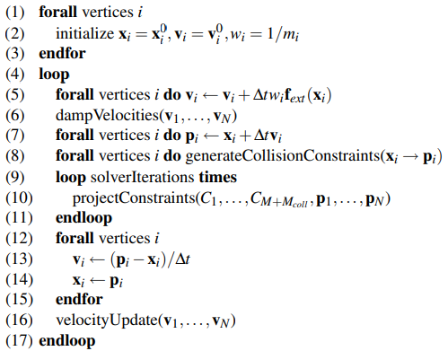

​		第（1）-（3）行只是初始化状态变量。基于位置的动力学的核心思想显示在第(7)、(9)-(11)和(13)-(14)行。在第(7)行中，使用显式欧拉积分步骤计算顶点新位置的估计pi。迭代求解器(9)-(11)对这些位置估计值进行操作，使其满足约束条件。它通过以高斯-塞德尔（GaussSeidel）类型的方式重复投射每个约束条件来做到这一点（见第3.2节）。在步骤(13)和(14)中，顶点的位置被移动到优化的估计值，速度也相应地被更新。这与Verlet积分步骤和对当前位置的修改是完全对应的[Jak01]，因为Verlet方法将速度隐含地存储为当前位置和最后位置的差。然而，对速度的处理允许用一种更直观的方式来操作它们

​		速度在第（5）、（6）和（16）行中被操纵。如果某些力不能转化为位置约束，第(5)行允许将外部力与系统挂钩。我们只用它来增加系统的重力，在这种情况下，该行变成vi ← vi +∆tg，其中g是重力加速度。在第(6)行中，如果有必要，可以对速度进行阻尼。在第3.5节中，我们将展示如何在不影响物体刚体模式的情况下增加全局阻尼。最后，在第(16)行中，碰撞顶点的速度根据摩擦系数和恢复系数被修改。

​		给定的约束条件C1,...,CM在整个模拟过程中是固定的。除了这些约束，第(8)行还产生了M~coll~碰撞约束，这些约束在不同的时间步长中发生变化。第(10)行的推算步骤同时考虑了固定的和碰撞的约束。

​		该方案是无条件稳定的。这是因为积分步骤（13）和（14）并不像传统的显式方案那样盲目地推断未来，而是将顶点移动到由约束求解器计算的物理上有效的配置π。唯一可能的不稳定源是求解器本身，它使用牛顿-拉弗森方法来求解有效位置（见第3.3节）。然而，其稳定性并不取决于时间步长，而是取决于**约束函数的形状**。

​		这种积分并不明显属于隐式或显式方案的范畴。如果每个时间步长只进行一次求解器迭代，它看起来更像一个显式方案。然而，通过增加迭代次数，可以使受限系统变得任意僵硬(arbitrarily stiff)，算法表现得更像一个隐式方案。增加迭代次数可以将瓶颈从碰撞检测转移到求解器上。

### 3.2 解算器（The Solver）

​		解算器的输入是M+M~coll~约束条件和点的新位置的估计值p~1~，...，p~N~。解算器试图修改估计值，使其满足所有的约束条件。由此产生的方程组是非线性的。即使是一个简单的距离约束C(p1,p2) = |p1 - p2| - d也会产生一个非线性方程。此外，不平等类型的约束产生不等式。为了解决这样一组一般的方程和不等式，我们使用高斯-塞德尔型迭代。原始的高斯-塞德尔算法（GS）只能处理线性系统。我们从GS中借鉴的部分是一个接一个地独立解决每个约束条件的想法。然而，与GS相比，解决一个约束是一个非线性操作。我们反复迭代所有的约束条件，仅就给定的约束条件而言，将粒子投射到有效位置。与雅可比类型的迭代相比，对点位置的修改马上就会被进程所看到。这大大加快了收敛速度，因为压力波可以在单个求解步骤中通过材料传播，这种效果取决于约束条件的求解顺序。在过度约束的情况下，如果顺序不保持恒定，该过程可能会导致震荡。

### 3.3 约束投影（Constraint Projection）

​		根据一个约束条件投影一组点意味着移动这些点，使它们满足约束条件。与直接在模拟循环内移动点有关的最重要的问题是**线性和角动量的守恒**。让∆p~i~是顶点i在投影中的位移。线性动量是守恒的，如果
$$
\sum_i m_i\triangle P_i = 0\tag{1}
$$
​		这相当于保持质心。角动量是守恒的，如果
$$
\sum_i r_i\cross m_i\triangle p_i = 0\tag{2}
$$
​		其中ri是pi到一个任意的共同旋转中心的距离。如果一个投影违反了这些约束中的一个，它就会引入所谓的鬼力（ghost forces），这些鬼力（ghost forces）就像外力一样拖动和旋转物体。然而，只有内部约束需要保存动量。碰撞或附着约束被允许对物体产生全局影响

​		我们提出的约束投影的方法保留了内部约束的两个质点。同样，基于点的方法更直接，因为我们可以直接使用约束函数，而基于力的方法则通过能量项推导出力（见[BW98, THMG04]）。让我们看一下在点p~1~,...,p~n~上有一个基数为n的约束，约束函数为C，刚度为k。我们让p是[p~1~^T^ ,...,p~n~^T^]~T~的连接。对于内部约束，C是独立于刚体模式的，即平移和旋转。这意味着旋转或平移这些点不会改变约束函数的值。因此，梯度∇~p~C垂直于刚体模式，因为它是最大变化的方向。如果修正量∆p被选择为沿∇C~p~的方向，如果所有的质量都是相等的，那么两个动量都会自动守恒（我们在后面处理不同的质量）。给定p，我们要找到一个修正Δp，使得C(p+Δp)=0。这个方程可以近似为
$$
C(p+\triangle p)\approx C(p)+\gradient_pC(p)*\triangle p = 0\tag{3}
$$
​		将∆p限制在∇~p~C的方向上意味着选择一个标量λ，使得
$$
\triangle p = \lambda\gradient_pC(p)\tag{4}
$$
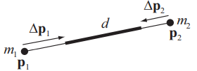

图2：约束C(p1,p2) = |p1 - p2| - d的投影。校正∆pi根据反质量wi = 1/mi加权。

​		将公式（4）代入公式（3），求解λ，并将其代入公式（4），得到∆p的最终公式。
$$
\triangle p = -\frac{C(p)}{|\gradient_pC(p)|^2}\gradient_pC(p)\tag{5}
$$
​		这是一个常规的Newton-Raphson步骤，用于迭代解决单一约束条件下的非线性方程。对于单个点p~i~的修正，我们有
$$
\triangle p_i = -s \gradient_{p_i}C(p_1,...,p_n)\tag{6}
$$
​		其中比例系数
$$
s = \frac{C(p_i,...,p_n)}{\sum_j|\gradient_{P_j}C(p_1,...p_n)|^2}\tag{7}
$$
​		对所有的点都是一样的。如果各点有单独的质量，我们用反质量wi = 1/mi来加权修正Δpi。在这种情况下，一个具有无限质量的点，即wi = 0，不会像预期的那样移动，例如。现在，公式（4）被替换为

​		∆pi = λw~i~∇p~i~C(p)，结果是
$$
s = \frac{C(p_1,...,p_n)}{\sum_jW_j|\gradient_{p_j}C(p_1,...p_n)|^2}\tag{8}
$$
​		为比例系数，为最后的修正有以下式子
$$
\triangle p_i=-sw_i\gradient_{p_i}C(p_i,...,p_n,)\tag{9}
$$
​		为了举例说明，让我们考虑距离约束函数C(p1,p2) = |p1 - p2| - d。相对于点的导数是∇p1C(p1,p2) = n，∇p2C(p1,p2) = -n，n = p1-p2 / |p1-p2| 。因此，比例因子s=(|p1-p2|-d)/(w1+w2)，最后的修正值为

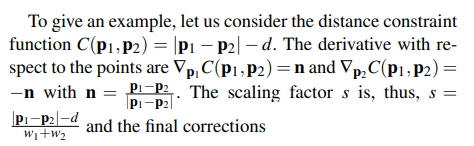
$$
\triangle p_1 = -\frac{w_1}{w_1+w_2}(|p_1-p_2|-d)\frac{p_1-p_2}{|p_1-p_2|}\tag{10}
$$

$$
\triangle p_2 = -\frac{w_2}{w_1+w_2}(|p_1-p_2|-d)\frac{p_1-p_2}{|p_1-p_2|}\tag{11}
$$

​		

这是在[Jak01]中提出的距离约束投射的公式（见图2）。它们作为一般约束投射方法的一个特例而出现。

​		到目前为止，我们还没有考虑约束的类型和刚度K。类型处理是直接的。如果类型是**平等的**，我们总是执行一个投影。如果类型是**不等式**，只有在C(p1,...,pn)<0时才进行投影。最简单的变体是将修正值∆p乘以k∈[0...1]。然而，对于求解器的多个迭代循环，k的影响是非线性的。在求解器迭代ns后，单个距离约束的剩余误差为∆p(1-k) ns。为了得到一个线性关系，我们不是直接乘以k，而是乘以k 0 = 1 - (1 - k) 1/ns。通过这种转换，误差变成了∆p(1-k 0 ) ns = ∆p(1-k)，因此，变得与k线性相关，而与ns无关，这是所期望的。然而，所产生的材料刚度仍然取决于模拟的时间步长。实时环境通常使用固定的时间步长，在这种情况下，这种依赖性是没有问题的。

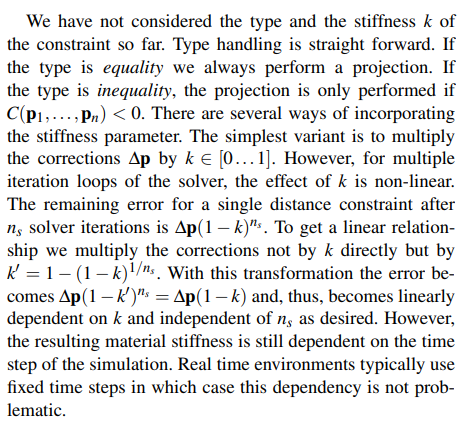

### 3.4 碰撞检测和响应 (Collision Detection and Response)

​		基于位置的方法的一个优点是可以简单地实现碰撞响应。在模拟算法的第(8)行，M~coll~碰撞约束产生。在整个模拟过程中，由物体表示法给出的前M个约束是固定的，而额外的M~coll~约束是在每个时间步骤中从头生成的。碰撞约束M~coll~的数量是不同的，取决于碰撞顶点的数量。连续碰撞和静态碰撞都可以被处理。对于连续碰撞处理，我们为每个顶点i测试射线xi → pi。如果这条射线进入了一个物体，我们就计算入口点q~c~和这个位置的表面法线n~c~。一个带有约束函数C(p)=(p-q~c~)-n~c~和刚度k=1的不等式约束被添加到约束列表中。**如果射线x~i~ → p~i~完全位于物体内部，**则连续碰撞检测在某一点上失败。在这种情况下，**我们回到了静态碰撞处理**。我们计算最接近pi的表面点q~s~和这个位置的表面法线n~s~。一个带有约束函数C(p)=(p-q~s~)-n~s~和刚度k=1的不等式约束被添加到约束列表中。碰撞约束的生成是在求解器循环之外完成的。这使得仿真的速度大大加快。然而，在某些情况下，如果求解器使用固定的碰撞约束集工作，就会错过碰撞。幸运的是，根据我们的经验，这些假象是可以忽略不计的。

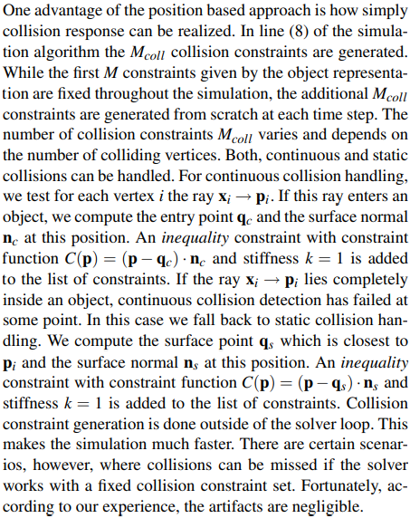

​		摩擦和恢复可以通过在算法的步骤（16）中操纵碰撞顶点的速度来处理。已生成碰撞约束的每个顶点的速度都会在垂直于碰撞法线的方向上进行阻尼，并在碰撞法线的方向上进行反射。

​		上面讨论的碰撞处理只对静态物体的碰撞是正确的，因为没有脉冲被转移到碰撞伙伴上。对两个动态碰撞物体的正确反应可以通过用我们的模拟器模拟这两个物体来实现，也就是说，作为我们算法输入的N个顶点和M个约束只是代表两个或多个独立的物体。然后，如果一个物体的一个点q移动通过另一个物体的三角形p1,p2,p3，我们插入一个不等式约束，约束函数C(q,p1,p2,p3)=±(q-p1)-[(p2-p1)×(p3-p1)]，使点q位于三角形的正确一边。由于这个约束函数与刚体模式无关，它将正确地保存线性和角动量。碰撞检测变得稍微复杂一些，因为四个顶点由射线xi → pi表示。因此，一个移动的点对一个移动的三角形的碰撞需要被检测出来（见关于布自碰撞的部分）。

### 3.5 阻尼（Damping）

​		在仿真算法的第(6)行中，速度在用于预测新位置之前被阻尼了。任何形式的阻尼都可以使用，文献中已经提出了许多阻尼的方法（见[NMK∗05]）。这里我们提出一种新的方法，具有一些有趣的特性。

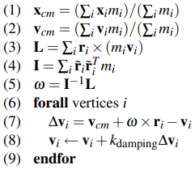

这里r~i~ = x~i~ -x~cm~，r˜~i~是具有r˜~i~v = r~i~ × v属性的3乘3矩阵，k~damping~∈ [0...1] 是阻尼系数。在第(1)-(5)行，我们计算系统的全局线速度x~cm~和角速度ω。然后第(6)-(9)行只阻尼速度vi与全局运动v~cm~ + ω × r~i~的个别偏差∆v~i~。因此，在k~damping~=1的极端情况下，只有全局运动得以保留，顶点集合的行为就像一个刚体。对于任意的k~damping~值，速度被全局阻尼，但不影响顶点的全局运动。

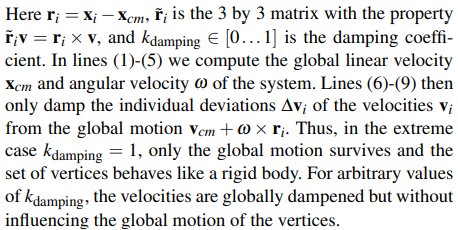

### 3.6 Attachments

​		通过基于位置的方法，将顶点附加到静态或运动物体上是非常简单的。顶点的位置被简单地设置为静态目标位置，或者在每个时间步长中被更新为与运动物体的位置相一致。为了确保包含该顶点的其他约束不会移动它，其反质量wi被设置为零

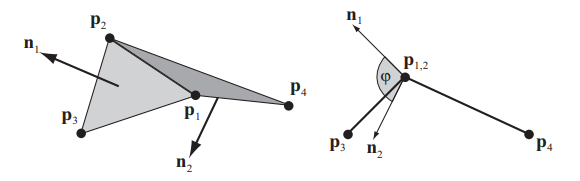

图4：对于弯曲阻力，使用约束函数C(p~1~,p~2~,p~3~,p~4~) = arccos(n~1~ - n~2~) - ϕ~0~。实际的二面角j被测量为两个三角形的法线之间的角度。

## 4. 布料模拟（Cloth Simulation）

​		我们使用了基于点的动力学框架来实现游戏的实时布景模拟器。在这一节中，我们将讨论布的具体问题，从而对上一节中介绍的一般概念给出具体的例子。

### 4.1 布料的表现（Representation of Cloth）

​		我们的布料模拟器接受任意的三角形网格作为输入。我们对输入网格的唯一限制是，它代表一个流形，即每条边最多由两个三角形共享。网格的每个节点成为一个模拟的顶点。用户提供一个密度ρ，以每面积质量[kg/m 2]表示。一个顶点的质量被设定为每个相邻三角形质量的三分之一之和。对于每条边，我们用约束函数生成一个拉伸约束。
$$
C_{stretch}(p_1,p_2)=|p_1-p_2|-l_0
$$
​		硬度k~stretch~和类型平等。标量ł~0~是边缘的初始长度，k~stretch~是由用户提供的一个全局参数。它定义了布的拉伸刚度。对于每一对相邻的三角形(p1,p3,p2)和(p1,p2,p4)，我们用约束函数生成一个弯曲的约束条件
$$
C_{bend}(p_1,p_2,p_3,p_4)=acos(\frac{(p_2-p_1)\cross(p_3-p_1)}{|(p_2-p_1)\cross(p_3-p_1)|}\cdot\frac{(p_2-p_1\cross(p_4-p_1)}{|(p_2-p_1)\cross(p_4-p_1)|})-\phi_0
$$
​		硬度k~bend~和类型相等。标量j~0~是两个三角形之间的初始二面角，k~bend~是一个定义布的弯曲刚度的全局用户参数（见图4）。与在p~3~和p~4~点之间添加距离约束相比，或与[GHDS03]提出的弯曲项相比，这个弯曲项的优点是它与拉伸无关。这是因为该术语与边缘长度无关。这样，用户就可以指定具有低拉伸刚度但高抗弯能力的布，例如（见图3）。

​		公式(10)和(11)定义了拉伸约束的投影。在附录A中，我们推导出投影弯曲约束的公式。

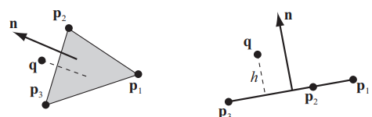

图5：约束函数C(q,p~1~,p~2~,p~3~)=(q-p~1~)·n-h，确保q保持在三角形p1,p2,p3上方的布厚度h。

### 4.2 与刚体的碰撞（Collision with Rigid Bodies）

​		对于与刚体的碰撞处理，我们按第3.4节所述进行。为了得到双向的相互作用，我们在接触点对刚体施加一个脉冲m~i~∆p~i~/∆t，每次顶点i由于与该刚体的碰撞而被投影。仅仅测试布顶点的碰撞是不够的，因为小的刚体可以通过大的布三角形落下。因此，也要测试刚体的凸角对布三角形的碰撞。

### 4.3 自碰撞（Self Collision）

​		假设三角形都有差不多的大小，我们使用空间散列来寻找顶点三角形的碰撞[THM∗03]。如果一个顶点q通过一个三角形p1, p2, p3移动，我们使用约束函数
$$
C(q,p_1,p_2,p_3)=(q-p_1)\cdot\frac{(p_2-p_1)\cross(p_3-p_1)}{|(p_2-p_1)\cross(p_3-p1)|}-h\tag{12}
$$
​		其中h是布的厚度（见图5）。如果顶点相对于三角形法线从下方进入，约束函数必须是
$$
C(q,p_1,p_2,p_3)=(q-p_1)\cdot\frac{(p_3-p_1)\cross(p_2-p_1)}{|(p_3-p_1)\cross(p_2-p1)|}-h\tag{13}
$$
​		以保持顶点在原边上。投射这些约束条件可以保存线性和角动量，这对布的自我碰撞是至关重要的，因为它是一个内部过程。图6显示了一块布的自碰撞的静止状态。如果布匹进入纠结状态，测试连续碰撞是不够的，所以必须采用像[BWK03]所提出的方法。

### 4.4  布质气球(Cloth Balloons)

对于封闭的三角形网格，网格内的超压可以很容易地被模拟出来（见图7）。我们在网格的所有N个顶点上添加一个平等约束，约束函数为
$$
C(p_1,...,p_N)=(\sum^{n_{triangles}}_{i=1}(p_{t_1^i}\cross p_{t_2^i})\cdot p_{t_3^i})-k_{pressure}V_0\tag{14}
$$
​		和刚度k=1的约束集。这里t^i^~1~,t^i^~2~和t^i^~3~是属于三角形i的顶点的三个索引。它与原始体积V~0~乘以超压系数k~pressure~进行比较。这个约束函数产生的梯度是
$$
\gradient_{p_i}C=\sum_{j:t^j_1=i}(p_{t^j_2}\cross p_{t^j_3})+\sum_{j:t^j_2=i}(p_{t^j_3}\cross p_{t^j_1})+\sum_{j:t^j_3=i}(p_{t^j_1}\cross p_{t^j_2})
$$
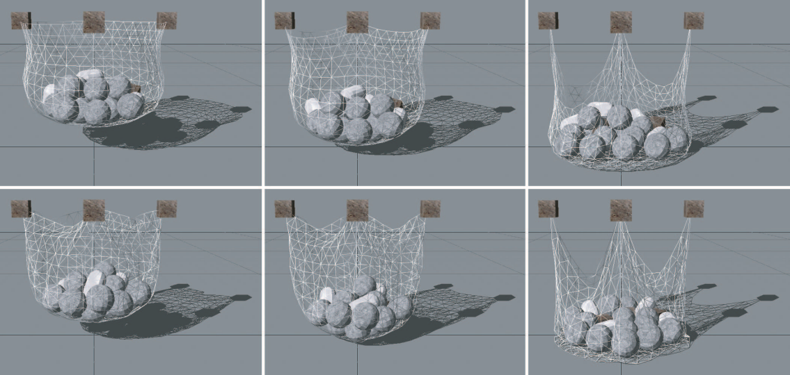

**图3**：通过我们提出的弯曲项，弯曲和拉伸是独立的参数。最上面一行显示(k~stretching~, k~bending~) = (1,1), ( 1/2 ,1) 和 ( 1/100 ,1)。底部一行显示(k~stretching~, k~bending~) = (1,0), ( 1/2 ,0) 和 ( 1/100 ,0)。

**图7**：人物内部超压的模拟。

## 5. 结果

​		我们已经将我们的方法整合到Rocket[Rat04]中，这是一个类似于游戏的物理模拟环境。我们进行了各种实验来分析所提方法的特点和性能。本节介绍的所有测试场景都是在PC奔腾4，3GHz上进行的。

​		独立的**弯曲和拉伸**（Independent Bending and Stretching）。我们的弯曲项只取决于相邻三角形的二面角，而不取决于边长，所以弯曲和拉伸阻力可以独立选择。图3显示了一个具有不同拉伸刚度的布袋，首先启用弯曲阻力，然后禁用。如顶行所示，弯曲并不影响拉伸阻力。

​		**双向互动的依赖**（Attachments with Two Way Interaction.）。我们可以模拟单程和双程耦合的附着约束。图8中的布条是通过单向约束连接到顶部的静态刚体上的。此外，在布条和底部刚体之间启用了双向互动。这种配置使布条的摆动和扭曲运动看起来很真实。这个场景有6个刚体和3块布，模拟和渲染的速度超过380帧/秒。

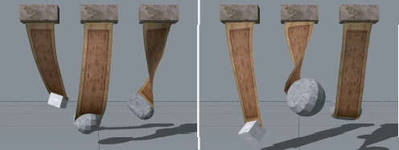

**图8**：布条通过单向互动连接到顶部的静态刚体，并通过双向约束连接到底部的刚体。

**实时自碰撞**。图6所示的这块布是由1364个顶点和2562个三角形组成。仿真的平均运行速度为30 fps，包括自我碰撞检测、碰撞处理和渲染。图9显示了摩擦的影响，同样的一块布在一个旋转的桶里翻滚。

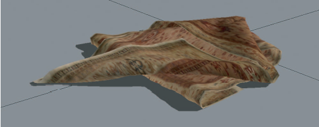

**图6：**这种折叠式配置展示了稳定的自我碰撞和反应

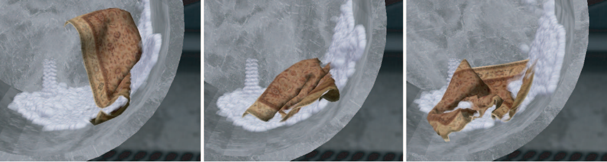

**图9：**受碰撞、自碰撞和摩擦的影响，一块布在旋转的桶中翻滚。

​		**撕裂和稳定性**。图10显示了一块由4264个顶点和8262个三角形组成的布，它被一个相连的立方体撕开，最后被一个抛出的球撕碎了。这个场景的模拟和渲染的平均速度为47帧。撕裂是通过一个简单的过程模拟的。每当一条边的拉伸度超过一个指定的阈值，我们就选择该边的一个相邻顶点。然后，我们通过该顶点放置一个垂直于边缘方向的分割平面，并分割该顶点。分割平面以上的所有三角形都被分配给原始顶点，而下面的所有三角形都被分配给重复的顶点。我们的方法即使在极端情况下也保持稳定，如图1所示，这是一个受[ITF04]启发的场景。一个充气的角色模型通过旋转的齿轮被挤压，导致多个约束、碰撞和自碰撞作用于单个布顶点。

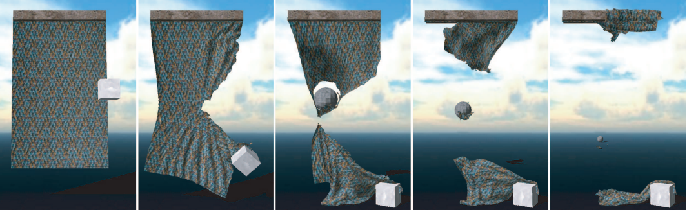

**图10**：一块布被一个相连的立方体撕开，又被一个抛出的球撕开。

​		**复杂的模拟场景**。所提出的方法特别适用于复杂的模拟环境（见图12）。尽管与动画人物和几何上复杂的游戏关卡有大量的互动，但多块布的模拟和渲染仍能以交互速度完成。

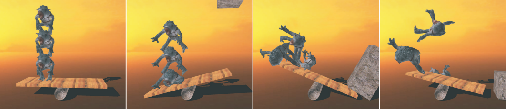

**图11**：三个膨胀的角色经历了多次碰撞和自我碰撞。

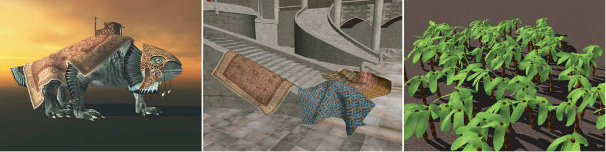

**图12：**布片与动画游戏人物之间的广泛互动（左），一个几何形状复杂的游戏关卡（中）和数百个模拟植物叶子（右）。

## 6. 结论（Conclusions） 

​		我们提出了一个基于位置的动力学框架，可以处理通过约束函数制定的一般约束。有了基于位置的方法，就有可能在模拟过程中直接操纵物体。这大大简化了对碰撞、附件约束和显式整合的处理，并使直接和即时控制动画场景成为可能。

​		我们在这个框架上实现了一个强大的布匹模拟器，它提供的功能包括布匹与刚体的双向互动，布匹的自我碰撞和响应，以及布匹与动态刚体的附着。

## 7. Future Work（未来展望）

​		我们在本文中没有处理的一个主题是刚体仿真。然而，我们提出的方法也可以很容易地扩展到处理刚体物体。与其像常规的刚体求解器那样计算一组用于解决碰撞的线性和角度脉冲（angular impulses），不如将运动和旋转应用于接触点上的物体，并且在求解器完成后对线性和角度速度进行相应调整。

